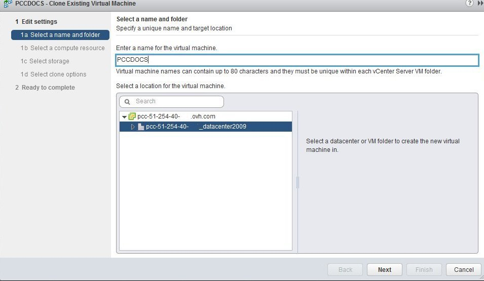
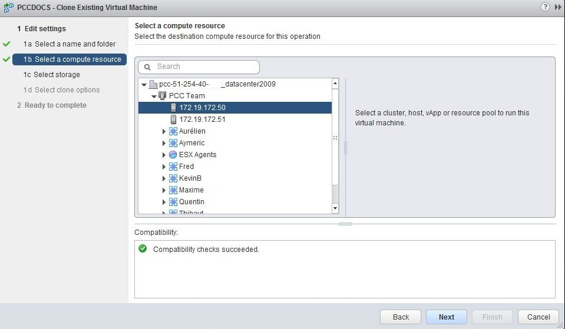

**Dernière mise à jour le 28/01/2019**

## Objectif

Le clonage d'une VM permet de créer une copie de la VM source.

**Ce guide explique comment réaliser cette opération**

## En pratique

Faites un clic droit sur la VM à cloner puis sélectionnez  `Clone`{.action}, et `Clone To virtual Machine`{.action}. Spécifiez le nom de votre nouvelle VM et son emplacement dans votre arborescence :

{.thumbnail}

### Sélection de la ressource

Spécifiez le cluster, l'hôte, la Vapp ou le ressource pool de cette VM :

{.thumbnail}

### Choix du stockage

Indiquez maintenant le stockage où sera l’espace disque de cette VM. Vous pouvez utiliser :

- `Same Format as Source` : la VM créée sera identique en tous points à la source.
- `Thin provisioned format` : créera le disque, mais n’utilisera que l’espace disque réellement employé sur le stockage.
- `Thick Format` : utilisera l’ensemble de l’espace disque correspondant à la VM sur le stockage.

Vous retrouverez plus d'explications sur ces formats dans [ce guide](https://docs.ovh.com/fr/private-cloud/cloner-une-vm/){.external-link}.

Lors du choix de `VM Storage Policy`, vous pouvez choisir la politique de stockage par défaut si vous avez des datastores, ou une politique personalisée si vous avez des hôtes [vSAN](https://docs.ovh.com/fr/private-cloud/vmware-vsan/){.external-link}, ou encore l'option [VM encryption](https://docs.ovh.com/fr/private-cloud/vm-encrypt/){.external-link}.

{.thumbnail}

### Configuration système

Nous arrivons maintenant à la configuration réseau à appliquer à cette VM. Vous avez deux choix :

- Si vous ne cochez rien, cela ne fera aucun changement sur la configuration réseau de la nouvelle VM par rapport à la source ;

- `Customize using the operating system`{.action} : cette option vous permettra de spécifier les nouvelles configurations que vous souhaitez mettre en place sur cette nouvelle VM.

{.thumbnail}

> [!warning]
>
> Si vous n'avez pas fait de personalisation de la machine virtuelle, il est nécessaire de modifier la configuration du Clone avant de la démarrer, afin d'éviter un conflit d'IP / MAC. Dans ce cas, il vous suffit simplement de décocher la carte réseau dans les paramètres de la machine virtuelle une fois celle ci clonée, juste avant de la démarrer**
>

{.thumbnail}

## Aller plus loin

Échangez avec notre communauté d'utilisateurs sur <https://community.ovh.com>.