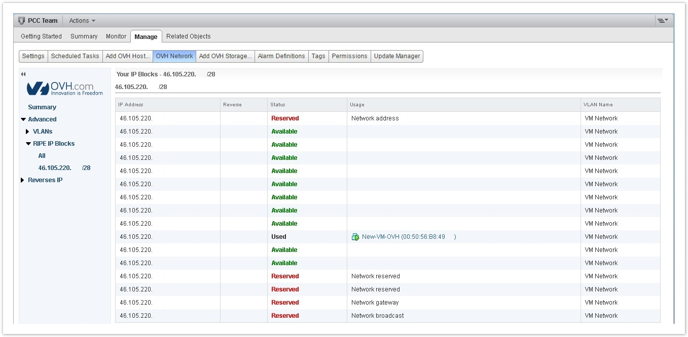
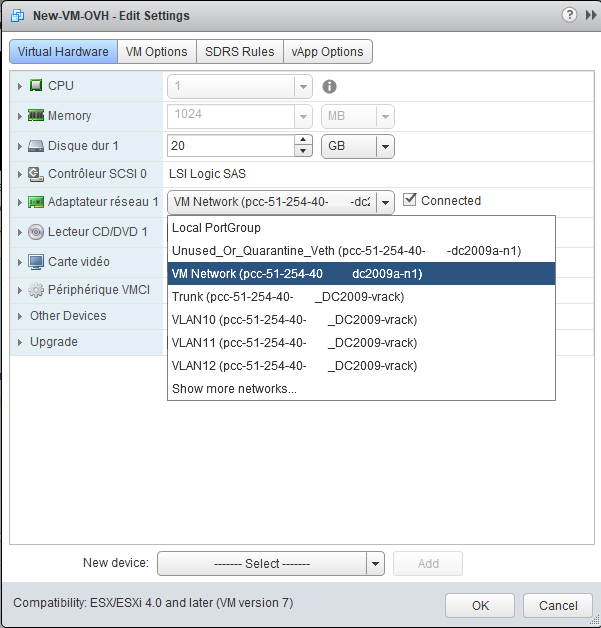
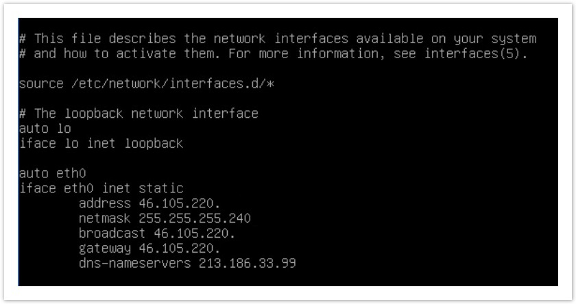
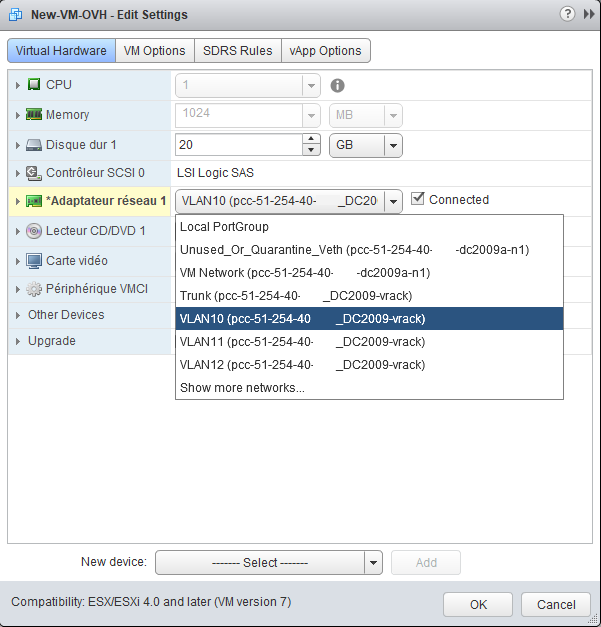
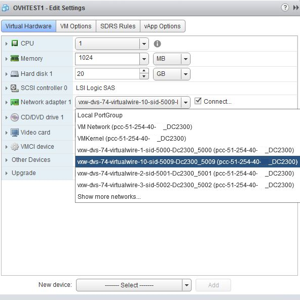
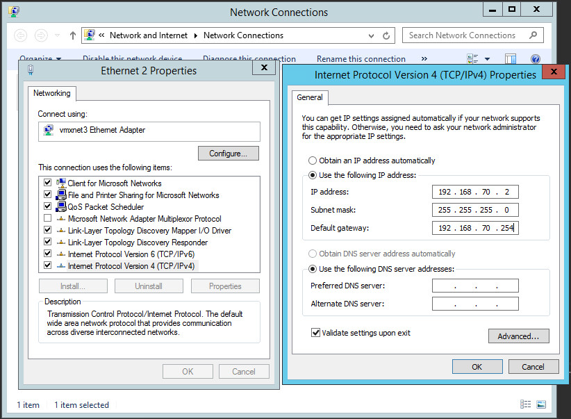

**Ostatnia aktualizacja z dn. 2018-01-03 r.**

## Wprowadzenie

Po utworzeniu w infrastrukturze maszyny wirtualnej (VM) możesz nadać jej publiczny lub prywatny adres IP.

**Ten przewodnik przedstawia sposób przeprowadzenia takiej konfiguracji.**

## Wymagania początkowe

- Utworzona maszyna wirtualna.
- Dysponowanie blokiem IP.

## W praktyce

### Uzyskiwanie informacji

Informacje o bloku publicznych adresów IP możesz uzyskać bezpośrednio z poziomu klienta vSphere, przechodząc do sekcji `Hosts and Clusters`{.action}. Następnie kliknij swój klaster i wybierz zakładkę `Manage`{.action}, a potem `OVH Network`{.action}.

{.thumbnail}

W każdym bloku dostarczanym przez OVH do konfiguracji sieci zarezerwowanych jest 5 adresów IP, których nie należy używać do maszyn wirtualnych. Chodzi tu o pierwszy oraz cztery ostatnie adresy IP w bloku.

Blok IP Private Cloud zorganizowany jest w następujący sposób:

- pierwszy adres IP oznaczony jako zarezerwowany (`Reserved`) odpowiada adresowi sieci;
- kolejnych adresów IP możesz używać do maszyn wirtualnych. Są one oznaczone jako dostępne (`Available`) jeśli nie są wykorzystywane przez VM lub w przeciwnym wypadku jako w użyciu (`Used`);
- cztery ostatnie adresy IP w bloku są zarezerwowane, z czego dwa dedykowane są dla routerów OVH, a dwa kolejne wykorzystywane są na bramę sieciową oraz broadcast.

{.thumbnail}

### Konfiguracja publicznego adresu IP

W celu skonfigurowania publicznego adresu IP na swojej maszynie wirtualnej najpierw musisz wybrać interfejs `VMNetwork`{.action} w ustawieniach karty sieciowej swojej VM:

{.thumbnail}

#### Linux

Oto przykładowa konfiguracja na dystrybucji Debian 8:

{.thumbnail}

```sh
auto eth0
iface eth0 inet static
address 46.105.220.xxx
netmask 255.255.255.240
broadcast 46.105.220.xxx
gateway 46.105.220.xxx
dns-nameservers 213.186.33.99
```

Zamontuj kartę za pomocą polecenia `ifup` w swoim interfejsie.

Możesz również sprawdzić konfigurację poleceniem `ifconfig`.

Jeśli Twoja maszyna wirtualna nie widzi sieci, być może należy sprawdzić czy karta sieciowa skonfigurowana jest na *VMNetwork* a nie na *LocalPortGroup* lub VLAN oraz czy zaznaczone zostało pole wyboru podłączenia karty.

#### Windows

Oto przykładowa konfiguracja na Windows 2012 R2.

W `panelu sterowania`{.action} przejdź do `Sieć i Internet`{.action}, następnie do `Centrum sieci i udostępniania`{.action} i w końcu do `Zmień ustawienia karty sieciowej`{.action}.

Szybszą opcją jest kliknięcie paska wyszukiwania Windows i wpisanie `Run` (co jest równoważne z jednoczesnym wciśnięciem na klawiaturze klawiszy *Windows* oraz *R*). Pojawi się okno uruchamiania Windows, w którym wpisuje się poniższe polecenie:

```shell
ncpa.cpl
```

Następnie należy kliknąć prawym przyciskiem myszy kartę sieciową odpowiadającą VMNetwork, a potem `Właściwości`{.action). Wybierz następnie `Protokół TCP/IP v4`{.action} i ponownie kliknij 'Właściwości' i wpisz informacje dotyczące adresu IP w następujący sposób:

{.thumbnail}

```sh
Adres IP: 46.105.220.xxx
Maska podsieci: 255.255.255.240
Brama domyślna: 46.105.220.yyy
Serwer DNS: 213.186.33.99
```

### Konfiguracja prywatnego adresu IP

Konfigurację prywatnego adresu IP przeprowadza się w podobny sposób, jak w przypadku IP publicznego. Należy jednak użyć karty sieciowej skonfigurowanej dla sieci VLAN bądź VXLAN.

W wyborze interfejsu można edytować następujące ustawienia:

- na SDDC, interfejs VLAN (domyślnie 10-20, można utworzyć więcej, w czym pomoże [ta instrukcja](https://docs.ovh.com/fr/private-cloud/creation-vlan/){.external} ;

- na Private Cloud, interfejs VXLAN (vxw-dvs…). Jeśli potrzebujesz więcej VXLAN, utwórz zgłoszenie do działu wsparcia klienta, w panelu klienta OVH.


#### SDDC

W ustawieniach swojej maszyny wirtualnej należy użyć VLAN:

{.thumbnail}

#### Private Cloud

W ustawieniach swojej maszyny wirtualnej należy użyć VXLAN:

{.thumbnail}

#### Linux

Oto przykładowa konfiguracja na dystrybucji Debian 8:

{.thumbnail}

Edytując plik interfejsu możesz wskazać prywatny adres IP z wybranego zakresu IP:

```sh
auto eth0
iface eth0 inet static
address 192.168.70.1
netmask 255.255.255.0
gateway 192.168.70.254
```

Zamontuj kartę za pomocą polecenia `ifup` w swoim interfejsie.

Możesz również sprawdzić konfigurację poleceniem `ifconfig`.

#### Windows

Oto przykładowa konfiguracja na Windows 2012 R2:

W `panelu sterowania`{.action} przejdź do `Sieć i Internet`{.action}, następnie do `Centrum sieci i udostępniania`{.action} i w końcu do `Zmień ustawienia karty sieciowej`{.action}.

Szybszą opcją jest kliknięcie paska wyszukiwania Windows i wpisanie `Run` (co jest równoważna z jednoczesnym wciśnięciem na klawiaturze klawiszy *Windows* oraz *R*). Pojawi się okno uruchamiania Windows, w którym wpisuje się poniższe polecenie:

```shell
ncpa.cpl
```

Następnie należy kliknąć prawym przyciskiem myszy kartę sieciową odpowiadającą VMNetwork, a potem `Właściwości`{.action). Wybierz następnie `Protokół TCP/IP v4`{.action} i ponownie kliknij 'Właściwości' i wpisz informacje dotyczące swojego IP w następujący sposób:

{.thumbnail}

Modyfikując ten interfejs możesz wskazać prywatny adres IP z wybranego zakresu IP:

```sh
Adres IP: 192.168.70.2
Maska podsieci: 255.255.255.0
Brama domyślna: 192.168.70.254
```

## Dowiedz się więcej

Przyłącz się do społeczności naszych użytkowników na <https://community.ovh.com>.

