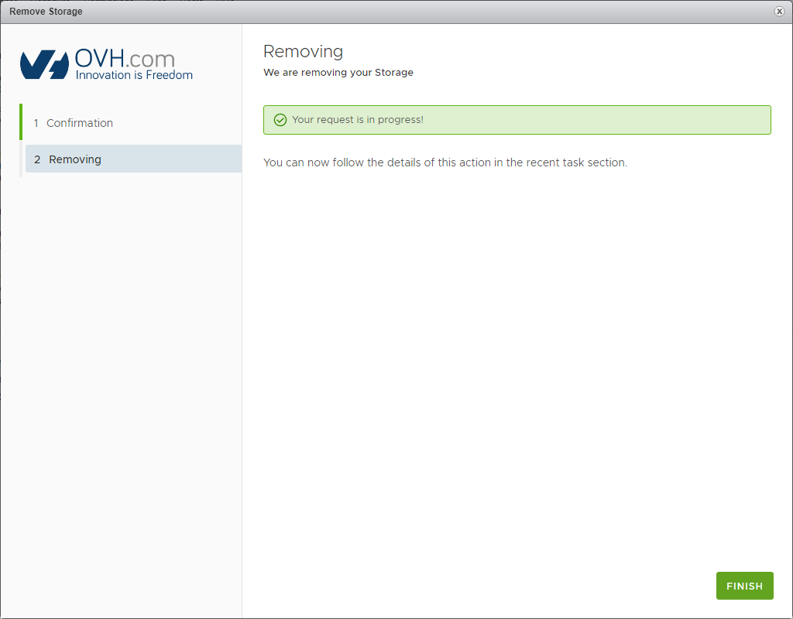

**Ultimo aggiornamento: 11/12/2018**

## Obiettivo

In certi casi può essere utile rimuovere un datastore dal cluster, ad esempio per eseguire una sostituzione o per effettuare un upgrade a una nuova versione.

**Questa guida ti mostra come rimuovere in modo sicuro un datastore da un’infrastruttura Private Cloud.**

## Prerequisiti

* Disporre di una soluzione [Private Cloud](https://www.ovh.it/private-cloud/){.external}
* Avere accesso all’interfaccia di gestione vSphere

## Procedura

> [!warning]
>
> Ti ricordiamo che non è possibile rimuovere i **due datastore da 300 GB o 1,2 TB** inclusi in un pack. Inoltre, per motivi di sicurezza, non è consentito rimuovere un datastore contenente macchine virtuali (nella finestra di conferma troverai l’elenco delle VM allocate nel datastore).
> 

Per eseguire la rimozione di un datastore, clicca con il tasto destro del mouse sulla risorsa da rimuovere, seleziona `OVH Private Cloud`{.action} e poi `Remove storage`{.action}.

{.thumbnail}

Nella nuova finestra, conferma di voler rimuovere il datastore cliccando su `Next`{.action}. 

{.thumbnail}

La richiesta di rimozione è stata inviata.

{.thumbnail}

È possibile seguire lo stato di avanzamento della rimozione del datastore nella sezione <b>Recent Tasks</b>.

{.thumbnail}

## Per saperne di più

Contatta la nostra Community di utenti all’indirizzo <https://www.ovh.it/community/>.