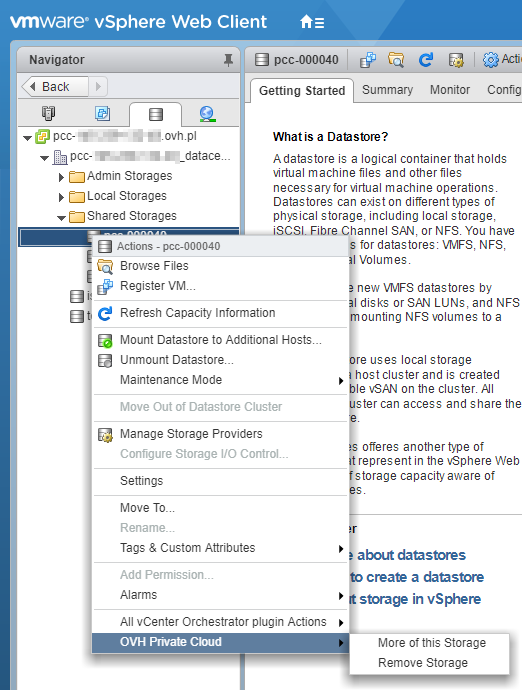

**Laatste update 21-08-2018**

## Introductie

In sommige gevallen kan het handig zijn om een datastore uit uw cluster te verwijderen, bijvoorbeeld om het te vervangen of om  naar een groter formaat te upgraden.

**Deze handleiding legt uit hoe u veilig een datastore uit uw infrastructuur verwijdert.**

## Vereisten

* U moet beschikken over [Private Cloud](https://www.ovh.com/nl/private-cloud/){.external}.
* U moet toegang hebben tot de vSphere Management Interface.

## Instructie

> [!warning]
>
> Let op: het is niet mogelijk om de bij uw pakket inbegrepen **twee 300 GB of 1.2 TB datastores** te verwijderen. Om veiligheidsredenen zal het verwijderingsverzoek ook afgewezen worden als er virtuele machines (VM's) aanwezig zijn in de betreffende datastore (u vindt de lijst in het validatievenster).
> 

Om een datastore te verwijderen, klikt u ten eerste met de rechtermuisknop op de resource. Selecteer `OVH Private Cloud`{.action}, vervolgens `Remove storage`{.action}.

{.thumbnail}

Er zal een validatievenster worden geopend. Bevestig door te klikken op `Next`{.action}.

{.thumbnail}

Het verwijderingsverzoek wordt vervolgens geaccepteerd. 

{.thumbnail}

De voortgang van het proces kan worden gevolgd via recente taken.

{.thumbnail}

## Verder

Ga in gesprek met andere communitygebruikers via <https://community.ovh.com/en/>.
