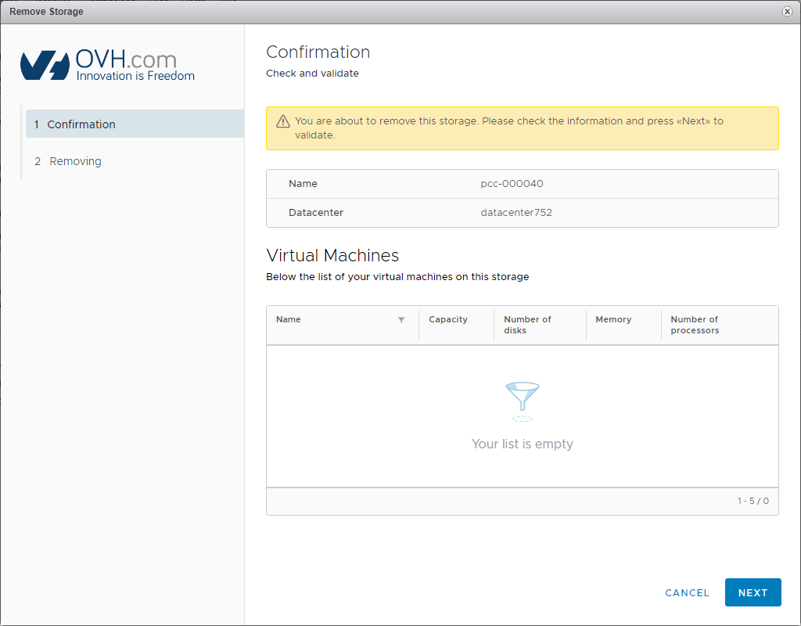

**Ostatnia aktualizacja z dnia 06-12-2018**

## Wprowadzenie

W niektórych przypadkach może zaistnieć potrzeba usunięcia datastore z Twojego klastra, np. w celu zastąpienia go lub zwiększenia.

**Niniejszy przewodnik wyjaśnia, jak usunąć w bezpieczny sposób przestrzeń dyskową (datastore) z Twojej infrastruktury.**

## Wymagania początkowe

* Posiadanie oferty [Private Cloud](https://www.ovh.pl/private-cloud/){.external}
* Dostęp do interfejsu zarządzania vSphere

## W praktyce

> [!warning]
>
> Uwaga, nie jest możliwe usunięcie **dwóch przestrzeni datastore o pojemności 300 GB lub 1,2 TB** zawartych w pakiecie. Ze względów bezpieczeństwa żądanie usunięcia datastora nie zostanie zrealizowane, jeśli na wybranej przestrzeni dyskowej znajdują się Twoje wirtualne maszyny (ich lista znajduje się w oknie potwierdzenia usunięcia datastore).
> 

Aby usunąć datastore, najpierw kliknij prawym przyciskiem myszy na wybrany zasób. Wybierz `OVH Private Cloud`{.action}, następnie `Remove storage`{.action}.

{.thumbnail}

Otworzy się okno służące do potwierdzenia usunięcia datastora. Kliknij `Next`{.action}.

{.thumbnail}

Żądanie usunięcia przestrzeni datastore jest w tym momencie przetwarzane.

{.thumbnail}

Możesz monitorować postęp usuwania datastora w sekcji Ostatnie zadania.

{.thumbnail}

## Sprawdź również

Przyłącz się do społeczności naszych użytkowników na stronie <https://community.ovh.com/en/>.