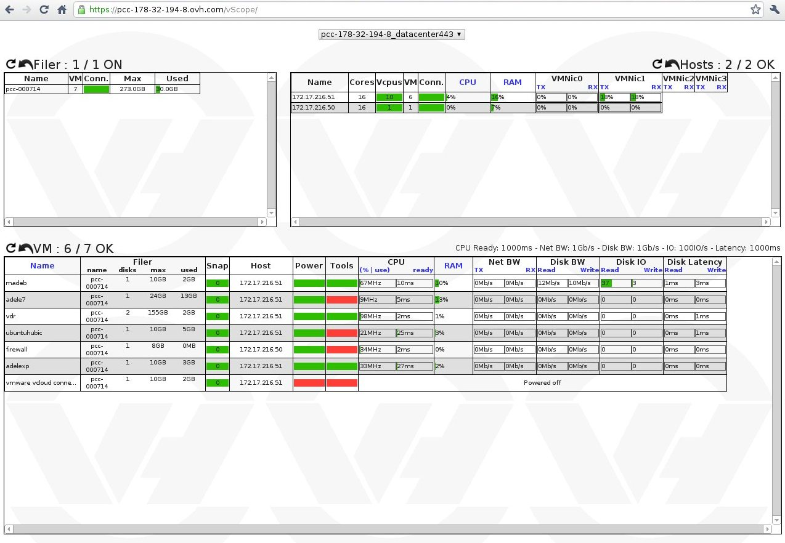

## Prieiga
Prie vScope galite jungtis naudodami tokį URL (pritaikykite pagal savo Private Cloud):

https://pcc-178-32-194-8.ovh.com/vScope (dėmesio, S yra didžioji)

{.thumbnail}
Reikės įvesti prisijungimo vardą ir slaptažodį, naudokite administratoriaus vardą ir slaptažodį, kaip ir jungiantis prie vSphere kliento. 
Kai prisijungsite prie sąsajos, matysite globalų duomenų centrų vaizdą.

{.thumbnail}

## Filer
Kairėje matysite saugyklų sąrašą, taip pat jų naudojimo statistiką.

## Hosts
Čia rasite host serverių sąrašą su branduolių skaičiumi, VM, CPU ir RAM naudojimu, taip pat tinklo grafiką ir serverių srautus (TX ir RX = upload ir download).

Jeigu dukart spragtelėsite serverį, atsidarys nauja kortelė, kurioje matysite grafiką su resursų naudojimu (RAM, CPU, tinklo ir t.t.):

{.thumbnail}
Spragtelėję kairįjį pelės klavišą galite priartinti tam tikrą grafiko periodą:

{.thumbnail}
Puslapio viršuje, iškrintančiame meniu, galite pasirinkti periodą, kurį vaizduoti (diena, savaitė, mėnuo, metai).

## Virtual Machine
Šioje vietoje rasite virtualių mašinų statistiką su:

- VM pavadinimais;
- Saugyklas, kuriose yra vmdk, taip pat naudojamą ir paskirtą saugyklų vietą;
- Serveryje esančių momentinių kopijų skaičių (padarytų su snapshot manager);
- Host serverį, kuriame yra VM;
- VM būseną (įjungta, išjungta, pristabdyta);
- CPU ir RAM naudojimą;
- Diskų informaciją (perdavimo spartos, I/O, uždelsimo duomenis).

Kaip ir host serverių atvejų, dukart spragtelėję virtualią mašiną, galėsite keisti jos grafiko nuostatas.

