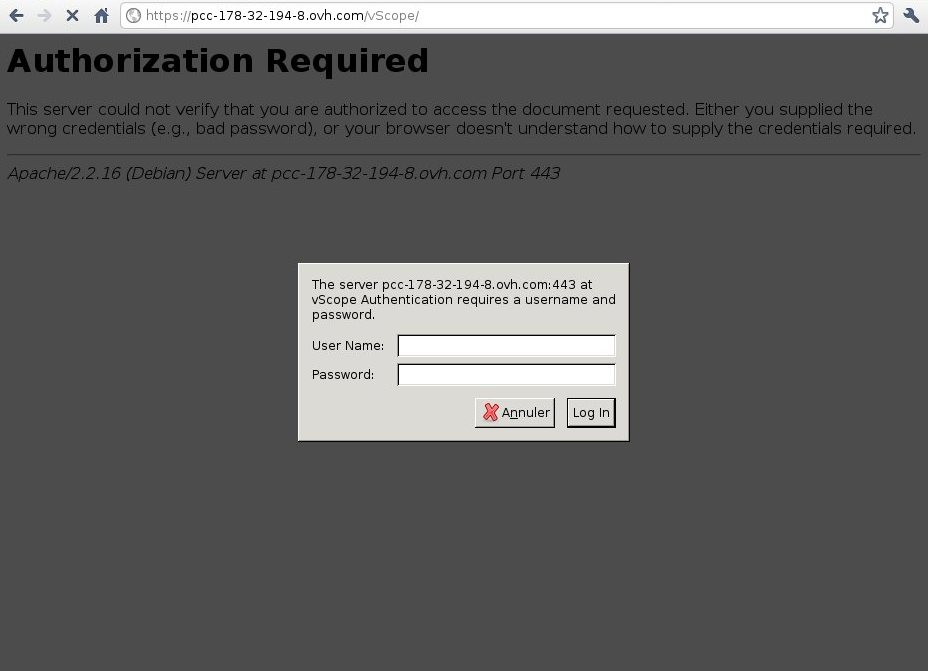
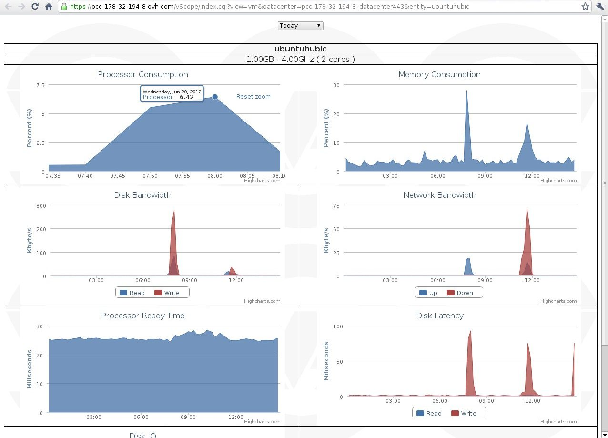

## Acesso
Pode aceder ao vScope através do seguinte URL (a adaptar de acordo com o seu serviço Cloud):

https://pcc-178-32-194-8.ovh.com/vScope (o 'S' é maiúsculo)

{.thumbnail}
Ser-lhe-á solicitado um login e uma palavra-passe para a ligação; basta utilizar o login admin e a senha que utiliza para se ligar ao "vSphere Client".
Assim que se autenticar, será diretamente encaminhado para a supervisão global de um dos seus datacenters:

{.thumbnail}

## Filer
À esquerda, terá a lista de armazenamentos (datastores), bem como as estatísticas de utilização associadas aos mesmos.

## Hosts
Nesta vista poderá encontrar a lista dos seus hosts e a quantidade de cores, de VMs, de CPUs e de RAM em uso e o tráfego de rede das placas do host (TX = upload e RX = download).
Se fizer um duplo-clique num host acederá a um outro separador que lhe apresentará gráficos que mostram a utilização de recursos  (RAM, CPU, Network, etc...):

{.thumbnail}
Pode também fazer zoom no gráfico a um período mais preciso, efetuando um clique com o botão esquerdo e selecionado a zona deseja do gráfico para fazer zoom:

{.thumbnail}
Tem a possibilidade de escolher o período da apresentação dos gráficos (dia, semana, mês, ano) no topo da página graças a uma "dropdownlist".

## Virtual Machine
Nesta secção encontrará as estatísticas das suas máquinas virtuais com

- os seus nomes
- o datastore no qual o disco virtual da máquina virtual é contido, bem como o espaço alocado no datastore.
- o número de snapshots (criados através do "snapshot manager") presentes para uma máquina virtual
- o host no qual uma VM está a "correr"
- o estado da VM (power off/on, pausa)
- o consumo de RAM e CPU
- informações sobre os discos (estatísticas de tráfego de dados, latência de I/O)

Tal como para os hosts, um duplo-clique irá permitir aceder às estatísticas da máquina virtual e consultar os diferentes gráficos associados.

