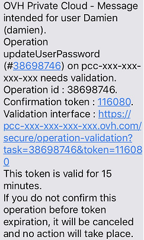

**Dernière mise à jour le 25 janvier 2019**

## Objectifs

Valider les opérations sensibles (changement de mot de passe, ajout d'utilisateur...) réalisées par des utilisateurs ou des tiers sur votre cloud privé HDS ou PCIDSS au travers de l'interface sécurisée.

**Ce guide explique le fonctionnement de l'interface pour valider ces opérations.**

## Prérequis

- Disposer d'une infrastructure avec l'option *security advanced* (inclus dans les offres PCI-DSS et HDS).Ce droit permet la validation.

- Avoir accès à l'interface sécurisée du PCC, exemple : https://pcc-xxx-xxx-xxx-xxx.ovh.com/secure/ (attention à ne pas oublier le “/” final de l’adresse).

## Utilisateurs

Dans une infrastructure HDS ou PCI-DSS, il est possible de donner un droit *token validator* à vos utilisateurs.
Ce droit permet la reception de SMS contenant des tokens servant à la validation d'opérations sensibles.

Lors de l'activation de l'option, vous devez au minimum avoir l'utilisateur "admin" avec ce droit. 
L'ajout de ce droit est possible sur les autres utilisateurs de votre choix dans [l'espace client OVH](https://docs.ovh.com/fr/private-cloud/manager-ovh-private-cloud/#utilisateurs).

## Validation des tokens

Quand un token est reçu par SMS, celui-ci doit être renseigné dans l'interface sécurisée afin que la tâche en attente puisse s’exécuter.

> [!warning]
>
> Attention, le token fourni n’est valable que 15 minutes. Sans validation de votre part en moins de 15 minutes, la tâche est annulée.
> 
> Elle vous sera à nouveau proposée par la suite (dans les cas de maintenance) ou vous devrez la relancer (dans le cas où cela fait suite à une action de votre part). 
> 

Voici un exemple de SMS que vous pouvez recevoir : 

{.thumbnail}

Si nous décrivons ce SMS, nous retrouvons : 

- L'utilisateur avec le droit *token validator* ayant reçu le SMS. Si vous avez renseigné votre numéro de téléphone sur plusieurs utilisateurs, cela peut vous aider à vous retrouver sur les token à valider

- Le nom de l'opération et son ID nécessitant une validation.

- L'opération ID

- Le token

- Le lien de validation. Attention, si votre téléphone n'est pas connecté à un réseau dont l'[IP est autorisée](https://docs.ovh.com/fr/private-cloud/manager-ovh-private-cloud/#securite), la page de validation ne s'affichera pas.

Pour valider cette opération rendez vous dans la partie `Opertation Validation`{.action} :

{.thumbnail}

Une fenêtre de connexion s'ouvrira, dans laquelle seul un utilisateur avec le droit *token validator* pourra s'authentifier.

Chargez l'opération en renseignant l'ID de l'opération dans le champ prévu a cet effet, puis cliquez sur le bouton `Load operation`{.action}, puis renseignez le token que vous venez de recevoir.

{.thumbnail}

Les utilisateurs avec le droit *token validator* recevront un second SMS les informant de la validation de l'opération, et de l'utilisateur ayant effectué cette validation.

{.thumbnail}

Pour ce second SMS, nous retrouvons : 

- L'utilisateur avec le droit *token validator* ayant reçu le SMS de confirmation.

- Le nom et l'ID (entre parenthèse) de l'opération venant d'être validée.

- L'utilisateur avec le droit *token validator* ayant validé l'opération.

## Changement de mot de passe

Pour changer le mot de passe d'un utilisateur sans le droit *token validator* ou d'un utilisateur avec le droit *token validator*, n'ayant pas perdu son mot de passe, vous devez vous rendre sur l'interface sécurisée et cliquer sur le bouton `Change Password`{.action} : 

{.thumbnail}

Choisir l'utilisateur et définir le nouveau mot de passe : 

{.thumbnail}

Un token sera envoyé aux utilisateurs avec le droit *token validator* pour valider l'opération.

## Mot de passe perdu

En cas de perte de mot de passe, pour un utilisateur avec le droit *token validator*, il est possible d'effectuer une réinitialisation.

Pour cela rendez vous sur l'interface sécurisée et cliquer sur le bouton `Password lost`{.action} :

{.thumbnail}

Un message vous avertira que cette procédure ne peut être faite que par un utilisateur pouvant recevoir des SMS.
Si tel est le cas, poursuivez en démarrant la procédure.

Remplissez les champs concernant votre utilisateur : 

{.thumbnail}

Une fois ces informations renseignées, rendez vous à l'étape suivante, et remplissez les champs avec les tokens que vous venez de recevoir par SMS et par mail, ainsi que votre nouveau mot de passe.

## Cas particulier

Un cas particulier peut arriver sur les infrastructures HDS / PCI-DSS : 

Si un utilisateur n'ayant pas le droit *token validator* perd son mot de passe.

Dans ce cas, un utilisateur avec le droit *token validator* devra faire le changement. 

*Le mot de passe sera transmis en clair entre les utilisateurs, il est fortement recommandé de le modifier par la suite*

## Aller plus loin

Échangez avec notre communauté d'utilisateurs sur <https://community.ovh.com>.
