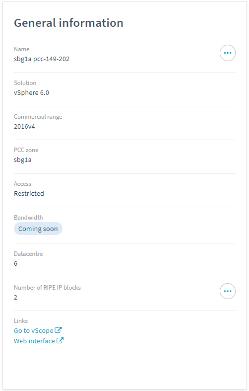
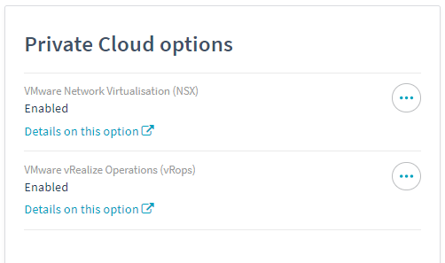
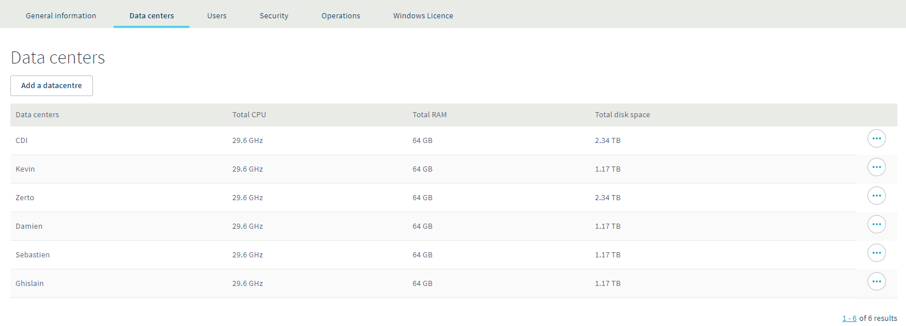
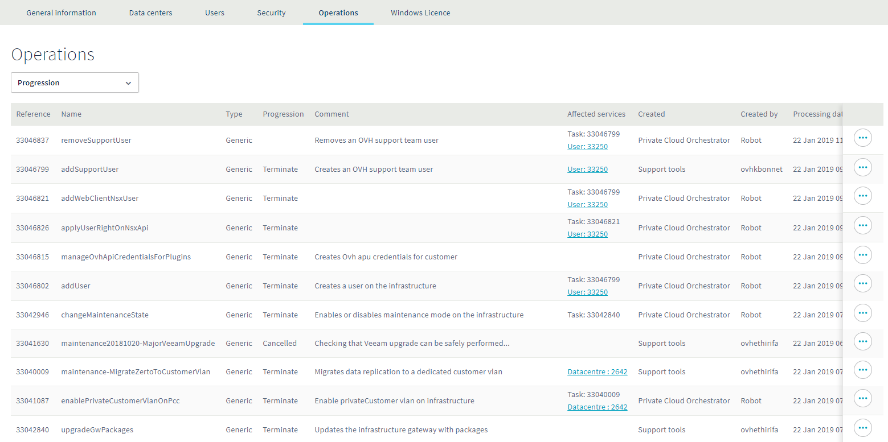

**Last updated 01/02/2018**

## Objective

In your OVH Control Panel, you can choose from many Private Cloud settings options.

**This guide will show you the different options you can use.**

## Requirements

- You must be logged in to your [OVH Control Panel](https://ca.ovh.com/auth/?action=gotomanager){.external}. Go to the `Dedicated`{.action} section, then select `Private Cloud`{.action}.
- You must have a [Private Cloud](https://www.ovh.com/sg/private-cloud/){.external} product.

## Instructions

### General tab

Once you have clicked `Dedicated`{.action}, and opened the `Private Cloud`{.action} section of your [OVH Control Panel](https://ca.ovh.com/auth/?action=gotomanager){.external}, you will see a general overview of your Private Cloud:

{.thumbnail}

At the top of the page, `(1 on the image)`, you will find the name and description of your Private Cloud. Feel free to customise it – this will be very useful if you have several infrastructures. 

On the right, `(2 on the image)`, you will see several buttons:

- Order an IP block, which will take you to the `IP`{.action} tab
- Order a licence (cPanel, Plesk, etc.), which will take you to the `Licences`{.action} tab
- Switch all resources to a fixed monthly rate (if you already pay monthly, this will not be displayed)
- Subscribe to the Private Cloud mailing list
- Cancel your service: you will be sent an email asking you to confirm your request

### General information

In the first section, you will find general information about your Private Cloud.

{.thumbnail}

- Your Private Cloud version
- Its OVH reference number
- The datacentre, and more precisely, the zone in which your infrastructure is located
- The security access to your infrastructure (`Open` or `Restricted`) with the restrictions per source IP
- The guaranteed bandwidth feature will be available soon
- The number of virtual datacentres in your infrastructure
- The number of IP blocks

### Options

You will then see the status of the NSX and vRops options.

{.thumbnail}

In this example, the NSX and vRops options are enabled, and you can disable them if you do not or no longer need them.

To enable one of these options, simply click the corresponding button.

{.thumbnail}

If you click `Details on this option`{.action}, you will find guides for each of the options.

### Datacentres

In this tab you will find a short summary of the virtual datacentres in your Private Cloud solution:

{.thumbnail}

See below for all information about the datacentres.

> [!primary]
>
> You can add another datacentre from this page at no extra cost.
> 

### Users

All users who can log in to vSphere can be found in this section:

{.thumbnail}

You can create a user by clicking on the `Create user`{.action} button on the right.

For each user, you will find this information:

- ID
- Email address (optional)
- Telephone number (optional)
- Validation token
- Status

Permissions in this section are set for the different users. The first column (IP) can be used to give users permission to manage the `OVH network`{.action} tab and manage the `Users`{.action} tab itself, whilst the second column (Failover IP) gives users permission to manage failover IPs.
If you click on the cogwheel icon to the right of the table, several options will appear:

- Modify entries in this table
- View and modify this user’s permissions by datacentre
- Change the user password
- Delete this user

We can look at the modification of permissions per datacentre in more detail:

{.thumbnail}

- `vSphere access`{.action} – this deals with the vSphere user’s overall permissions:

|Permissions|Description|
|---|---|
|none|no access|
|read only|read only access|
|read/write|read/write access|
|provider|access for OVH administrators only|

- `Add resources`{.action} – this button enables you to grant or withhold the right to add additional resources via the OVH plugin in the vSphere client.

- `Access to the VM Network`{.action} - for managing permissions over the public network section (called `VM Network` in the vSphere interface):

|Permissions|Description|
|---|---|
|none|no access|
|read only|read only access|
|provider|allows you to configure virtual machines (VM) on the public network|

- `Access to the V(X)LAN`{.action} - for managing rights on the private network section (VXLANs for the Dedicated Cloud range or VLANs for the SDDC range):

|Permissions|Description|
|---|---|
none|no access|
|read only|read only access|
|provider|allows you to configure virtual machines (VM) on the private network|
|administrator|allows you to manage the virtual switch port groups (create, modify or delete them, etc.)|

> [!warning]
>
> Since the permissions are being rewritten, the information here may change.
> 

### Security

You can modify the access settings for your vCenter in this tab:

{.thumbnail}

You can configure the elements above and in the table using the cogwheel icons on the right. You can configure:

- A limit for login sessions
- The number of concurrent connections authorised
- The access settings, restricted or unrestricted, with an authorisation per source IP. The IPs will be in the table

The logout policy involves logging out the first or last user logged in.
In this example, if 50 users are logged in, and a 51st person logs in, the first user to have logged in will be logged out.
If you set the access mode to restricted and do not enter an IP, nobody will be able to log in to the vSphere client. However, the virtual machines will still be accessible.

### Operations

In this last tab, you will find active operations on your infrastructure.

{.thumbnail}

You can check if an operation has encountered a problem, if there is any scheduled maintenance, etc.

If you are unable to access the vSphere client, there could be an ongoing maintenance operation, and you can use this tab to check if this is the case.

### Datacentre Preview

With Private Cloud solutions, your services may be based in several datacentres. By clicking on your Private Cloud, you can see them:

{.thumbnail}

You can customise the name of your datacentre by clicking on the pencil icon. You can also add a customised description.
You will find the main information on your datacentre, its range (SDDC or DC), the number of hosts and data stores.
You can use several datacentres in one Private Cloud solution, if your product is part of the Dedicated Cloud and Software Defined Datacentre ranges.

### Hosts

Here, you can view your datacentre hosts:

{.thumbnail}

In this section, you will find:

- The host names
- Their profile (M, L, L+, etc.)
- Their billing method: if you are billed on an hourly basis, you can switch to monthly billing
- The host status
- The number of hours used (only for an hourly resource)

On the right of this image, you can order a new host, to be billed on a monthly basis.

### Data stores

The data stores table is similar to that of the hosts:

{.thumbnail}

In this section, you will find:

- The data store names
- Information about their size
- The billing method
- The data store status
- The number of hours used (only for an hourly resource)

On the right of this image, you can order a new data store, to be billed on a monthly basis.

### Backup

The backup tab allows you to enable the `Veeam backup` solution by clicking on the `Enable backup`{.action} button:

{.thumbnail}

For more information on this option, see this guide.

### Windows Licence

The `Windows Licence`{.action} tab allows you to activate Windows SPLA licences on your datacentre by clicking the button on the right:

{.thumbnail}

You can find the pricing page [here](https://www.ovh.com/sg/private-cloud/options/images-licences.xml){.external}.

## Go further

Join our community of users on <https://community.ovh.com/en/>.