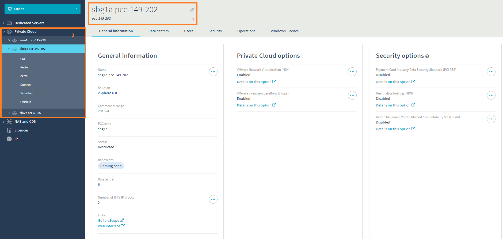
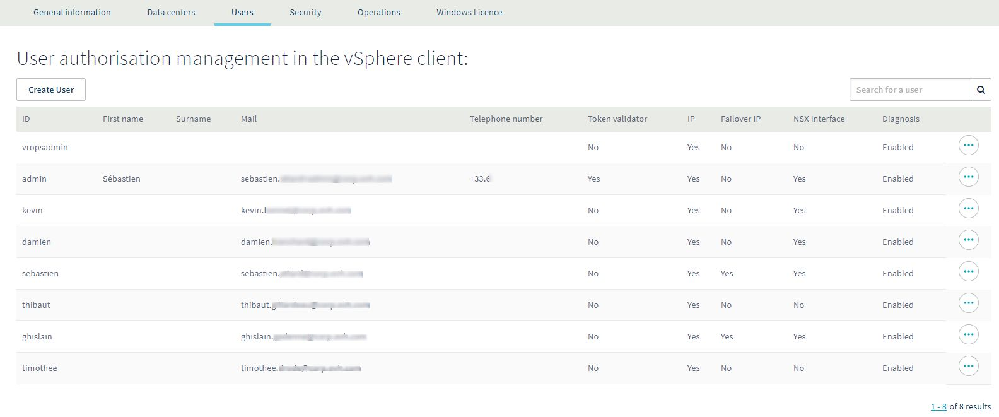
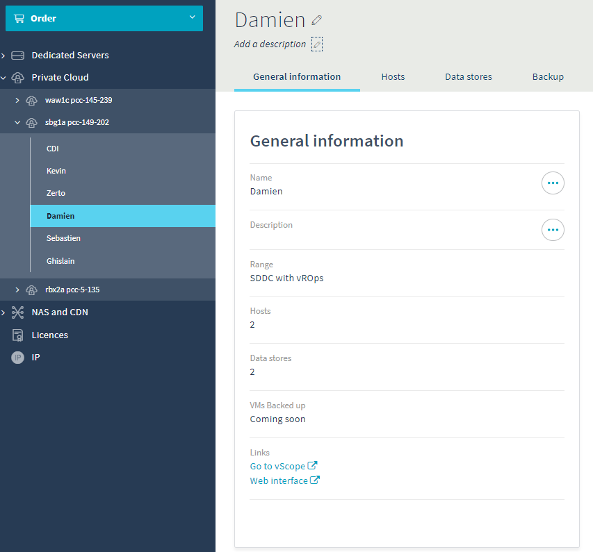

**Ultimo aggiornamento: 27/02/2018**

## Obiettivo

Lo Spazio Cliente OVH propone numerose opzioni di configurazione della tua infrastruttura Private Cloud.

**Questa guida ti mostra le funzionalità disponibili in questa interfaccia per gestire i tuoi servizi.**

## Prerequisiti

- Essere connesso allo [Spazio Cliente OVH](https://www.ovh.com/auth/?action=gotomanager){.external}, sezione `Dedicato`{.action} > `Private Cloud`{.action}
- Disporre di un servizio [Private Cloud](https://www.ovh.it/private-cloud/){.external} attivo

## Procedura

### Informazioni generali

Accedendo alla sezione `Dedicato`{.action} > `Private Cloud`{.action} del tuo [Spazio Cliente OVH](https://www.ovh.com/auth/?action=gotomanager){.external}, visualizzi le informazioni relative alla tua piattaforma:

{.thumbnail}

In alto a sinistra viene mostrato il nome e la descrizione dell’istanza (`1 nell’immagine`). Personalizzare queste informazioni è molto utile, soprattutto se hai creato più infrastrutture. 

A destra sono invece presenti diversi pulsanti (`2 nell’immagine`):

- ordine di blocchi IP, che ti reindirizzerà alla scheda `IP`{.action} 
- ordine di licenze (cPanel, Plesk..), che ti reindirizzerà alla scheda `Licenze`{.action}
- passaggio di tutte le tue risorse al forfait mensile (se questa modalità è già impostata, il pulsante non verrà mostrato)
- iscrizione alla mailing list Private Cloud
- richiesta di cancellazione del servizio (riceverai un’email per confermare l’operazione)

### Informazioni generali

Nella prima sezione sono disponibili le informazioni generali del tuo Private Cloud:

{.thumbnail}

- versione del tuo servizio
- codice della gamma commerciale
- datacenter, e più precisamente la localizzazione in cui la tua infrastruttura è installata
- modalità di accesso alla tua infrastruttura (`Libera` o `Limitata`), con le restrizioni per IP sorgente
- banda passante garantita (funzionalità disponibile a breve)
- numero di datacenter virtuali presenti nella tua infrastruttura
- numero di blocchi IP

### Opzioni

In questa sezione è mostrato lo stato delle opzioni NSX e vROps

{.thumbnail}

Nel nostro esempio le opzioni NSX e vROps sono abilitate, ma è possibile disattivarle in qualsiasi momento.

Per attivare una di queste opzioni è sufficiente cliccare sul pulsante corrispondente.

{.thumbnail}

Cliccando su `Scopri questa opzione`{.action} si aprirà una pagina informativa o una guida relativa alla funzionalità scelta.

### Datacenter

In questa scheda viene mostrato un breve riepilogo dei datacenter virtuali presenti nella tua soluzione Private Cloud:

{.thumbnail}

Descriveremo in seguito tutte le informazioni relative ai datacenter.

> [!primary]
>
> Da questa sezione è possibile aggiungere altri datacenter, senza spese aggiuntive.
> 

### Utenti

In questa scheda sono presenti tutti gli utenti autorizzati a connettersi a vSphere:

{.thumbnail}

Per creare un nuovo utente, clicca sul pulsante `Crea un utente`{.action} a destra.

Per ogni utente visualizzi queste informazioni:

- identificativo
- indirizzo email (facoltativo)
- numero di telefono (facoltativo)
- token di conferma
- stato

In questa sezione vengono mostrati anche i permessi assegnati ai diversi utenti: la colonna `IP`{.action} indica l’autorizzazione a gestire la rete OVH, `IP Failover`{.action} il diritto di gestione della rete OVH relativamente agli IP Failover.
Cliccando sull’icona a forma di ingranaggio in corrispondenza dell’utente vengono mostrate diverse opzioni, che permettono di:

- modificare le voci della tabella
- visualizzare e modificare i permessi dell’utente per datacenter
- modificare la password dell’utente
- eliminare l’utente

Vediamo in dettaglio la modifica dei permessi per datacenter:

{.thumbnail}

- `Accesso vSphere`{.action} - Permessi globali dell’utente su vSphere:

|Permesso|Descrizione|
|---|---|
|Nessuno|Nessun accesso|
|Sola lettura|Accesso in sola lettura|
|Lettura/Scrittura|Accesso in lettura/scrittura|
|Provider|Accesso riservato agli amministratori OVH|

- `Aggiungi risorse`{.action} - Permesso di aggiungere risorse supplementari tramite il plugin OVH nel client vSphere

- `Accesso al VM Network`{.action} - Gestione dei permessi nella sezione rete pubblica (`VM Network` nell'interfaccia vSphere):

|Permesso|Descrizione|
|---|---|
|Nessuno|Nessun accesso|
|Sola lettura|Accesso in sola lettura|
|Provider|Permette di configurare macchine virtuali nella rete pubblica|

- `Accesso al V(X)LAN`{.action} - Gestione dei permessi nella sezione rete privata (VxLan per Dedicated Cloud e VLAN per SDDC):

|Permesso|Descrizione|
|---|---|
Nessuno|Nessun accesso|
|Sola lettura|Accesso in sola lettura|
|Provider|Permette di configurare macchine virtuali nella rete privata|
|Amministratore|Permette di gestire i port group dello switch virtuale (creare, modificare, eliminare...)|

> [!warning]
>
> I permessi sono in fase di revisione e le informazioni fornite potrebbero variare.
> 

### Sicurezza

In questa scheda è possibile configurare la politica di accesso al tuo vCenter:

{.thumbnail}

Utilizza i pulsanti sulla destra per definire i parametri degli elementi presenti nella parte superiore e nella tabella: 

- durata massima delle sessioni di login
- numero di connessioni simultanee autorizzate
- politica di accesso, libera o limitata, con un’autorizzazione per IP sorgente (gli IP saranno indicati nella tabella)

La politica di disconnessione indica per quale utente verrà chiusa la sessione: il primo o l’ultimo ad aver effettuato l’accesso.
Nel nostro esempio le connessioni simultanee consentite sono 50. Quando il 51°utente effettua il login, il primo ad aver effettuato l’accesso viene disconnesso.
Se la politica di accesso selezionata è “Limitata” e non sono stati inseriti IP, nessun utente sarà in grado di accedere al client vSphere.  Le macchine virtuali saranno comunque accessibili.

### Operazioni

In questa scheda vengono mostrate le operazioni in corso sulla tua infrastruttura:

{.thumbnail}

È possibile verificare lo stato delle operazioni, eventuali interventi pianificati...

Se, ad esempio, non riesci ad accedere al client vSphere perché è in corso un intervento di manutenzione, potrai verificarlo da questa tab.

### Informazioni datacenter

Sulla tua infrastruttura Private Cloud possono essere presenti diversi datacenter. Per visualizzarli, seleziona il tuo servizio nel menu a sinistra:

{.thumbnail}

Per personalizzare il nome del tuo datacenter e aggiungere una descrizione, clicca sull’icona a forma di matita.
In questa interfaccia vengono mostrate le informazioni relative al datacenter selezionato: gamma (SDDC o DC), numero di host e datastore.
Per le gamme Dedicated Cloud e Software Defined Datacenter, è possibile usufruire di più datacenter nella stessa soluzione Private Cloud.

### Host

In questa scheda vengono mostrate le informazioni relative agli host del tuo datacenter.

{.thumbnail}

Per ogni host potrai visualizzare:

- nome
- profilo (M, L, L+...) 
- modalità di fatturazione (se hai scelto la fatturazione oraria, è possibile passare al forfait mensile)
- stato
- numero di ore utilizzate (informazione disponibile solo per le risorse orarie)

Per ordinare un nuovo host con forfait mensile, clicca sul pulsante a destra.

### Datastore

Le informazioni presenti in questa scheda sono simili a quelle della tab precedente:

{.thumbnail}

Per ogni datastore potrai visualizzare:

- nome
- dimensione
- modalità di fatturazione
- stato
- numero di ore utilizzate (informazione disponibile solo per le risorse orarie)

Per ordinare un nuovo datastore con forfait mensile, clicca sul pulsante a destra.

### Backup

Da questa scheda è possibile attivare la soluzione `Veeam backup` cliccando sul pulsante `Attiva il backup`{.action}:

{.thumbnail}

Per maggiori informazioni sull’opzione, accedi a [questa pagina](https://www.ovh.it/private-cloud/opzioni/veeam.xml){.external}.

### Licenze Windows

Dalla scheda `Licenza Windows`{.action} è possibile attivare sul tuo datacenter le licenze SPLA Windows cliccando sul pulsante a destra:

{.thumbnail}

Per consultare le tariffe, [clicca qui](https://www.ovh.it/private-cloud/opzioni/immagini-licenze.xml){.external}.

## Per saperne di più

Contatta la nostra Community di utenti all’indirizzo <https://www.ovh.it/community/>.
