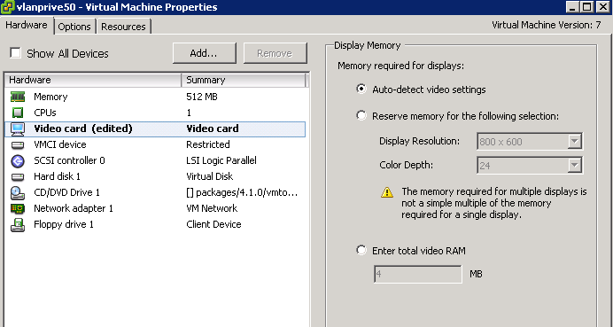

## 
In this guide we will highlight the settings that can be modified on a virtual machine ("edit settings" on VMware).

You must first create a virtual machine using the following 
guide:- 

## 
All the modifications described below must be performed from your private cloud using vSphere by right clicking on the virtual machine, then clicking "Edit Settings"

## Memory (RAM)
The allocation of RAM may be modified at any time provided that the machine is off. (VMware Hot Add gives the functionality of performing this operation on a machine that is on a from a host L).

To do this, move the cursor on screen to your desired memory:

{.thumbnail}
For instructions on Hot Add, visit 
[here](#CONFIG_AND_ADVANCED_OPTIONS)

## The processor (CPU)
You can change the number of CPUs allocated to the virtual machine when the machine is off (you can do with when the machine is on from a Host L using the VMware Hot Add functionality)

{.thumbnail}
For instructions on Hot Add, visit 
[here](#CONFIG_AND_ADVANCED_OPTIONS)

## Graphics card
You can change the following settings of the video card:

- automatic detection;
- manual resolution selection;
- the number of MBs reserved for video RAM.

{.thumbnail}

## Hard drive
You can change the virtual disk space on your machine by changing the allocated space:

{.thumbnail}
You can also select the type of drive (SATA or IDE) and the type of storage (persistent or non-persistent).

Persistent storage allows you to store data when rebooting a machine.
With non-persistent storage, the data is not maintained: if the machine is rebooted, all the data is erased.

With the "Add ..." button, you can add a second drive on the machine any time the VM is on or off.

## CD / DVD reader
It allows you to easily mount an image of your datastore:

{.thumbnail}

## IMPORTANT! ! !
It is necessary to check the "Connect at power on" so that the reader is detected and then your iso is powered.

## NIC
This allows you to choose the type of card you want to configure on the virtual machine and the connection type (or VM Network LocalportGroup).

With the VM Network you can put a virtual machine on the public network (with a RIPE IP) or on a local network between the hosts.

The LocalPortGroup only allows communication via a private network, and is limited to the host (only a single VM host can communicate with each other).

You can use the following guide for the configuration:

- 

{.thumbnail}

## General options
This option lets you change the type of machine selected when creating the VM, or to simply change the name afterwards.

## vApp Options
This option allows you to precisely define the type of IP you want or the OVF settings of the virtual machine.

## VMware Tools
This section allows you to manage the actions, of the buttons used by VMware tools.
The "Stop" button for example, can perform a shut down on the VM, or a power off.

## Advanced options
Advanced options allow you to fine tune your machine. In this section you can enable or disable the addition of hot CPU and RAM, thanks to the "Memory/CPU Hotplug". However, this option requires having at least one host L or higher.

A second option is called the "Swapfile Location". By default, OVH configures this option to place the swap file to the virtual machine directly on the host. In the case were it is a Private Cloud, it's placed on the SSD. Using this configuration, you will have better  read / write performances.

However, if for example you configure a virtual machine with 12GB of RAM, VMware will automatically place a 12GB swap file on the local storage of 30GB. The disk risks becoming full very quickly.

Also note that if you use this option, you will no longer benefit from the protection that the Hot Add functionality provides.

For this you can change the option so that the swap file is still linked to the vm and then placed on the NAS with the .vmx and .vmdk.

