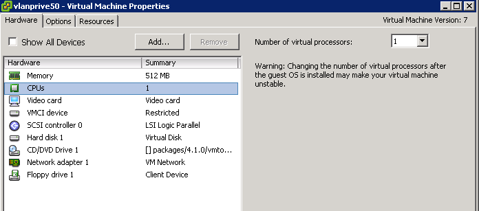

## 
In questa guida spiegheremo le possibili modifiche su una macchina virtuale (i dettagli della funzione "Modifica impostazioni" su VMware).

E 'necessario aver creato una macchina virtuale, utilizzando la seguente guida:

- 

## 
Tutte le modifiche descritte sotto devono essere realizzate dal tuo Private Cloud su vSphere, effettuando un clic destro su una macchina virtuale, e poi "Modifica Impostazioni"

## La memoria (RAM)
L'allocazione della memoria RAM può essere modificata in qualsiasi momento a condizione che questa sia spenta. (La funzionalità VMware Hot Add permette di effettuare questa operazione su una macchina accesa a partire da un host L)

Per fare questo puoi spostare il cursore sullo schermo per ottenere la memoria desiderata:

{.thumbnail}
Per l'aggiunta a caldo via Hot Add visita
[ici](#CONFIG_AND_ADVANCED_OPTIONS)

## Il processore (CPU)
E' possibile modificare il nome della CPU assegnata alla macchina virtuale quando la macchina è spenta (è possibile
farlo con una macchina accesa a partire da un Host L grazie alla funzionalità VMware Hot Add)

{.thumbnail}
Per l'aggiunta a caldo via Hot Add visita
[ici](#CONFIG_AND_ADVANCED_OPTIONS)

## La scheda grafica
Puoi definire le impostazioni della scheda video modificando:

- il rilevamento automatico;
- la selezione della risoluzione manuale;
- il numero dei MB dedicati al video sulla RAM.

{.thumbnail}

## Il disco fisso
Puoi ridefinire in qualsiasi momento lo spazio del disco virtuale sulla tua macchina modificando lo spazio allocato:

{.thumbnail}
È inoltre possibile selezionare il tipo di drive (SATA o IDE) e il tipo di storage (persistente o non persistente).

Lo storage persistente permette la conservazione dei dati
durante il riavvio di una macchina.
Lo storage non persistente, invece, ha la particolarità di non mantenere i dati: se fai un reboot della macchina, tutti i dati saranno cancellati.

Grazie ad "Aggiungi...", puoi aggiungere un secondo disco sulla macchina in qualsiasi momento, che la VM sia accesa oppure spenta.

## Il lettore CD/DVD
Ti permette di montare facilmente un'immagine del tuo datastore:

{.thumbnail}

## IMPORTANTE ! ! !
E' importante marcare la casella "Connect at power on" in modo che il lettore venga rilevato e quindi la vostra iso caricata.

## La scheda di rete
Questo ti permette di scegliere il tipo di scheda che desideri configurare sulla macchina virtuale, così come il tipo di connessione (VM Network o LocalportGroup).

Il VM Network permette di mettere una macchina virtuale sulla rete pubblica (con un IP RIPE) o su una rete locale tra gli hosts.

La LocalPortGroup permette unicamente la comunicazione attraverso una rete privata, e si limita all'host (solo le VM di uno stesso host possono comunicare tra loro).

Per la configurazione puoi utilizzare le guide seguenti:

- 

{.thumbnail}

## Opzioni generali
Questa opzione ti permette di modificare il tipo di macchina selezionata durante la creazione della VM, o semplicemente modificare il suo nome.

## Opzioni vApp
Questa opzione offre la possibilità di definire con maggiore precisione il tipo di IP desiderato o le impostazioni OVF della macchina virtuale.

## Strumenti VMware
Questa sezione permette di gestire le azioni dei tasti utilizzati dagli strumenti di VMware.
Il tasto "Stop" per esempio, può eseguire un arresto della VM, o uno spegnimento.

## Opzioni avanzate
Le opzioni avanzate ti consentono di affinare le regole della tua macchina. In questa sezione è possibile abilitare o disabilitare l'aggiunta di CPU e RAM a caldo, grazie al "Memory / CPU Hotplug". Questa opzione richiede tuttavia il possesso di almeno un host L o superiore.

Una seconda opzione porta il nome di "SwapFile Location". Per default, OVH configura questa opzione in modo da piazzare il file di swap della macchina virtuale direttamente sull'host, e quindi nel caso del Private Cloud, sui dischi SSD. Utilizzando questa configurazione, si ottiene la migliore prestazione in lettura / scrittura.

Tuttavia, se per esempio configuri una macchina virtuale con 12GB di memoria RAM, VMware piazzerà automaticamente un file di swap di 12GB sullo storage locale di 30GB. Il disco. Il disco rischia quindi di riempirsi rapidamente.

Nota inoltre che se utilizzi questa opzione, non sarà più possibile beneficiare della protezione che ti fornisce funzionalità di HA.

Per questo puoi modificare l'opzione in modo che il file di swap sia ancora legato alla VM e quindi immesso sul NAS con il .vmx e .vmdk.

