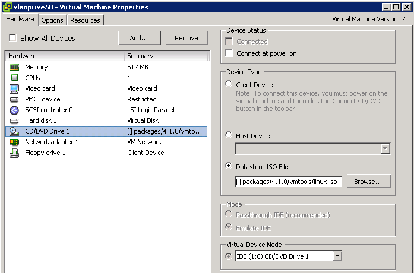
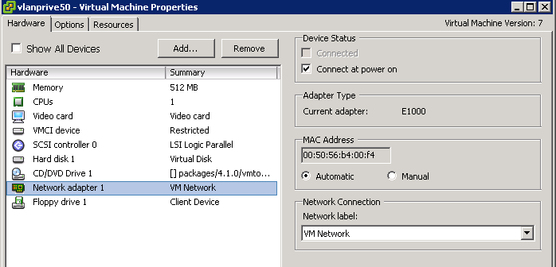

## 
In deze handleiding behandelen we, welke instellingen gewijzigd kunnen worden (details over de 'Edit Settings' functie in VMware).

U moet eerst een virtual machine aanmaken door de volgende handleiding te volgen:

- 

## 
Alle onderaan beschreven wijzigingen moeten uitgevoerd worden vanuit uw private cloud op vSphere, door rechts te klikken op een virtual machine en dan op 'Edit Settings'.

## Het (RAM) geheugen
De RAM allocatie mag ten alle tijde gewijzigd worden, zolang de machine uit staat. (Vanaf de L host geeft VMware Hot Add u de mogelijkheid, om deze operatie uit te voeren, terwijl de machine in bedrijf is).

Om dit te doen, plaatst u de cursor op het scherm naar het gewenste memory:

{.thumbnail}
Meer informatie over de allocatie terwijl de machine in bedrijf is via Hot Add, zie
[hier](#CONFIG_AND_ADVANCED_OPTIONS)

## De processor (CPU)
U kunt het aantal CPU's wijzigen, die zijn toegekend aan de virtual machine, wanneer deze is uitgeschakeld (met Hot Add kunt u dit vanaf een Host L doen, terwijl de machine aan is)

{.thumbnail}
Meer informatie over de allocatie terwijl de machine in bedrijf is via Hot Add, zie
[hier](#CONFIG_AND_ADVANCED_OPTIONS)

## De graphics card
U kunt de volgende instellingen wijzigen op de graphics card:

- Automatische detectie
- Manuele resolutie selectie
- Aantal MB's gereserveerd voor video Ram

{.thumbnail}

## De hard disk
U kunt te allen tijde de virtual disk ruimte op uw machine wijzigen, door het wijzigen van de toegekende ruimte:

{.thumbnail}
U kunt ook het type disk (SATA of IDE) kiezen, alsook het storage type (persistent of non persistent).

Met de persistente storage kunt u gegevens opslaan tijdens de reboot van een machine.
Met de non-persistente storage wordt de data niet onderhouden: na de reboot, wordt alle data gewist.

Met de 'Add...' knop, kunt u een tweede disk toevoegen op de machine, terwijl de VM aan of uit is.

## CD/DVD reader
Hiermee kunt u eenvoudig een image mounten op uw datastore:

{.thumbnail}

## BELANGRIJK!!
Het is noodzakelijk om 'Connect at power on' aan te vinken, zodat de reader wordt gedetecteerd om uw iso te laden.

## De netwerk card
Dit geeft u de mogelijkheid om het type card te kiezen, die u wilt configureren op uw virtual machine en het connectie type (VM Network of LocalportGroup).

Met het VM netwerk kunt u een virtual machine op het public netwerk zetten (met een RIPE IP) of op een lokaal netwerk tussen de hosts.

De LocalPortGroup laat alleen communicatie toe via een private netwerk en is gelimiteerd tot de host (enkel VM's van eenzelfde host kunnen communiceren met elkaar).

Raadpleeg de volgende handleiding voor de configuratie:

- 

{.thumbnail}

## Algemene opties
Met deze optie kunt u het machine type wijzigen die is geselecteerd bij het maken van de VM, of alleen maar de naam wijzigen.

## vApp Opties
Met deze optie kunt u nauwkeurig het gewenste IP type of de OVF instellingen van de virtual machine definiëren.

## VMware Tools
In dit gedeelte kunt u de acties beheren van de knoppen die door VMware tools gebruikt worden.
De 'Stop knop' kan bijvoorbeeld een VM afsluiten of uitschakelen.

## Gevanceerde opties
Met Advanced Options kunt u uw machine precies afstellen. In dit gedeelte kunt u de toevoeging van hot CPU en RAM in- of uitschakelen, dankzij de 'Memory/CPU Hotplug'. Deze optie vereist op zijn minst een host L of hoger.

Een tweede optie is genaamd: 'Swapfile location'. OVH configureert standaard deze optie, zodat uw swap file standaard direct op de host van de virtual machine wordt geplaatst. In het geval dat het een Private Cloud is, wordt het geplaatst op de SSD. Via deze configuratie krijgt u betere read/write prestaties.

Hoewel, als u bijvoorbeeld een virtual machine configureert met 12 GB RAM, zal VMware automatisch een swap file van 12 GB plaatsen op de lokale storage van 30 GB. De disk dreigt zeer snel vol te raken.

Let op, indien u deze optie gebruikt, zult u niet langer de protectie kunnen gebruiken, die Hot Add biedt.

U kunt hiervoor de optie wijzigen, zodat de swap file nog steeds is gekoppeld aan de vm en dan geplaatst wordt op de NAS met de .vmx en .vmdk.

