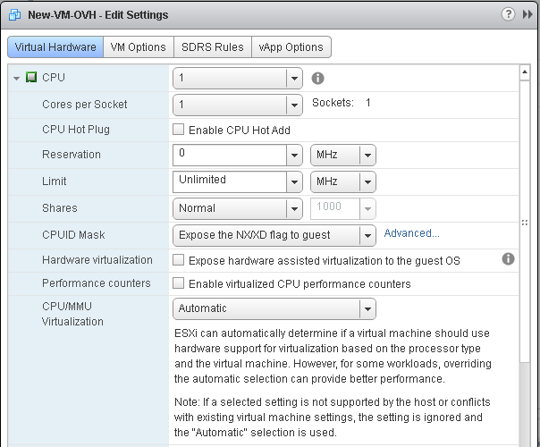
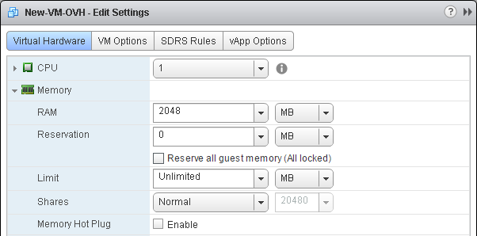
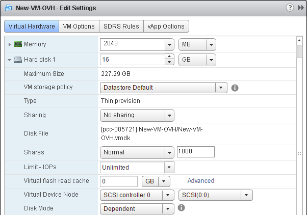
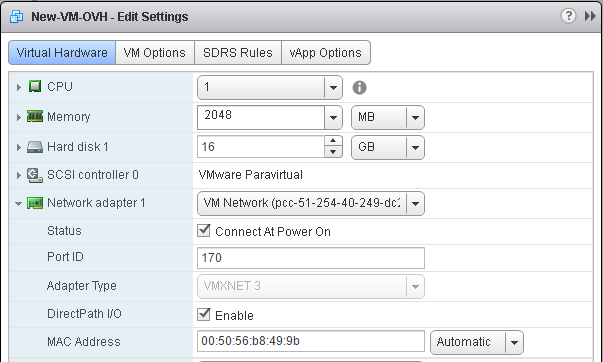

**Ostatnia aktualizacja dnia 2017-11-28**

## Wprowadzenie

Po utworzeniu, maszyna nie posiada stałych, niezmiennych zasobów. Z wyjątkiem kilku ograniczeń można je dowolnie przyporządkowywać, co sprawi, że Twoja infrastruktura będzie bardziej elastyczna.

**Ten przewodnik wyjaśnia jak zmieniać zasoby maszyny wirtualnej.**

## Wymagania początkowe

- Utworzona maszyna wirtualna.
- Połączenie z klientem vSphere.

## W praktyce

Wszystkie opisane poniżej zmiany powinny zostać wykonane z poziomu Private Cloud na vSphere po kliknięciu prawym przyciskiem na maszynę wirtualną i wybraniu `Edit Settings`{.action}. 

{.thumbnail}

W tym menu masz możliwość zwiększenia zasobów dla swojej maszyny wirtualnej. U dołu obrazka można zauważyć, że istnieje możliwość dodania urządzeń peryferyjnych, co opiszemy w dalszej części przewodnika.

### Procesor (CPU)

Liczba procesorów nie może być wyższa niż liczba dostępnych rdzeni hosta.

Jeśli Twoja maszyna wirtualna migruje na hosta, który ma mniej procesorów niż jest przydzielonych do maszyny, będzie ona w statusie `CPU ready`, co spowoduje spadek wydajności.

{.thumbnail}

Istnieje również możliwość zarezerwowania częstotliwości (minimalnej i maksymalnej) oraz wyboru liczby rdzeni na gniazdo (socket).

Po zaznaczeniu pola `Enable CPU Hot Add`{.action}, możesz zmieniać te ustawienia już po uruchomieniu maszyny wirtualnej.

W zależności od systemu operacyjnego, dynamiczne dodawanie procesorów do uruchomionego systemu („na gorąco”), może być niewłaściwie obsługiwane i powodować nieprawidłowe działanie hosta.

Można również dokonać rezerwacji, co oznacza, że do swojej maszyny wirtualnej możesz przydzielić minimalną ilość *MHz* (megaherców).

Wprowadzenie takiego limitu, domyślnie ustawionego w opcji dodawania nieograniczonych zasobów CPU, umożliwia ograniczenie procesora Twojej maszyny wirtualnej do wybranej wartości w *MHz*. Można np. ograniczyć maszynę wirtualną wykorzystywaną do rozwoju aplikacji.

### Pamięć (RAM)

Podobnie jak w przypadku procesora, pamięć (RAM) jest ograniczona do zasobów hosta.

Istnieje również możliwość rezerwacji zasobów. W ten sposób masz pewność, że Twoja maszyna wirtualna będzie dysponować zawsze zarezerwowaną minimalną ilość pamięci RAM.

{.thumbnail}

### Dysk twardy

Jeśli chodzi o dysk twardy, to możesz zwiększyć jego wielkość w zależności od wolnego miejsca w datastore, który wykorzystuje maszyna wirtualna.

{.thumbnail}

Zaleca się używanie kontrolerów SCSI zamiast IDE. Z kontrolerem IDE niemożliwe jest np. wykonanie backupu przy pomocy rozwiązania Veeam.

Możesz również wybrać tryb dysku:

- `Dependent`: dysk będzie objęty snapshotem;

- `Independent - Persistent`: umożliwia zachowanie danych po restarcie maszyny, ale dysk nie będzie objęty snapshotem;

- `Independent - Non Persistent`: nie zachowa danych: po restarcie maszyny wszystkie dane zostaną skasowane.

### Karta sieciowa

W swojej maszynie wirtualnej masz możliwość zmiany karty sieciowej, podłączenia karty przy uruchamianiu maszyny wirtualnej, zmiany typu karty, sprawdzania portu ID i swojego adresu MAC.

{.thumbnail}

Ten interfejs może Cię zainteresować w przypadku niewłaściwego działania sieci. Możesz się upewnić, że *port ID* odpowiada wprowadzonemu w zakładce `Networking`{.action} oraz `Ports`{.action} dla danej karty.

### Napęd CD/DVD

Napęd CD/DVD umożliwia np. podmontowanie obrazu ISO w Twojej maszynie wirtualnej.

{.thumbnail}

Po zakończeniu prac wymagających napędu CD/DVD, zalecane jest jego usunięcie. W innym przypadku może on przeszkadzać przy przenoszeniu maszyny wirtualnej.

### Dodawanie urządzeń peryferyjnych

U dołu tego okna masz możliwość dodawania dodatkowych urządzeń peryferyjnych.

Możesz dodawać dyski pochodzące z innego zasobu datastore lub karty sieciowe, jeśli Twoja infrastruktura wymaga korzystania z kilku sieci prywatnych.

{.thumbnail}

## Dowiedz się więcej

Przyłącz się do społeczności naszych użytkowników na <https://community.ovh.com>.

