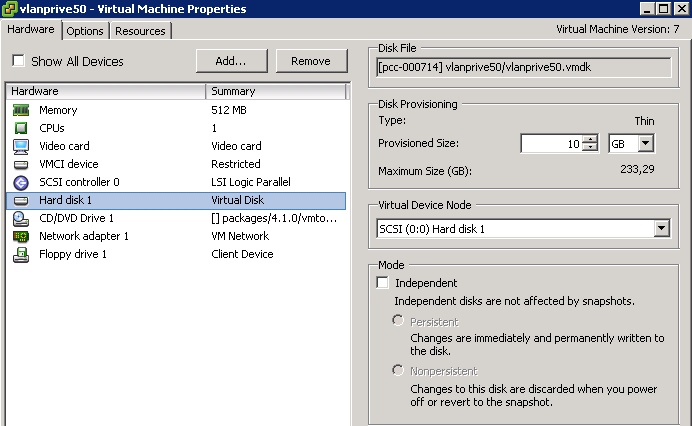

## 
Neste guia iremos explicar as modificações possíveis numa máquina virtual (função "edit settings" da VMware).

É necessário ter criado previamente uma máquina virtual, ao utilizar o seguinte guia:

- 

## 
Todas as modificações descritas aqui deverão ser realizadas a partir do seu Private Cloud no vSphere ao efetuar com um botão direito do rato na máquina virtual, e depois em "Edit Settings"

## A memória (RAM)
A alocação da memória RAM pode a qualquer momento ser modificada à condição de que a máquina esteja desligada. (A funcionalidade VMware Hot Add permite efetuar esta operação numa máquina ligada a partir de um host L).

Para tal, basta alterar com o cursos indicado no ecrão de forma a obter a memória desejada:

{.thumbnail}
Para adicionar a quente através de Hot Add queira ir [aqui](#CONFIG_AND_ADVANCED_OPTIONS)

## O processador (CPU)
É possível alterar o número de CPU ligados à máquina virtual quando a máquina está desligada (é ainda possível de o efetuar numa máquina ligada a partir do Host L graças à funcionalidade VMware Hot Add)

{.thumbnail}
Para adicionar a quente através de Hot Add queira ir [aqui](#CONFIG_AND_ADVANCED_OPTIONS)

## A placas gráfica
Poderá definir os parâmetros da placa de vídeo ao modificar:

- a deteção automática;
- a seleção de resolução manual;
- o número de MB reservados ao vídeo na RAM.

{.thumbnail}

## Disco rígido
Poderá a qualquer momento redefinir o espaço do disco virtual da sua máquina ao modificar o espaço alocado:

{.thumbnail}
É igualmente possível que selecione o tipo de disco (SATA ou IODE) assim com o tipo de armazenamento (persistente ou não persistente).

O armazenamento persistente permite a conservação dos dados aquando de um reboot de uma máquina.
O armazenamento não persistente possui a particularidade de não conversar os dados: Se efetua um reboot à máquina, todos os dados serão eliminados.

Graças ao botão "Add..", poderá adicionar um segundo disco na máquina a qualquer momento, quer a máquina esteja ligada ou desligada.

## Leitor de CD/DVD
Permite-lhe facilmente montar uma imagem do seu datastore

{.thumbnail}

## IMPORTANTE!!
É necessário clicar em "Connect at power on" de forma a que o leitor seja detetado no boot e a iso seja carregada.

## Placa de rede
Esta opção permite-lhe escolher o tipo de placa que deseja configurar na sua máquina virtual, assim como o tipo de ligação (VM Network ou LocalportGroup).

A VM Network permite que uma máquina esteja na rede pública (com um IP RIPE) ou numa rede local entre os hosts.

O LocalPortGroup permite unicamente uma comunicação através de rede privada, e limita-se ao host (apenas as VMS de um mesmo host podem comunicar entre elas).

Poderá utilizar o seguinte guia para efetuar a configuração:

- 

{.thumbnail}

## Opções gerais
Esta opção permite-lhe modificar o tipo de máquina seleccionada aquando da criação da VM, ou simplesmente modificar o nome da mesma.

## vAPP Options
Esta opção dá-lhe a possibilidade de definir de uma forma mais precisa o tipo de IP que deseja, ou os parâmetros OVF da máquina virtual.

## VMware Tools
Esta opção permite-lhe gerir as ações dos botões utilizados pelas ferramentas VMware.
O botão "Stop" por exemplo, pode efetuar um shutdown na VM, ou um power off.

## Opções avançadas
As opções avançadas permite-lhe definir as regras da sua máquina. Nesta parte, poderá ativar ou desativar a adição de CPU ou RAM a quente, graças à opção "Memory/CPU Hotplug". Esta opção necessita, no entanto, que possua um host L ou superior.

Uma segunda opção têm o nome de "SwapFile Locastion". Por defeito, a OVH configura esta opção de forma a introduzir o ficheiro de swap na máquina virtual diretamente no host, e no caso do Private Cloud, nos discos SSD. Ao utilizar esta configuração, obtém melhores performances ao nível de leitura/escrita.

Se por exemplo configurar uma máquina virtual com 12GB de memória RAM, a VMware irá introduzir automaticamente um ficheiro de swap de 12GB no local de armazenamento de 30GB. O disco corre o risco de ficar rapidamente cheio.

De notar que se utiliza esta opção, não poderá beneficar da proteção que lhe oferece a funcionalidade HA.

Para tal, poderá modificar a opção de forma a que o ficheiro de swqp esteja ligado à VM e fique localizado na NAS com o .vmx e .xmdk.

