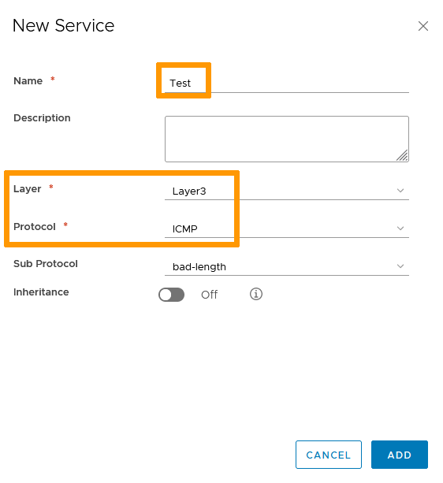
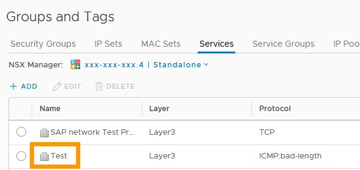
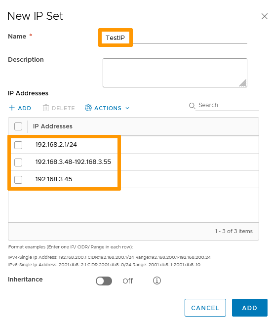
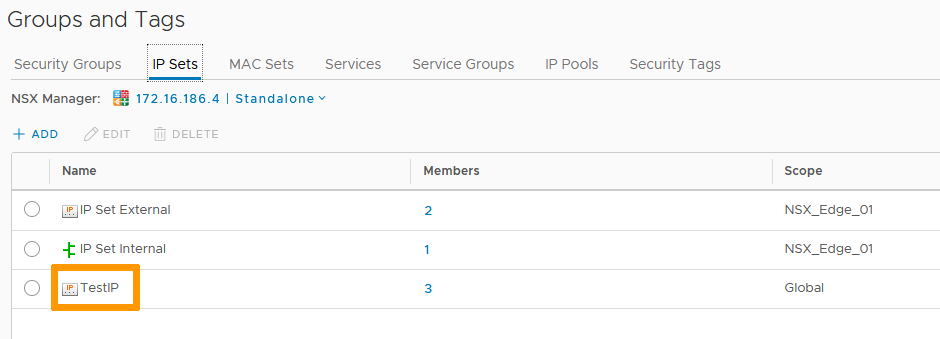
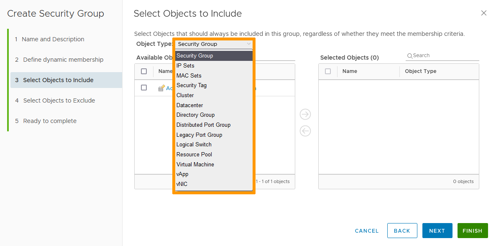
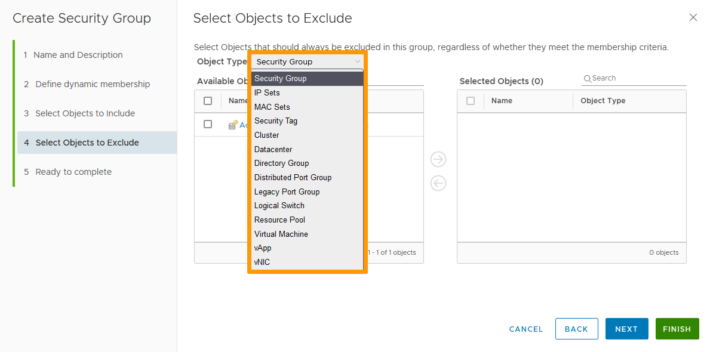
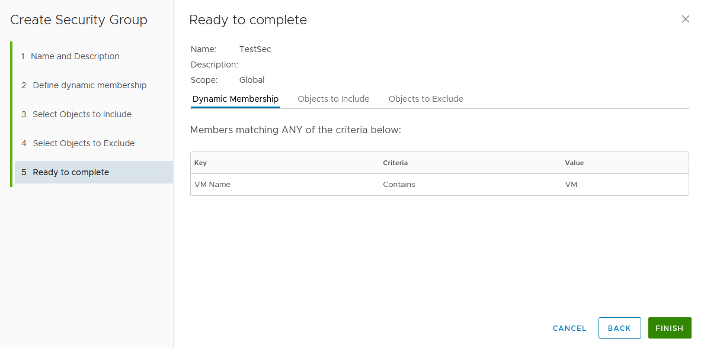

**Dernière mise à jour le 24/11/2021**

## Objectif

Dans le monde de la sécurité réseau, un objet est une entité singulière à laquelle des règles peuvent être appliquées. *Exemples: addresse IP, nom de machine, service, port réseau, adresse MAC...*     

Créer des groupes d'objets permet de limiter le nombre de règles et de simplifier leur gestion.

**Ce guide explique la création/gestion des groupes d'objets NSX.**

## Prérequis

- Être contact administrateur de l'infrastructure [Hosted Private Cloud](https://www.ovhcloud.com/fr/enterprise/products/hosted-private-cloud/), afin de recevoir les identifiants de connexion.
- Avoir un identifiant utilisateur actif avec les droits spécifiques pour NSX (créé dans l'[espace client OVHcloud](https://www.ovh.com/auth/?action=gotomanager&from=https://www.ovh.com/fr/&ovhSubsidiary=fr)).
- Avoir déployé une [NSX Edge Services Gateway](https://docs.ovh.com/fr/private-cloud/comment-deployer-une-nsx-edge-gateway/).

## En pratique

### Accès à l'interface

Dans le menu vSphere, rendez-vous dans le tableau de bord `Mise en réseau et sécurité`{.action}.

{.thumbnail}

Sur la gauche de l'écran, naviguez jusqu'à la section `Groupes et balises`{.action}.

La section offre 7 types de groupes:

- Balises de sécurité
- Pools d'adresses IP
- Groupes de services 
- Services
- Ensemble d'addresses MAC
- Ensemble d'addresses IP
- Groupes de sécurité

{.thumbnail}

### Balises de sécurité

Les balises sont des metadonnées ajoutées aux VMs pour facilement les identifier et les classer.    

Pour en créer une, allez dans la section `Balises de sécurité`{.action} et cliquez sur `+ Ajouter`{.action}.

{.thumbnail}

Une balise est simplement un mot clé. Vous pouvez la définir à votre guise.

{.thumbnail}

Une fois créée, selectionnez-la et cliquez sur `Attribuer une VM`{.action}

{.thumbnail}

Choisissez la(les) VM(s) à attribuer puis utilisez la flèche pour les faire glisser dans la partie « Objets Sélectionnés ».

Cliquez ensuite sur `OK`{.action}.

{.thumbnail}

Votre balise de sécurité est alors paramétrée et fonctionnelle.

{.thumbnail}

### Pools d'adresses IP

Un Pool d'adresses IP est une plage d'addresses IP.     

Pour en créer un, allez dans la section `Pools d'adresses IP`{.action} et cliquez sur `+ Ajouter`{.action}.

{.thumbnail}

Le pool a besoin d'un nom, d'une passerelle et d'une longueur de préfixe pour être utilisable. Les informations DNS sont optionnelles.

Les IPs doivent être ajoutées sous forme de plage (xxx.xxx.xxx.xxx-xxx.xxx.xxx.xxx). 

Cliquez sur `Ajouter`{.action}.

{.thumbnail}

Votre pool d'adresses IP est alors paramétré et fonctionnel.

{.thumbnail}

### Groupes de services

Un groupe de services est un ensemble de services et/ou groupes de services existants.     

Pour en créer un, allez dans la section `Groupes de services`{.action} et cliquez sur `+ Ajouter`{.action}.

{.thumbnail}

Le groupe nécessite un nom et l'addition d'objet(s).

Les objets possibles sont de deux types :

- Groupes de services
- Services

Vous pouvez surligner des objets des deux types et les faire glisser dans la section des « Objets Sélectionnés ».

Cliquez ensuite sur `Ajouter`{.action}.

{.thumbnail}

Votre groupe de services est alors paramétré et fonctionnel.

{.thumbnail}

### Services

Les services sont des applications qui opèrent sur les couches réseau et supérieures. Ils sont généralement liés à des ports réseau et des protocoles pour leur communication.

Pour en créer un, allez dans la section `Services`{.action} et cliquez sur `+ Ajouter`{.action}.

{.thumbnail}

Les services les plus communs sont déjà listés mais vous pouvez en définir de nouveaux, pour plus de précision ou pour créer des ensembles de ports spécifiques.

Cliquez ensuite sur `Ajouter`{.action}.

{.thumbnail}

Votre service est alors paramétré et fonctionnel.

{.thumbnail}

### Ensemble d'addresses MAC

Une adresse MAC est l'adresse physique d'un composant réseau.     

Pour créer un ensemble d'addresses MAC, allez dans la section `Ensemble d'addresses MAC`{.action} et cliquez sur `+ Ajouter`{.action}.

{.thumbnail}

Nommez votre ensemble et entrez les addresses.

Cliquez ensuite sur `Ajouter`{.action}.

{.thumbnail}

Votre ensemble d'addresses MAC est alors paramétré et fonctionnel.

{.thumbnail}

### Ensemble d'addresses IP

Pour créer un ensemble d'addresses IP, allez dans la section `Ensemble d'addresses IP`{.action} et cliquez sur `+ Ajouter`{.action}.

{.thumbnail}

Nommez votre ensemble et entrez les addresses.        

Les IPs peuvent être tapées de façon unique (xxx.xxx.xxx.xxx), en plage (xxx.xxx.xxx.xxx-xxx.xxx.xxx.xxx) ou en CIDR (xxx.xxx.xxx.x/xx).

Cliquez ensuite sur `Ajouter`{.action}. 

{.thumbnail}

Votre ensemble d'addresses IP est alors paramétré et fonctionnel.

{.thumbnail}

### Groupes de sécurité

Un groupe de sécurité est un ensemble d'objets réseau.     

Pour en créer un, allez dans la section `Groupes de sécurité`{.action} et cliquez sur `+ Ajouter`{.action}.

{.thumbnail}  

Nommez l'ensemble puis cliquez sur `Suivant`{.action}.     

{.thumbnail}

Les groupes de sécurité peuvent être assignés dynamiquement. Vous pouvez définir une ou de multiples variables pour assigner/retirer automatiquement des objets à un groupe.    

> [!primary]
>
> Cette fonctionnalité n'est pas obligatoire et peut être laissée vide.

Cliquez sur `Suivant`{.action}.

{.thumbnail}

Ajoutez tous les Groupes/Objets à inclure dans la section « Objets Sélectionnés ».

Cliquez sur `Suivant`{.action}.

{.thumbnail}

S'il y a des objets spécifiques à laisser de coté (un seul membre d'un groupe ajouté précédement par exemple), ajoutez-le aux objets à exclure.

Cliquez sur `Suivant`{.action}.

{.thumbnail}

Vérifier vos paramètres et cliquez sur `Terminer`{.action}.

{.thumbnail}

Votre groupe de sécurité est à présent paramétré et fonctionnel.

{.thumbnail}

## Aller plus loin

Échangez avec notre communauté d'utilisateurs sur <https://community.ovh.com>.
