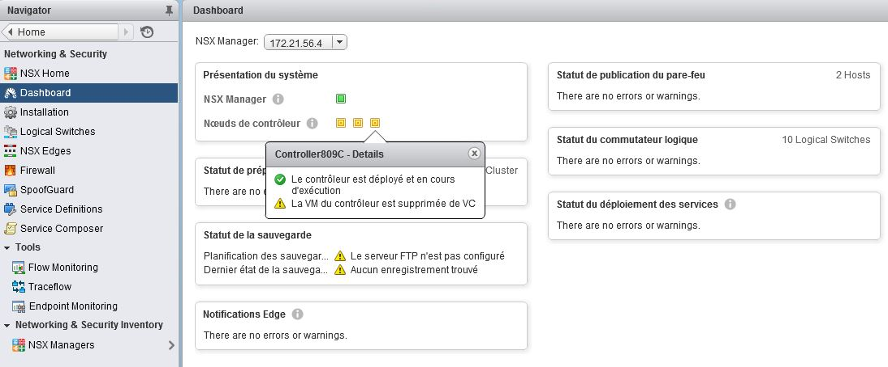

**Dernière mise à jour le 28/12/2017**

## Objectif

Dans votre interface NSX, le message *VM du contrôleur supprimée* peut apparaître.

**Ce guide vous explique comment le comprendre**.

## Prérequis

- Disposer de l'option NSX.
- Avoir créé un utilisateur avec les [droits d'accès NSX](https://docs.ovh.com/fr/private-cloud/changer-les-droits-d-un-utilisateur/){.external}.

## En pratique

Depuis [l'interface NSX](https://docs.ovh.com/fr/private-cloud/acceder-a-l-interface-de-gestion-nsx/), partie `Installation`{.action}, le message d'erreur *VM du contrôleur supprimée* peut apparaître sous le nom du contrôleur :

Cela vient du fait qu'OVH n'héberge pas de contrôleurs sur votre infrastructure, mais sur une infrastructure de gestion interne distincte afin de ne pas consommer de ressources sur la vôtre.

Dans le fonctionnement standard de NSX, il est prévu que les contrôleurs se trouvent sur le même datacenter que vos machines virtuelles, ce qui explique cette erreur. Le fonctionnement de votre machine ne sera pas affecté par ce message.

Dans l'interface NSX, assurez-vous simplement que le statut des contrôleurs est `Connecté`. Si c'est le cas, votre machine est fonctionnelle.

> [!warning]
>
> La résolution de cette erreur via le bouton `Résoudre`{.action} provoque la suppression des contrôleurs de votre infrastructure, ce qui perturbera l'utilisation de NSX ainsi que celle du réseau de l'infrastructure. Nous vous conseillons donc de ne pas effectuer cette action. La gestion des contrôleurs NSX reste à la charge d'OVH.
> 

Cela explique également l'alerte sur le tableau de bord NSX :

## Aller plus loin

Échangez avec notre communauté d'utilisateurs sur <https://community.ovh.com>.