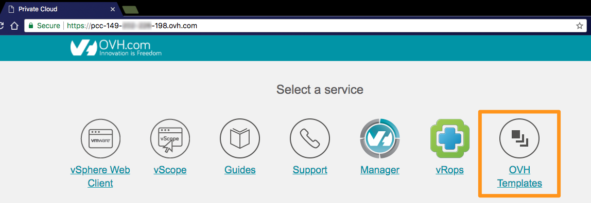

> [!primary]
> Questa traduzione è stata generata automaticamente dal nostro partner SYSTRAN. I contenuti potrebbero presentare imprecisioni, ad esempio la nomenclatura dei pulsanti o alcuni dettagli tecnici. In caso di dubbi consigliamo di fare riferimento alla versione inglese o francese della guida. Per aiutarci a migliorare questa traduzione, utilizza il pulsante "Modifica" di questa pagina.
>

**Ultimo aggiornamento: 12/10/2020**

## Obiettivo

OVHcloud propone templates Linux, Windows Server e Windows SQL server (in formato OVF) che puoi distribuire direttamente dal tuo client Web (HTML 5).

Le VM Windows implementate a partire da un template utilizzano automaticamente le licenze SPLA fornite da OVHcloud. Il deploy di una VM Windows attiverà automaticamente una fatturazione aggiuntiva.

**Questa guida ti spiega dove trovare i file immagine e come procedere all’installazione.**

> [!primary]
> 
> Per trovare le tariffe delle immagini proposte da OVHcloud, visita la pagina [Immagini e Licenze](https://www.ovhcloud.com/it/enterprise/products/hosted-private-cloud/images-licenses/){.external}.
>

## Prerequisiti

- Avere accesso al client Web (HTML5)
- [Avere attivato le licenze di Windows](../manager-ovh-private-cloud/#licenze-windows) dal tuo [Spazio Cliente OVHcloud](https://www.ovh.com/auth/?action=gotomanager&from=https://www.ovh.it/&ovhSubsidiary=it){.external} (scheda `Licenza Windows`{.action} del datacenter) 

## Procedura

### Recupera l’URL del template OVF

Da un browser, vai alla home del tuo Private Cloud e clicca su `OVH Template`{.action}.

{.thumbnail}

Nella schermata `OVH Templates` che appare, potete accedere ai dettagli dei templates Linux, Windows e SQL proposti. 

Seleziona il template, si aprirà una finestra che ti proporrà i link che ti serviranno per il deploy in funzione della tua versione di vSphere.

{.thumbnail}

### Installa il template OVF

Una volta connesso al client Web vSphere, vai alla pagina `Host and Clusters`{.action}, clicca con il tasto destro sul tuo datacenter e successivamente su `Deploy OVH Template..`{.action}.

{.thumbnail}

Non appena visualizzi il menu contestuale, puoi iniziare a personalizzare l’installazione. Nel primo step, è necessario aggiungere il link che hai recuperato in precedenza:

{.thumbnail}

Lo step successivo ti permette di scegliere il datacenter:

{.thumbnail}

In seguito scegli il cluster nel quale verrà installata la macchina virtuale:

{.thumbnail}

Trovi tutti i dettagli del template e, in particolare, la password predefinita. Per motivi di sicurezza, è importante cambiarla al momento dalla prima connessione:

{.thumbnail}

Scegli il datastore nel quale verrà archiviata la macchina virtuale, così come il formato del disco: 

{.thumbnail}

Scegli la rete da utilizzare.

{.thumbnail}

Ora che l’operazione è quasi terminata, puoi visualizzare un riepilogo della configurazione:

{.thumbnail}

Dopo aver cliccato su `Finish`{.action}, viene creato un task per poter seguire l’installazione:

{.thumbnail}

Una volta terminata l’installazione, puoi chiudere la finestra.

Puoi ritrovare nel tuo inventario la macchina virtuale appena installata. 

{.thumbnail}

### Completamento dell'installazione per SQL Server

Avvia la tua macchina virtuale con la massima semplicità e apri la console.

Apri la sessione Windows e inserisci il nome della tua istanza SQL, la password e i giochi di carattere desiderati nella finestra prevista a tal fine.

{.thumbnail}

> [!primary]
> 
> Ti consigliamo di impostare una password conforme a questi criteri:
> 
> * Contenere almeno otto caratteri.
> * Contenere almeno tre tipi di caratteri (maiuscole, minuscole, cifre, caratteri speciali).
> * non essere tratta dal dizionario
> * Non includere informazioni personali (nome, cognome o data di nascita)
>

Una volta inserite le informazioni, clicca su `OK`{.action}.

Si aprirà una finestra con l'immagine del deploy. Alla fine del processo si aprirà un'ultima finestra che ti informerà del successo del deploy.

Clicca di nuovo su `OK`{.action} per completare l'installazione e riavviare la macchina virtuale.

A seguito di questo riavvio, potrai iniziare ad utilizzare la tua macchina virtuale.

## Per saperne di più

Contatta la nostra Community di utenti all’indirizzo <https://community.ovh.com/en/>.
