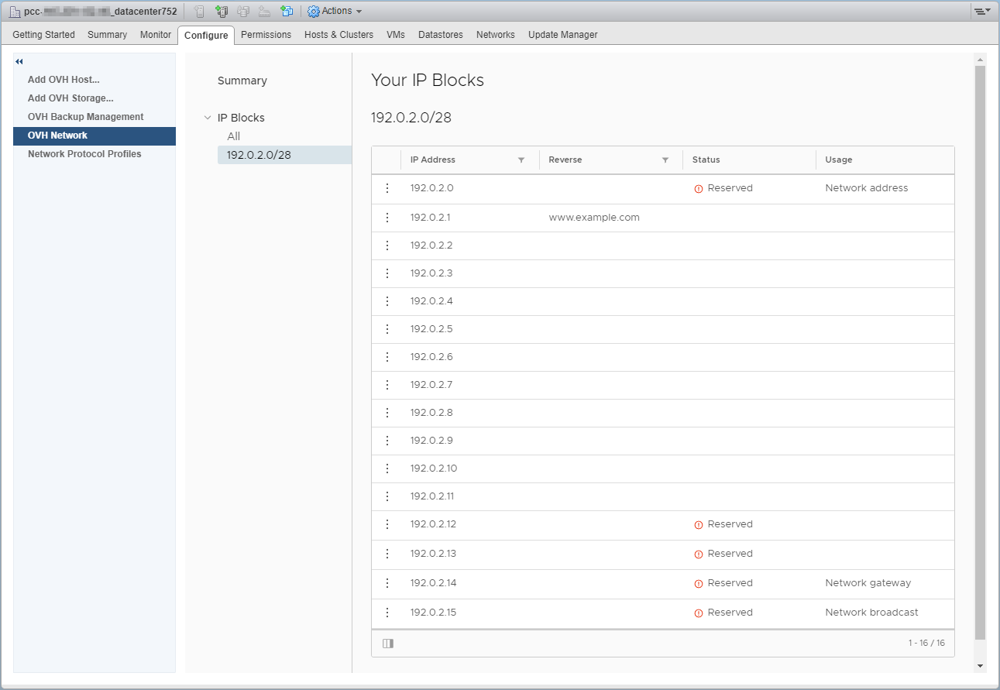

**Poslední aktualizace 25/09/2018**

## Cíl

Plugin OVH Network byl vyvinut společností OVH. Jeho účelem je zprostředkování přehledné správy IP adres asociovaných s řešením Private Cloud.

**Zjistěte, jak používat plugin OVH Network v rámci řešení Private Cloud.**

## Prerekvizity

* [Private Cloud OVH](https://www.ovh.cz/private-cloud/){.external}.
* [Blok IP adres](https://www.ovh.cz/dedikovane_servery/ip_failover.xml){.external} asociovaný s řešením [Private Cloud](https://www.ovh.cz/private-cloud/){.external}.
* Přístup do rozhraní vSphere.

## Postup

Po přihlášení do rozhraní vSphere rozklikněte nabídku `Host and Cluster`{.action} a vyberte datacentrum či cluster infrastruktury. Klikněte na tlačítko `Manage`{.action} a vyberte `OVH Network`{.action}.

{.thumbnail}

Zobrazí se nabídka `Summary`, obsahující základní informace o jednotlivých blocích IP adres.

{.thumbnail}

Nabídka **IP Blocks** obsahuje seznam IP adres daného bloku. Následující IP adresy prosím nepoužívejte pro konfiguraci a vysokou dostupnost svých služeb:

* První IP adresa, oznamující daný blok routeru.
* Poslední IP adresa, vyhrazená pro **broadcast**.
* Předposlední IP adresa, sloužící jako Vaše **gateway**.
* 2 IP adresy stojící v seznamu ihned před gateway adresou, které jsou na routerech používány jako **HSRP** (Hot Standby Router Protocol).

{.thumbnail}

OVH plugin je na používané veřejné IP adresy zapotřebí upozornit. Toho lze dosáhnout prostřednictvím ARP požadavku (_arping_), odeslaného z virtuálních strojů, které tyto adresy používají. Upozornění: pokud není ARP protokol autorizován, některé konfigurace s virtuálním firewallem mohou bránit doručování MAC adres.

Následně můžete nakonfigurovat své reverzní IP (například pro mailový server). Tuto akci lze rovněž provést prostřednictvím [Zákaznického prostoru OVH](https://www.ovh.com/auth/?action=gotomanager){.external} či [OVH API](https://api.ovh.com/){.external}. U příslušné IP adresy klikněte na ikonku tří teček a vyberte volbu `Edit Reverse`{.action}.

{.thumbnail}

Zadejte reverzní adresu a klikněte na tlačítko `Confirm`{.action}.

{.thumbnail}

Zadaná hodnota se následně zobrazí ve druhém sloupci tabulky.

{.thumbnail}

## Kam dál

Sdílejte své zkušenosti s uživatelskou komunitou na <https://community.ovh.com/en/>.
