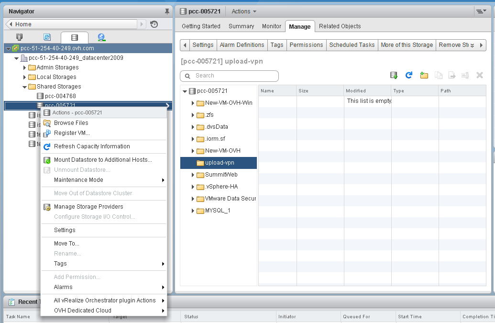

**Ostatnia aktualizacja dnia 2018-11-14**

## Wprowadzenie

Połączenie SFTP z zasobami datastore umożliwia dodawanie plików lokalnych do infrastruktury. Połączenie takie jest możliwe z interfejsu graficznego za pomocą programu typu FileZilla, dostępnego z Windowsa i Maca. Z Linuxa można natomiast połączyć się za pomocą wiersza poleceń.

Ten system pozwala na dostęp jedynie do folderu upload-vpn w przestrzeni dyskowej (na datastore). Przy połączeniu tą metodą pliki umieszczone poza tym folderem nie będą dostępne.

**Niniejszy przewodnik objaśnia jak połączyć się przez protokół SFTP z interfejsu graficznego lub z wiersza poleceń.** 

## Wymagania wstępne

- Aktywny użytkownik utworzony w Panelu klienta.


## W praktyce

### Połączenie z interfejsu graficznego

W kliencie FTP (tutaj na przykładzie programu FileZilla) należy wprowadzić następujące wartości:

```
Host: [sftp://pcc-xxx-xxx-xxx-xxx.ovh.com] / Login : user / Hasło : password
```

{.thumbnail}

Po połączeniu, po lewej stronie znajduje się lokalne urządzenie, a po prawej datastore:

{.thumbnail}


### Połączenie z okna terminala

W oknie terminala sprawdzić, czy zainstalowane jest polecenie `sftp` wpisując:

```sh
sftp
```

Polecenie dla połączenia jest następujące:

```sh
sftp user@pcc-xxx-xxx-xxx-xxx.ovh.com
```

Zostaniesz następnie poproszony o podanie hasła.

Po połączeniu, za pomocą polecenia `ls` możesz wylistować dostępne zasoby datastore:

```sh
sftp> ls pcc-000714
```

Do znalezionego za pomocą poprzedniego polecenia zasobu dyskowego można przejść następująco:

```sh
sftp> pcc-000714
```
W celu przesłania plików z urządzenia lokalnego do zasobu dyskowego (datastore) należy użyć polecenia `put`:


```sh
sftp> put /home/ubuntu-11.10-desktop-i386-fr.iso
/datastore/pcc-000714/ubuntu-11.10-desktop-i386-fr.iso
```

W celu przesłania plików z zasobu dyskowego(datastore) do urządzenia lokalnego należy użyć polecenia `get`:


```sh
sftp> get /datastore/pcc-00714/ubuntu-16.04-desktop-amd64.iso /home/
```

Polecenie ‘exit’ powoduje zamknięcie połączenia.


### Przeglądanie katalogów w interfejsie vSphere

W interfejsie vSphere, w folderze `upload-vpn` możesz zobaczyć wysłaną zawartość przechodząc do zasobu dyskowego (datastore) (kliknięcie prawym przyciskiem myszy na `Browse File`{.action} przy właściwym datastore):

{.thumbnail}


## Sprawdź również

Przyłącz się do społeczności naszych użytkowników na <https://community.ovh.com>.

