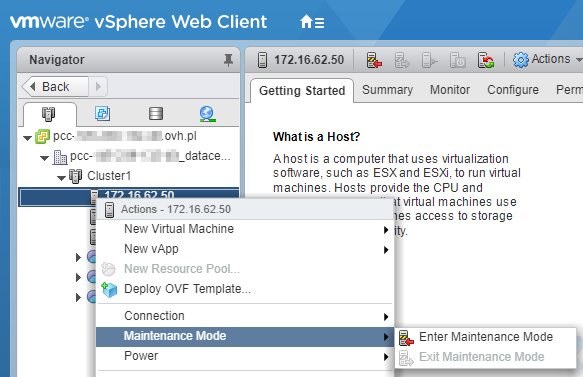

**Dernière mise à jour le 08/07/2018**

## Objectif

Il peut être utile de supprimer un hôte de votre Cluster par exemple pour nous rendre un "spare" fourni gratuitement et non utilisé ou pour évoluer dans une gamme supérieure.

**Ce guide vous explique comment retirer en toute sécuriter un hôte de votre infrastructure.**

## Prérequis

* Posséder une offre [Private Cloud](https://www.ovh.com/fr/private-cloud/){.external}.
* Accéder à l’interface de gestion vSphere.

## En pratique

La suppression d’un hôte se déroule en deux étapes : la mise en mode maintenance de l’hôte et la suppression en elle même.

### Le Mode Maintenance

Dirigez-vous sur votre client vSphere, dans l’inventaire de vos hôtes & Cluster et sélectionnez l’hôte concerné avec un simple clic droit, `Maintenance Mode `{.action} et `Enter Maintenance Mode`{.action}. Aucune inquiétude, si jamais des machines virtuelles sont en fonctionnement sur cet hôte, elles seront automatiquement enregistrés sur un autre hôte présent dans votre Cluster (Mode HA & DRS activé).

{.thumbnail}

****

Vous aurez accès à une fenêtre vous permettant de confirmer le passage en maintenance.

{.thumbnail}

****

Vous pouvez suivre la progression du passage en mode maintenance dans la zone "Recent Tasks"

{.thumbnail}

#### La suppression

L’hôte est maintenant en mode maintenance, fait un clic droit sur celui-ci et `OVH Private Cloud`{.action} en enfin `Remove OVH Host`{.action}

{.thumbnail}

****

Dans le pop-up, confirmez la suppression avec `Next`{.action}

{.thumbnail}

****

La demande de retrait est bien prise en compte.

{.thumbnail}

Vous pouvez suivre la progression du passage en mode maintenance dans la zone "Recent Tasks"

{.thumbnail}

L’hôte se supprime ensuite et n’est plus visible sous quelques minutes. Veuillez noter que la suppression passera en erreur si le moindre répertoire/fichier qui n’était pas présent initialement sur le stockage local de l’hôte à été ajouté. Seuls les répertoires de base et les fichiers de vSwap ne bloquent pas la suppression de l’hôte.

## Aller plus loin

Échangez avec notre communauté d’utilisateurs sur <https://community.ovh.com/>.
