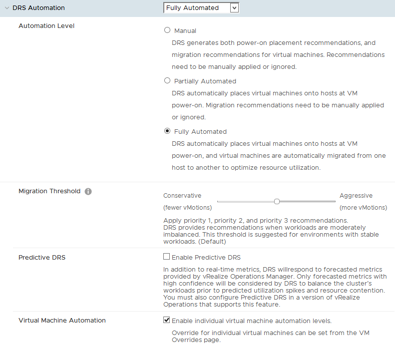

**Last updated Apr. 30th 2020**

## Objective

The Distributed Resource Scheduler (DRS**) function is available in a **VMware** cluster, allowing load balancing of hosts by moving virtual machines automatically (vMotion). It will allocate VMs to the different hosts in the cluster based on their uses and resources.

**This guide explains the setting of this function.**

## Instructions

Starting from the fact that **DRS*** will allow us to better allocate resources it will proceed or advise us to move VMs to a Host or Pool (better suited) of our cluster.

{.thumbnail}

### Activation

DRS is enabled by default in the first cluster that OVHcloud provides you with when we deliver your Hosted Private Cloud.
If a new cluster is created, you can enable it when it is created, or after.

If DRS is not enabled in your cluster, go to the `Configure`{.action} tab of your cluster and then to the `vSphere DRS`{.action} tab available in `Services`{.action}.

Click `Edit`{.action} and slide the cursor to enable the DRS feature.

{.thumbnail}

### Settings

In the same settings editing window, you will find 4 categories of options.

#### Automation

The Automation Level have 3 different levels :

- **Manual** : DRS generates both power-on placement recommendations, and migration recommendations for virtual machines. Recommendations need to be manually applied or ignored.
- **Partially Automated** : DRS automatically places virtual machines onto hosts at VM power-on. Migration recommendations need to be manually applied or ignored.
- **Fully Automated** : DRS automatically places virtual machines onto hosts at VM power-on, and virtual machines are automatically migrated from one host to another to optimize resource utilization.

It is also possible to set a migration threshold more or less aggressive on automated modes.

The "Predictive DRS" option allows you to perform migrations based on the forecast measurements returned by vROps.
vROps is mandatory for this DRS option.

Finally, virtual machine automation allows you to configure specific DRS settings for some VMs in the `VM Overrides`{.action} tab of the `configuration`{.action} section (some VMs may have a partially automatic migration mode while the cluster will be fully automated).

{.thumbnail}

#### Additional Options

You can configure 3 additional options in the DRS setting :

* **VM Distribution** : For availability, distribute a more even number of virtual machines across hosts.
* **Memory Metric for Load Balancing** : Load balance based on consumed memory of virtual machines rather than active memory.
This setting is only recommended for clusters where host memory is not over-committed.
* **CPU Over-Commitment** :  Limit CPU overcommitment for all hosts in the cluster. This setting will create a virtual CPU on a primary physical CPU ratio limit (vCPU:pCPU) implemented on each ESXi host.

{.thumbnail}

#### Power Management

> [!warning]
>
> This option **must** always be **disabled**.
> 

Its primary utility is to turn off hosts in your infrastructure if DRS deems that you do not need them in your operation, while satisfying the tipping level requested by HA.
At OVHcloud, our monitoring will detect this extinction as abnormal and create a datacenter intervention.

#### Advanced Options

Multiple advanced configuration settings can be used in your DRS cluster.

Here are some examples:

|Advanced Option Name|Description|Default value|Most aggressive value|
|:---|:---|:---|:---|
|UseDownTime|If cost analysis should take into account the workload impact of possible memory stalls during migration|1|0 (no impact consideration)|
|IgnoreDownTimeLessThan|Threshold (in seconds) to discard cumulative migration stall times in cost analysis (can be increased if VM workloads are not sensitive to memory stalls during migration).|1|A large number (not including downtime)|
|MinImbalance|Used to calculate target imbalance|50|0|
|MinGoodness|Minimal improvement in cluster imbalance required for each move|Adaptive|0 (All vMotion is considered)|
|MaxMovesPerHost|Maximum number of movements per recommended host per invocation|Adaptive|0 (No limits)|

{.thumbnail}

### DRS rules

In the `Configuration`{.action} section you can find the management of `VM/host rules`{.action} :

- **Keep Virtual Machines Together** : VMs are on the same host
- **Separate Virtual Machines** : Separate VMs on separate hosts within a single Cluster
- **Virtual Machines to Hosts** : VMs that are members of the VM group of the specified cluster must run on the specified host group. It is necessary to create VM and host groups in the `VM/Host Groups`{.action} tab.

The fourth rule, **Virtual Machines to Virtual Machines** is explained in our guide on [vSphere HA](https://docs.ovh.com/gb/en/private-cloud/vmware-ha-high-availability/){.external}.

## Go further

Join our community of users on <https://community.ovh.com/en/>.
