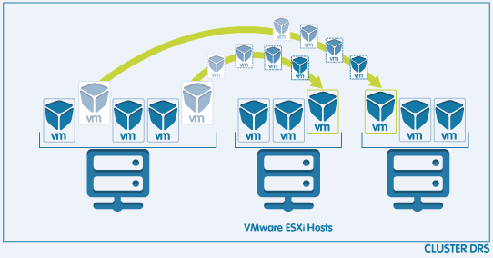
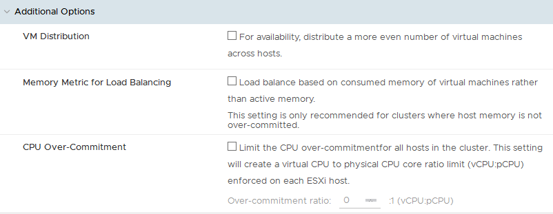

**Dernière mise à jour le 19/02/2018**

## Objectif

La Fonction **DRS** (Distributed Ressource Scheduler) est disponible dans un cluster **VMware**, cette fonction permet d'équilibrer la charge des hôtes grâce au déplacement des machines virtuelles de manière automatique (vMotion). Elle va répartir les VMs sur les différents hôtes du cluster en fonction de leurs utilisations et de leurs ressources.

**Ce guide explique le paramètrage de cette fonction**

## En pratique

En partant sur le fait que **DRS** nous permettra de mieux répartir les ressources il va procéder ou nous conseiller le déplacement des VMs sur un Host ou un Pool(mieux approprié) de notre cluster.

{.thumbnail}

### Activation

DRS est activé par défaut dans le cluster de base qu'OVH vous fournit lors de la livraison de votre Cloud Privé.
En cas de création d'un nouveau cluster, vous pouvez l'activé, lors de la création de celui-ci, ou après.

Si dans votre cluster, DRS n'est pas activé, rendez vous dans l'onglet `Configure` de votre cluster puis sur l'onglet `vSphere DRS` disponible dans la rubrique `Services`.

Cliquez sur `Edit`{.action} et cochez la case pour arctiver la fonctionnalité DRS.

{.thumbnail}

### Paramètres 

Dans la même fenêtre d'édition des paramètres, vous retrouverez 4 catégories d'options.

#### L'automatisation

Le premier paramètre dispose de 3 niveau différents : 

- En mode “manuelle”, DRS ne déplacera pas les VMs, vous devrez gérer le déplacement et la répartition de vos VMs de manière autonome.

- En mode “partiellement automatisé”, DRS vous conseillera sur des migrations de vos VMs, mais ne les fera que si vous validez le déplacement.

- En mode “Entièrement automatisé”, DRS déplacera les VMs automatiquement sans validation de votre part, et en fonction de la charge présente sur les hôtes.

Il est également possible de définir un seuil de migration plus ou moins agressif sur les modes automatisées.

L'option "Predictive DRS", disponible à partir de la version 6.5 de VMware, permet d'effectuer des migrations en fonction des mesures prévisionnelles renvoyées par vROps.
Cette dernière est de ce fait indispensable pour le fonctionnement de cette option DRS.

Enfin l'automatisation de machine virtuelle permet de configurer des règlages DRS particulier pour certaines VMs dans l'onglet `Remplacement VM` de la section `Configuration` (Certaines VMs pourront avoir un mode de migration en partiellement automatique alors que le cluster sera en mode entièrement automatisé).

{.thumbnail}

#### Options supplémentaires

Vous pouvez configurez 3 options supplémentaires dans le paramètrage DRS :

- Distribution de VM : Pour la disponibilité, distribuez un nombre encore plus homogène de machines virtuelles sur les hôtes. 

- Mesures de mémoire pour l'équilibrage de charge : Équilibrage de charge basé sur la mémoire consommée des machines virtuelles plutôt que sur la mémoire active.
Ce paramètre est recommandé uniquement pour les clusters dans lesquels la mémoire hôte n'est pas surchargée. 

- Surengagement du CPU : Limitez le surengagement de CPU pour tous les hôtes du cluster. Ce paramètre créera un CPU virtuel sur une limite de ratio principale de CPU physique (vCPU:pCPU) mis en œuvre sur chaque hôte ESXi. 

{.thumbnail}

#### Gestion de l'alimentation

Cette option doit toujours être désactivée.
Son utilité première est d'éteindre des hôtes de votre infrastructure si DRS juge que vous n'en avez pas besoin dans votre fonctionnement, tout en satisfaisant le niveau de basculement demandé par HA.
Chez OVH, notre monitoring détéctera cette extinction comme anormal et créera une intervention en datacentre.

#### Options avancées

Plusieurs paramètres de configuration avancée peuvent être utilisés dans votre cluster DRS.

Voici quelques exemples :

|Nom de l'option avancée|Description|Valeur par défaut|Valeur la plus aggressive|
|:---|:---|:---|:---|
|UseDownTime|S'il faut tenir compte, dans l'analyse des coûts, de l'impact sur la charge de travail des éventuels décrochages de mémoire au cours de la migration|1|0 (pas de prise en compte des impacts)|
|IgnoreDownTimeLessThan|Seuil (en secondes) pour ignorer dans l'analyse des coûts les temps de décrochage cumulatifs de migration (peut être augmenté si la charge de travail des machines virtuelles n'est pas sensible aux décrochages de mémoire pendant la migration).|1|Un grand nombre (pas de prise en compte des temps d'arrêt)|
|MinImbalance|Utilisé pour calculer le déséquilibre cible|50|0|
|MinGoodness|Amélioration minimale du déséquilibre de la grappe requise pour chaque déplacement|Adaptive|0 (Tous les déplacements sont considérés)|
|MaxMovesPerHost|Nombre maximum de mouvements par hôte recommandé par invocation|Adaptive|0 (Pas de limites)|

{.thumbnail}

### Les règles DRS

Dans la section `Configuration` vous pourrez trouver la gestion des règles de VM/hôte.

- Garder les machines virtuelles ensembles : Les machines virtuelles se situent sur le même hôte
- Séparer les machines virtuelles : Séparation des VMs sur des hôtes distincts au sein d'un même Cluster
- Machines virtuelles sur les hôtes : Les machines virtuelles membres du groupe de VM du cluster renseigné doivent s'exécuter sur le groupe d'hôtes renseigné. Il est necessaire de créer des groupes de VM et d'hôtes dans l'onglet `Groupes de VM/Hôte`.

La quatrième règle, 'Machines virtuelles à machines virtuelles' est expliqué dans notre guide sur la [fonction HA](https://docs.ovh.com/fr/private-cloud/vmware-ha-high-availability/){.external-link}.

## Aller plus loin

Échangez avec notre communauté d’utilisateurs sur <https://community.ovh.com/>.