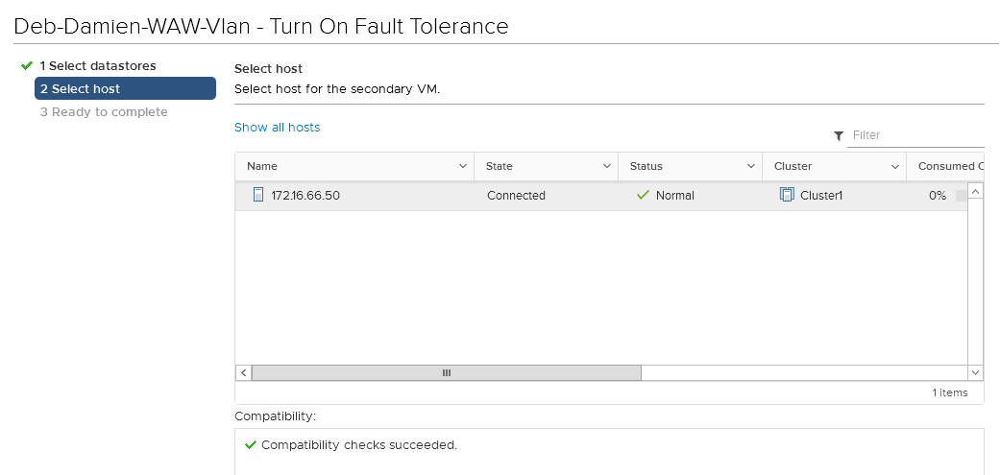

**Dernière mise à jour le 22/07/2020**

## Objectif

La fonctionnalité **Fault Tolerance** (FT) de VMware vSphere permet de protéger une machine virtuelle des défaillances matérielles en clonant la machine sur deux hôtes distincts.

{.thumbnail}

**Découvrez comment utiliser la fonctionnalité Fault Tolerance sur votre machine virtuelle**

## Prérequis

- Activer vSphere HA.
- Réservation de ressource égale à 100 % de la mémoire.
- VMware Tools installés.
- Processeurs de même génération.
- 4 vCPUs maximum.

## En pratique 

Pour activer l'option **Fault Tolerance**, faites un clic droit sur une machine virtuelle, puis cliquez successivement sur `Fault Tolerance` et `Activer Fault Tolerance`.

{.thumbnail}

Une fenêtre de configuration s'ouvrira, vous invitant à définir vos choix pour la machine virtuelle secondaire.

La banque de données :

{.thumbnail}

L'hôte : 

{.thumbnail}

Enfin, un résumé des choix effectués. Validez pour activer la FT sur votre machine virtuelle :

{.thumbnail}

Votre machine virtuelle est maintenant protégée par **Fault Tolerance**, son icone est désormais différente et son nom affiche alors le statut « Primaire ».

{.thumbnail}

Plusieurs opérations sont dès lors disponibles en fonction de votre besoin.

{.thumbnail}

## Actions impossibles et incompatibilités

Sur une machine virtuelle avec **Fault Tolerance** activé, il n'est plus possible d'effectuer certaines actions, ni d'utiliser certains périphériques.

Vous retrouverez la liste des actions devenues impossibles sur [cette page](https://docs.vmware.com/fr/VMware-vSphere/6.7/com.vmware.vsphere.avail.doc/GUID-F5264795-11DA-4242-B774-8C3450997033.html){.external-link} et la liste des incompatibilités sur [celle-ci](https://docs.vmware.com/fr/VMware-vSphere/6.7/com.vmware.vsphere.avail.doc/GUID-C1749AD4-70E2-406C-864C-719F54BF1BC1.html){.external-link}.

## Aller plus loin

Échangez avec notre communauté d’utilisateurs sur <https://community.ovh.com/>.
