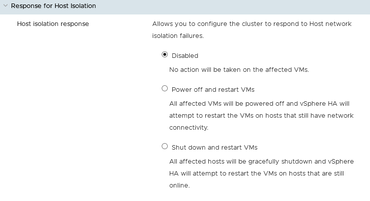
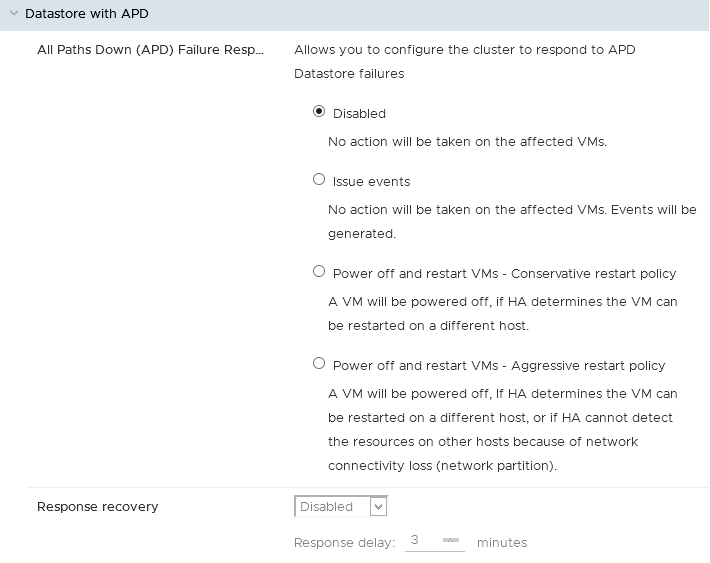

**Última atualização: 27/07/2020**

## Objetivo

A principal função do **VMware HA** (High Availability), no caso de falha material, é a de reiniciar as máquinas virtuais noutro host do cluster. A **HA** permite igualmente monitorizar as máquinas virtuais e as aplicações.

{.thumbnail}

**Este guia explica a configuração desta função.**

## Requisitos

- Estar ligado à [interface vSphere](https://docs.ovh.com/pt/private-cloud/instalar_o_vsphere_client/).
- Ter um produto [Hosted Private Cloud](https://www.ovhcloud.com/pt/enterprise/products/hosted-private-cloud/){.external}.

## Instruções

### Ativação

A HA encontra-se ativada de forma predefinida no cluster de base que a OVHcloud fornece aquando da entrega de uma Hosted Private Cloud.

Na eventualidade de criação de um novo cluster, pode ativar a HA durante ou após essa criação.

Se a HA não se encontrar ativada no seu cluster, aceda ao separador `Configurar` do cluster e, a seguir, ao separador `Disponibilidade vSphere` na rubrica `Serviços`.

Clique em `Modificar`{.action} e selecione a opção para ativar a funcionalidade HA.

É igualmente importante ativar o monitoramento do host. Este parâmetro permite o envio de sinais de pulsação entre os hosts ESXi, de modo a detetar uma eventual falha.
A desativação é necessária para a realização de operações de atualização com o [Update Manager](https://docs.ovh.com/pt/private-cloud/utilizar_o_vmware_update_manager/), por exemplo. Neste caso específico, o host é isolado.

{.thumbnail}

### Parâmetros

#### Falhas e respostas

Esta primeira categoria permite definir a política de reinício das máquinas virtuais em função das diferentes falhas possíveis.

##### Resposta em caso de falha do host

Esta categoria vai definir a política de reinício das máquinas virtuais em caso de perda de um host.

Assim, pode optar por reiniciar as suas MV de forma automática ou não.
É igualmente possível uma gestão predefinida de reinício do cluster. Pode afinar este critério por cada MV no separador `Substituições MV`.

Pode também selecionar uma condição diferente da predefinida (Recursos Alocados), que a HA do vSphere vai verificar antes de proceder ao reinício.

{.thumbnail}

##### Resposta ao isolamento do host

Esta categoria permite-lhe definir as ações a realizar em caso de perda de ligação de rede de um host.

Tem à sua escolha: 

- Não fazer nada.
- Desativar as máquinas virtuais e tentar reiniciá-las noutro host disponível.
- Desligar o host em causa e tentar reiniciar as máquinas virtuais noutro host disponível.

{.thumbnail}

##### Datastore com PDL

Em caso de falha de um datastore devido a um estado PDL (Permanent Device Loss), pode definir as ações a realizar:

- Não fazer nada.
- Nada fazer nada, mas gerar logs nos eventos.
- Desativar as máquinas virtuais e tentar reiniciá-las nos hosts que mantêm a ligação ao datastore.

{.thumbnail}

##### Datastore com APD

Em caso de falha de um datastore devido a um estado APD (All Path Down), pode definir as ações a realizar:

- Não fazer nada.
- Nada fazer nada, mas gerar logs nos eventos.
- Desativar as máquinas virtuais e tentar reiniciá-las.

{.thumbnail}

##### Monitorização das máquinas virtuais

A monitorização das MV passa a estar disponível após a instalação das [VMware Tools](https://docs.ovh.com/pt/private-cloud/instalar_o_pacote_vmware_tools/).
Em caso de ausência de resposta através das **tools** (sinais de pulsação), a MV será automaticamente reiniciada. Esta funcionalidade dispõe de uma configuração avançada (intervalos de reinício, por exemplo).

{.thumbnail}

#### Controlo de admissão

A HA do vSphere utiliza o controlo de admissão para garantir que estão reservados recursos suficientes para a recuperação das MV em caso de falha de um host.

O controlo de admissão impõe limites à utilização dos recursos. Não são autorizadas as ações passíveis de desrespeitar esses limites. As ações que podem não ser autorizadas incluem os exemplos seguintes:

- Ativação de uma MV.
- Migração de uma MV.
- Aumento da reserva de CPU ou de memória de uma MV.

A base do controlo de admissão da HA do vSphere é o número de falhas de hosts que o cluster é autorizado a tolerar e que continua a garantir o fail-over. A capacidade de fail-over dos hosts pode ser definida de três formas distintas:

- [Percentagem de recursos do cluster](https://docs.vmware.com/en/VMware-vSphere/6.5/com.vmware.vsphere.avail.doc/GUID-FAFEFEFF-56F7-4CDF-A682-FC3C62A29A95.html){.external-link}

- [Estratégia de slot](https://docs.vmware.com/en/VMware-vSphere/6.5/com.vmware.vsphere.avail.doc/GUID-85D9737E-769C-40B6-AB73-F58DA1A451F0.html){.external-link}

- [Hosts de fail-over dedicados](https://docs.vmware.com/en/VMware-vSphere/6.5/com.vmware.vsphere.avail.doc/GUID-C4F5F9EE-4235-4151-BEBE-FCB2A752407B.html){.external-link}

#### Datastore de sinal de pulsação

Quando o host principal de um cluster HA não consegue comunicar com um host subordinado na rede de gestão, o host principal utiliza o sinal de pulsação do datastore para determinar se o host subordinado está a falhar, se se encontra numa partição da rede ou se está isolado da rede.

#### Opções avançadas

O seu cluster pode ser sujeito a vários parâmetros de configuração avançada.

Encontre esses parâmetros [nesta página](https://docs.vmware.com/en/VMware-vSphere/6.5/com.vmware.vsphere.avail.doc/GUID-E0161CB5-BD3F-425F-A7E0-BF83B005FECA.html){.external-link}.

### Regra HA

Na secção `Configuração`, no separador `Regras MV/Host`, pode criar uma regra de tipo «Máquinas Virtuais».

Esta última vai adicionar uma condição de reinício, a fim de garantir que as MV de um primeiro grupo são reiniciadas antes das de um segundo grupo.

Esta regra pode perfeitamente servir como complemento das prioridades de reinício configuráveis no separador `Substituições MV`.

## Quer saber mais?

Fale com a nossa comunidade de utilizadores em https://community.ovh.com/en/.
