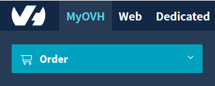
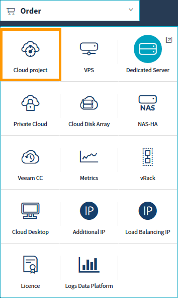

**Last updated 15/10/2018**

## Objective

[Public Cloud instances](https://www.ovh.com.au/public-cloud/instances/){.external} offer a flexible, pay-as-you-go solution for managing virtual resources. This means that you can add and remove resources (instances, storage, etc) as and when you need to.

**This guide will show you how to create your first Public Cloud project.**

## Requirements

* access to the [OVH Control Panel](https://www.ovh.com/auth/?action=gotomanager){.external}

## Instructions

### Create a project

Log into to the [OVH Control Panel](https://ca.ovh.com/auth/?action=gotomanager){.external}. Once you're logged in, click on the `Cloud`{.action} menu.

{.thumbnail}

Next, click on the `Order`{.action} button.

{.thumbnail}

Under the 'Order' menu, click `Cloud project`{.action}.

{.thumbnail}

You will now need to give the project a name and chose a payment method.

{.thumbnail}

### Select a payment method

As mentioned earlier, the Public Cloud is a pay-as-you-go service. Once your project is created, you can buy instances, storage etc. However, when you create your first project, you'll need to choose one of the following three payment methods:

#### Register a bank card

This is the easiest method. When you register a bank card, you will automatically be debited at the start of the month. This method will allow you to register (depending on your country):

* a credit/debit card
* a PayPal account
* a bank account

> [!primary]
>
If this is your first payment with OVH, we will only accept credit cards with 3-D Secure.
>

Select your desired method from the list and click the `Add`{.action} button.

{.thumbnail}

Once you've clicked the `Add`{.action} button, you'll be prompted to complete the setup of your payment method, as shown below.

{.thumbnail}

#### Buy cloud credit

You can also pay for your [Public Cloud](https://www.ovh.com.au/public-cloud/instances/){.external} usage using cloud credit. Your first cloud credit purchase will cost £30. Any resources you use after this will consume your credit. When your credit is depleted, you can purchase more using any accepted payment method.

Cloud credit is non-transferable or refundable. It has no monetary value, and if it is not used within 13 months it will be lost.

{.thumbnail}

#### Use a voucher

If you have a promotional code, you can add it during this stage to pay for your resources. The duration of the voucher may vary.

{.thumbnail}
 
Once you have created your project, it will be available in the left-hand menu.

### Add an instance or storage

To add resources to your new project, click the `Actions`{.action} button on the `Infrastructure`{.action} tab.

{.thumbnail}

Next, from the dropdown menu, select either `Add a server`{.action} or `Add a disk`{.action}.

{.thumbnail}

## Go further

Join our community of users on <https://community.ovh.com/en/>.