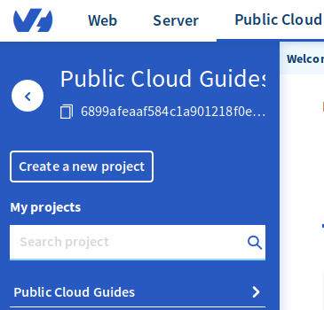

**Last updated 17th October 2018**

## Objective

When you create a [Public Cloud Instance](https://www.ovh.ie/public-cloud/instances/){.external}, you won't receive an email with login credentials, because authentication is based on secure SSH keys instead of usernames and passwords.

**This guide will show you how to create an SSH key, so that you can log into your instance.**

> [!primary]
>
Please note that SSH keys are not used for authentication on instances running the Windows operating system. For Windows instances, you will still need to use a username and password.
>

## Requirements

* a [Public Cloud](https://www.ovh.ie/public-cloud/instances/){.external} project in your OVH account
* access to the [OVH Control Panel](https://www.ovh.com/auth/?action=gotomanager){.external}

## Instructions

### Creating an SSH key on Linux and Mac

First, open the terminal (command line) app, then run the following command to generate a 4096 bit SSH key:

```sh
# ssh-keygen -b 4096
```

The command will output the following result and prompt you to save the newly created key:

```sh
Generating public/private rsa key pair.
Enter file in which to save the key (/home/user/.ssh/id_rsa):
```

> [!warning]
>
> The private part of the key should be kept safe, and access should be limited to people authorised to use it.
> 

Once you have saved the key, the command line will output the following:

```ssh
Your identification has been saved in /home/user/.ssh/id_rsa.
Your public key has been saved in /home/user/.ssh/id_rsa.pub.
The key fingerprint is:
0a:3a:a4:ac:d1:40:6d:63:6d:fd:d9:fa:d6:b2:e0:36 user@host
The key's randomart image is:
+---[RSA 4096]----+
|      .          |
|                 |
| .               |
|. . . .          |
|. .=.o .S.       |
| =o.o. ..   .    |
|o +   .  . o ..  |
|.. .      oEoo . |
|o.        .o+oo  |
+-----------------+
```

You can read and display the key with the following command:

```ssh
# cat .ssh/id_rsa.pub
```

Running this command will output the following:

```ssh
cat /home/user/.ssh/id_rsa.pub
ssh-rsa AAAAB3NzaC1yc2EAAAADAQABAAABAQC8teh2NJ42qYZV98gTNhumO1b6rMYIkAfRVazl
k6dSS3xf2MXJ4YHsDacdjtJ+evXCFBy/IWgdkFtcvsGAMZ2N1RdvhDyQYcy6NDaJCBYw1K6Gv5fJ
SHCiFXvMF0MRRUSMneYlidxU3U2q66yt/wPmw1yRsQagtNKHAzFUCSOB1nFz0RkqvqgARrHTY0bd
aS0weA//aK9f6z+Y4THPbcCj4xPH4iGikFMPrFivP8Z6tidzVpAtbr1sXmJGZazYWrU3FoK2a1sF
i4ANmLy7NULWK36yU0Rp9bFJ4o0/4PTkZiDCsK0QyHhAJXdLN7ZHpfJtHIPCnexmwIMLfIhCWhO5
 user@host
```

### Creating an SSH key on Windows

#### Using PuTTY

[PuTTY](https://www.chiark.greenend.org.uk/~sgtatham/putty/){.external} is a popular SSH client for Windows. You can use it to remotely connect to a Linux server. Its companion software, [PuTTYgen](https://the.earth.li/~sgtatham/putty/latest/w64/puttygen.exe){.external}, can be used to create SSH keys.

First, download the [PuTTYgen](https://the.earth.li/~sgtatham/putty/latest/w64/puttygen.exe){.external} software, which we will use to generate the key.

Next, run the software and select RSA as the key type, enter 4096 as the number of bits to generate, and then click the `Generate`{.action} button.

{.thumbnail}

Next, randomly move your mouse around in the area underneath the progress bar, as shown below.

{.thumbnail}

As you move your mouse, the progress bar will start to fill up. When it's completely full, the key will be ready.

{.thumbnail}

### Import your SSH key into the OVH Control Panel

First, highlight and copy the text of your public key, then log into the [OVH Control Panel](https://www.ovh.com/auth/?action=gotomanager){.external}.

Now click on the `Cloud`{.action} menu.

{.thumbnail}

Now select your Public Cloud project from the left-hand menu and click on `Infrastructure`{.action}.

{.thumbnail}

Now select the `SSH keys`{.action} tab.

{.thumbnail}

Next, paste the 4096 byte key into the space provided, give the key a name, and click the `Add this key`{.action} button.

{.thumbnail}

Your key will now be saved in the OVH Control Panel for authentication.

## Go further

Join our community of users on <https://community.ovh.com/en/>.