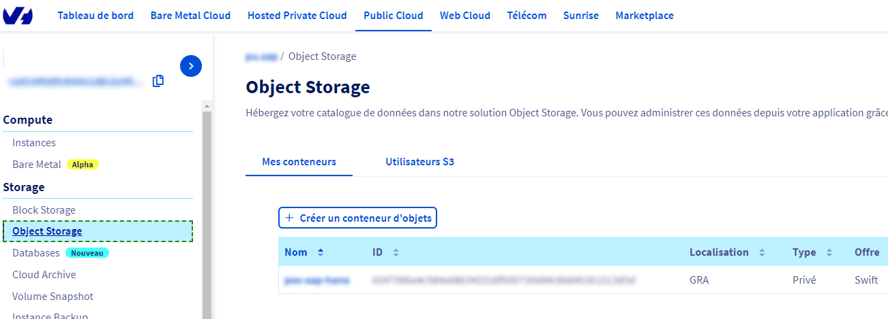
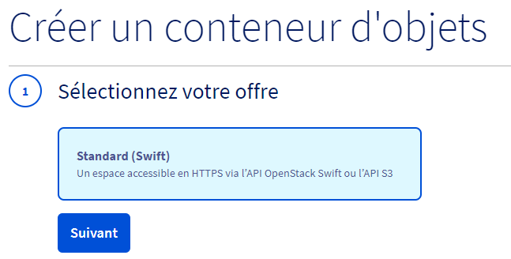
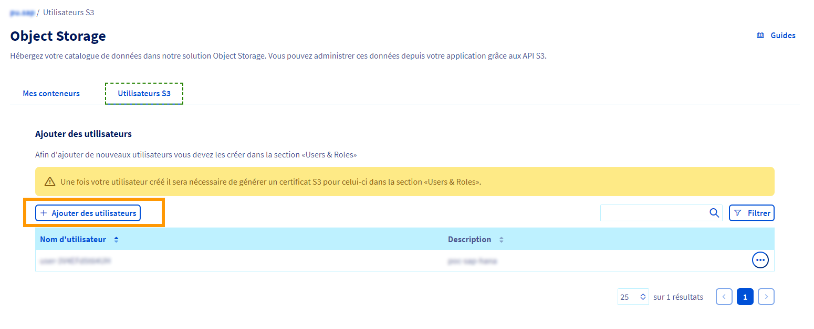
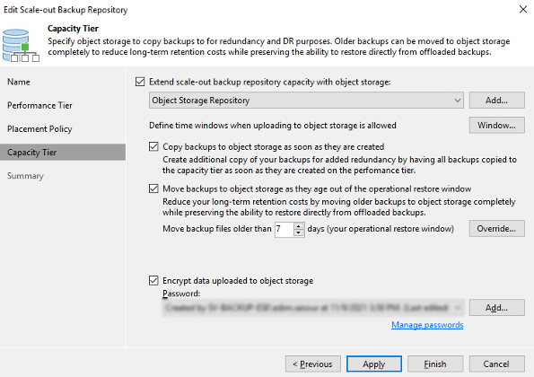

**Dernière mise à jour le 29/03/2022**

## Objectif

OVHcloud fournit du matériel certifié SAP sur lequel construire une solution SAP HANA.

Ce guide fournit des instructions générales sur la sauvegarde d'une base de données SAP HANA hébergée sur du matériel OVHcloud.

Nous allons aborder la mise en place d'une architecture de sauvegarde pour SAP HANA en utilisant l'offre OVHcloud Veeam Backup & Replication Enterprise.

Veeam Enterprise est un service OVHcloud qui vous permet d’utiliser Veeam Backup & Replication sur votre propre infrastructure avec une licence de niveau Veeam Enterprise Plus.

**NB : vous pouvez utiliser n'importe quelle solution approuvée par SAP pour mettre en place votre infrastructure de sauvegarde.**

> [!warning]
>
> Bien que les éléments contenus dans ce guide aient été formulés avec toute la vigilance requise, OVHcloud ne garantit pas et ne déclare pas que les éléments contenus dans ce guide constituent un guide officiel SAP.
>
> Toutes les tâches d'intégration technique, d'installation et/ou d'administration des solutions SAP doivent être validées par un professionnel SAP.

## Prérequis

- Accès à la base de données SAP HANA
- Un utilisateur en base avec les droits et/ou rôle de backup

## Instructions

Retrouvez ci-dessous un index des étapes décrites dans ce guide :

[1. Configuration de l'utilisateur de sauvegarde](#utilisateur-sauvegarde)<br>
[2. Mise en place de Veeam Backup & Replication](#installation-veam)<br>
[3. Configuration de la sauvegarde](#configuration-backup)<br>
[4. Nettoyage](#nettoyage)<br>

### Configuration de l'utilisateur de sauvegarde <a name="utilisateur-sauvegarde"></a>

#### Création d'un utilisateur avec un mot de passe

Depuis l'interface de ligne de commande SQL ou le studio SAP HANA, créez un utilisateur avec les droits de sauvegarde appropriés :

```bash
CREATE USER backup_user PASSWORD enterpasswordhere NO FORCE_FIRST_PASSWORD_CHANGE;
ALTER  USER backup_user DISABLE PASSWORD LIFETIME;
CREATE ROLE BACKUP_ROLE;
GRANT BACKUP ADMIN, CATALOG READ, MONITORING TO BACKUP_ROLE;
GRANT BACKUP_ROLE TO backup_user;
```

#### Création d’un utilisateur avec le magasin d’utilisateurs sécurisé (hdbuserstore)

Le magasin d’utilisateurs sécurisé (hdbuserstore) est un outil installé avec le client SAP HANA. Utilisez-le pour stocker les informations de connexion aux systèmes SAP HANA de manière sécurisée sur le client, de sorte que les applications clientes puissent se connecter à SAP HANA sans que les utilisateurs aient à entrer leurs informations.

Il est généralement utilisé par les scripts se connectant à SAP HANA.

Pour plus d'informations et des indications sur la manière de l'installer, consultez la [Documentation SAP](https://help.sap.com/viewer/b3ee5778bc2e4a089d3299b82ec762a7/2.0.05/en-US/dd95ac9dbb571014a7d7f0234d762fdb.html){.external}

### Veeam Backup & Replication Setup <a name="installation-veam"></a>

Pour nos besoins de sauvegarde, nous utiliserons la solution [OVHcloud Veeam Enterprise](https://www.ovhcloud.com/fr/storage-solutions/veeam-enterprise/).

Vous pouvez retrouver le guide d'installation OVHcloud [ici](/pages/cloud/storage/backup/veeam_veeam_backup_replication).

#### Flux réseau

|Adresse source|Port source|Adresse de destination|Port de destination|Protocole|Commentaires|
|---|---|---|---|---|---|
|SAP HANA|tout|Veeam Backup&Replication|10006|TCP|Port par défaut utilisé pour la communication avec le serveur Veeam Backup & Replication. Notez bien que les données entre les modules externes Veeam et les référentiels de sauvegarde sont transférées directement, en contournant le serveur Veeam Backup & Replication.|
|SAP HANA|tout|Veeam Backup Repository|2500 à 3300|TCP|Plage par défaut des ports utilisés comme canaux de transmission de données. Pour chaque connexion TCP utilisée par un processus de sauvegarde, un port de cette plage est attribué.|
|Veeam Backup & Replication|tout|Veeam Backup Repository|2500 à 3300|TCP|Plage par défaut des ports utilisés comme canaux de transmission de données. Pour chaque connexion TCP utilisée par un processus de sauvegarde, un port de cette plage est attribué|
|Veeam Backup & Replication|tout|Serveur Linux utilisé comme repository de backup ou serveur gateway|22|TCP|Port utilisé comme canal de contrôle du serveur Veeam Plug-in vers l'hôte Linux cible|
|Veeam Backup & Replication|tout|Microsoft Windows Server utilisé comme repository de backup ou serveur gateway|135, 137 à 139, 445|TCP/UDP|Ports utilisés comme canal de gestion du serveur Veeam Plug-in vers le serveur Repository/Gateway. Les ports sont également utilisés pour déployer les composants Veeam|
|Veeam Backup & Replication|tout|Microsoft Windows Server utilisé comme repository de backup ou serveur gateway|6160, 6162|TCP|Ports par défaut utilisés par le Service Veeam Installer et le Service Veeam Data Mover|

#### Mise en place des Backup Repositories

Après l'installation de la solution Veeam Backup & Replication, vous pouvez procéder à l'installation du Backup Repository.

Un Backup Repository est un espace de stockage où Veeam B&R stocke les fichiers de sauvegarde et les métadonnées de VM répliquées.

Pour ajouter un nouveau Backup Repository:

- lancez l'assistant de création de Backup Repository;
- spécifiez un nom et une description de Backup Repository;
- spécifiez les paramètres du serveur ou du dossier partagé;
- configurez les paramètres de contrôle de chemin et de charge;
- spécifiez les paramètres du « Mount Server »;
- vérifiez les propriétés et les composants;
- appliquez les paramètres du Backup Repository;
- vérifiez les paramètres du Backup Repository nouvellement créé et cliquez sur « Terminer »;

*** Pour plus d'informations, nous vous invitons à consulter la [documentation de Veeam Backup Repository](https://helpcenter.veeam.com/archive/backup/100/vsphere/repo_add.html){.external} ***

#### Mise en place des Scale Out Backup Repositories

Après la mise en place et la configuration de vos Backup Repositories, vous pouvez configurer un Scale-Out Backup Repository.

Cette étape est facultative mais fortement conseillée afin de sécuriser vos données dans une autre localisation.

##### **Utilisation de l'Object Storage (Public Cloud)**

L'Object Storage offre de nombreux avantages, dont le principal est la réduction des coûts liée à la croissance de vos données. Vos données sont stockées sur un ou plusieurs serveurs dimensionnés pour accueillir des téraoctets, voire des pétaoctets d'informations, tout en optimisant les coûts d'exploitation.

L’environnement est également conçu pour s’adapter à l’évolution des besoins, sans avoir à revoir en profondeur l’infrastructure ou son mode de fonctionnement

Nous utiliserons donc la solution [OVHcloud Object Storage](https://www.ovhcloud.com/fr/public-cloud/object-storage/) pour étendre le Scale-Out Backup Repository créé précédemment.

> [!primary]
> Pour le moment, Veeam Backup and Replication ne supporte que l'object storage en tant que « capacity tier » des scale-out backup repositories.

**Prérequis :**

- un compte client OVHcloud
- un [projet Public Cloud](/pages/platform/public-cloud/create_a_public_cloud_project)

<ol start="1">
  <li>Connectez-vous à l'<a class="external-link" href="https://www.ovh.com/auth/?onsuccess=https%3A//www.ovh.com/manager&ovhSubsidiary=FR/" rel="nofollow">espace client OVHcloud</a>, accédez à la section <code class="action">Public Cloud</code>, sélectionnez votre projet puis cliquez sur <code class="action">Object Storage</code> et enfin cliquez sur <code class="action">Créer un conteneur d'objets</code>.</li>
</ol>

{.thumbnail}

<ol start="2">
  <li>Sélectionner <code class="action">Standard (Swift)</code> :</li>
</ol>

{.thumbnail}

<ol start="3">
  <li>Sélectionnez la région. ex: 'Gravelines (GRA)' : </li>
</ol>

{.thumbnail}

<ol start="4">
  <li>Sélectionnez le type de conteneur <code class="action">Privé</code> : </li>
</ol>

{.thumbnail}

<ol start="5">
  <li>Donnez un nom à votre conteneur : </li>
</ol>

{.thumbnail}

Votre conteneur va maintenant apparaître dans la liste, comme montré ci-dessous :

{.thumbnail}

<ol start="6">
  <li>Accédez à l'onglet <code class="action">s3 users</code> pour créer un utilisateur : </li>
</ol>

{.thumbnail}

***N.B : Stockez le mot de passe associé à cet utilisateur dans un gestionnaire de mots de passe, il ne vous sera fourni qu'une seule fois.***

<ol start="7">
  <li>Dans la section `Project Management`, donnez le rôle <code class="action">Object Storage Operator</action> à l'utilisateur sous l'onglet <code class="action">Users & Roles</clode> :</li>
</ol>

{.thumbnail}

<ol start="8">
  <li>Sélectionnez l'utilisateur et téléchargez le fichier de configuration OpenStack :</li>
</ol>

{.thumbnail}

<ol start="9">
  <li>Installez le client OpenStack & Nova : </li>
</ol>

```bash
sudo apt-get install python3-openstackclient python3-novaclient -y
```

<ol start="10">
  <li>Une fois l'installation terminée, sourcez le fichier de script .sh :</li>
</ol>

```bash
source xxxxxxxxxxxxxxxxxx-openrc.sh
```

> [!primary]
> Enregistrez le mot de passe dans votre gestionnaire de mots de passe préféré.

<ol start="11">
  <li>Créez les identifiants:</li>
</ol>

```bash
openstack ec2 credentials create
```

<ol start="12">
  <li>Nous pouvons désormais ajouter le conteneur object storage en tant que Backup Repository sur notre infrastructure Veeam avec la clé d'accès & secret fournie ci-dessus</li>
</ol>

{.thumbnail}

{.thumbnail}

{.thumbnail}

{.thumbnail}

{.thumbnail}

{.thumbnail}

{.thumbnail}

<ol start="13">
  <li>Nous pouvons désormais spécifier ce BR comme extension de l'un de nos SOBR : </li>
</ol>

{.thumbnail}


### Configuration de la sauvegarde <a name="configuration-backup"></a>
#### Sauvegarde du système de fichiers

Les sauvegardes du système de fichiers écrivent toutes les données dans des fichiers (par exemple, sur un partage NFS accessible à tous les noeuds).

Veillez à superviser le niveau de remplissage de votre système de fichiers pendant les opérations de sauvegarde.

Les sauvegardes du système de fichiers peuvent être configurées via les options suivantes :

- manuellement dans HANA Studio;
- script SQL (planificateur manuel / externe);
- cockpit SAP DBA (planificateur externe).

Si vous souhaitez protéger le serveur SAP HANA lui-même, vous pouvez utiliser les fonctionnalités de sauvegarde d'image ou de fichiers de Veeam Backup & Replication ou de Veeam Agent for Linux.

Notez bien que les sauvegardes au niveau des images et/ou du système de fichiers des serveurs SAP HANA ne garantissent pas la cohérence des transactions des sauvegardes de base de données.

#### Planification des sauvegardes

Les sauvegardes de base de données HANA peuvent être planifiées via les options suivantes :

- dans HANA Studio;
- script SQL (planificateur manuel / externe);
- cockpit SAP DBA (planificateur externe).

##### **Planification d’un script de sauvegarde d’un système de fichiers**

Pour sauvegarder votre instance HANA sur un système de fichiers, consultez la [SAP NOTE 1950261](https://launchpad.support.sap.com/#/notes/1950261){.external}

##### **Backint API Backup**

Backint for SAP HANA est une API qui permet aux fournisseurs d'outils tiers de connecter directement leurs agents de sauvegarde à la base de données SAP HANA.

Pour permettre la sauvegarde via l'API backint, une installation et une configuration du plugin Veeam sont nécessaires sur le serveur hébergeant la base de données HANA.

Voici comment fonctionne le backup :

<ol start="1">
  <li>HANA démarre la sauvegarde.</li>
  <li>Veeam Plugin for SAP HANA attribue plusieurs flux à la cible de sauvegarde.</li>
  <li>Les données sont stockées sur le Backup Repository Veeam</li>
</ol>

*** Pour plus d'informations, merci de vérifier la documentation [Veeam Plugin for SAP-HANA](https://helpcenter.veeam.com/docs/backup/plugins/sap_hana_plugin.html?ver=100){.external} ***

Pour installer le plugin :

1. Copiez le Veeam Plugin pour SAP HANA de l'ISO Veeam Backup and Replication Installation vers le serveur HANA-DB
2. Exécutez l'installation du package rpm

```bash
rpm -i VeeamPluginforSAPHANA-10.x.x.xxxx-x.x86_64.rpm
```

Vous pourrez ensuite configurer le plugin :

1. Connectez-vous avec l'utilisateur du système d'exploitation (<sid>adm)
2. Exécutez l'assistant de configuration du plug-in backint :

```bash
SapBackintConfigTool --wizard
Enter backup server name or IP address: 172.x.x.x
Enter backup server port number [10006]:
#NB: Le compte utilisé doit avoir accès aux Backup Repositories Veeam que vous prévoyez d'utiliser.
Enter username: xx-backup-ovh\svc_veeam_hana
Enter password for xx-backup-ovh\svc_veeam_hana:
Available backup repositories:
1. Backup Repository
#Sélectionnez le backup repository où les backups de la base HANA seront stockées
Enter repository number: 1
Configuration result:
    SID xxx has been configured
```

#### Planification des sauvegardes via backint

Le plugin Veeam crée automatiquement un job de backup et transfère les données en fonction du planning de sauvegarde que vous avez défini.

Si vous exécutez une sauvegarde manuelle via le backint, celle-ci sera donc automatiquement poussée vers la solution Veeam BR.

> [!primary]
> Tous les jobs SAP HANA sont supervisables au sein de la console Veeam Backup & Replication.

### Nettoyage <a name="nettoyage"></a>

Il est recommandé de régulièrement supprimer les sauvegardes complètes et les générations de sauvegardes qui ne sont plus nécessaires à la restauration de votre base de données SAP HANA.

A défaut de le faire, le volume dédié à la sauvegarde peut devenir saturé et bloquer la génération de nouvelles sauvegardes.

Pour plus d’informations sur ce sujet, consultez les guides SAP officiels suivants :

[Housekeeping: Deleting and Archiving Backups](https://help.sap.com/viewer/afa922439b204e9caf22c78b6b69e4f2/2.13.0.0/en-US/cac903c28b0e4301b39814ef41dbf568.html){.external}

[2399996 - How-To: Configuring automatic SAP HANA Cleanup with SAP HANACleaner](https://launchpad.support.sap.com/#/notes/2399996){.external}

## Aller plus loin

 Si vous avez besoin d'une formation ou d'une assistance technique pour la mise en oeuvre de nos solutions, contactez votre commercial ou cliquez sur [ce lien](https://www.ovhcloud.com/fr/professional-services/) pour obtenir un devis et demander une analyse personnalisée de votre projet à nos experts de l’équipe Professional Services. 
