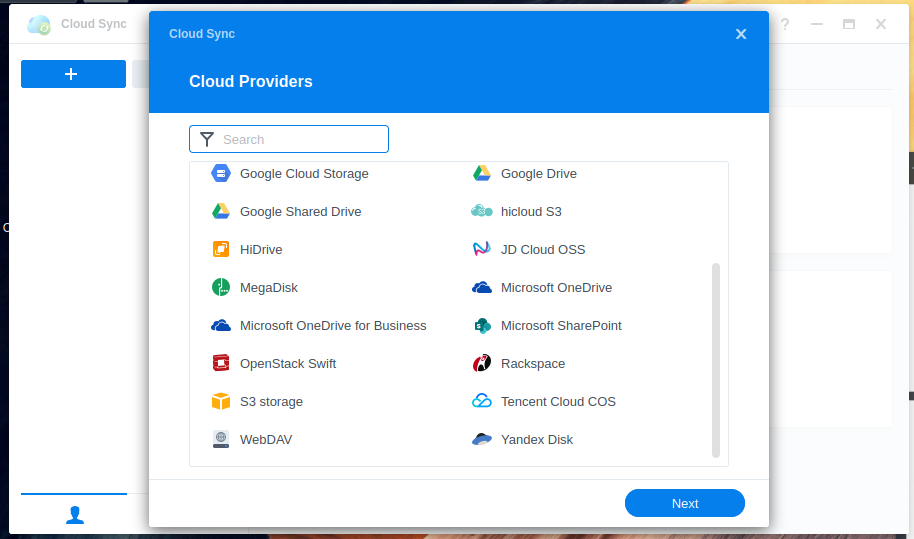

> [!primary]
> Esta traducción ha sido generada de forma automática por nuestro partner SYSTRAN. En algunos casos puede contener términos imprecisos, como en las etiquetas de los botones o los detalles técnicos. En caso de duda, le recomendamos que consulte la versión inglesa o francesa de la guía. Si quiere ayudarnos a mejorar esta traducción, por favor, utilice el botón «Contribuir» de esta página.
>

**Última actualización: 22/05/2023**

## Objetivo

DiskStation Manager 7.0 de Synology ofrece una herramienta de sincronización con diferentes soluciones cloud.

Es compatible con el Object Storage de Public Cloud de OVHcloud y, por lo tanto, le permitirá realizar una copia de seguridad de sus datos y hacerlos accesibles desde cualquier lugar.

**Esta guía explica cómo configurar DiskStation Manager 7.0 para sincronizar los archivos de su NAS con su Object Storage.**

> [!primary]
>
> DiskStation Manager 6 no es compatible con el Object Storage Public Cloud de OVHcloud.
>

## Requisitos

- [Crear un contenedor Object Storage](/pages/cloud/storage/object_storage/pcs_create_container)
- [Crear un acceso a Horizon](/pages/platform/public-cloud/create_and_delete_a_user#requisitos)

## Procedimiento

### Configuración de DiskStation Manager 7.0

> [!warning]
>
> Las soluciones de Synology, como el DiskStation o el Hyperbackup, no son compatibles con Public Cloud Archive.
>

#### Recargar las claves OpenStack

Para configurar la sincronización de su NAS Synology, debe tener las claves de su usuario OpenStack.

Para obtenerlos, descargue el archivo OpenRC mediante la primera parte de la siguiente guía:

- [Cargar las variables de entorno OpenStack](/pages/platform/public-cloud/loading_openstack_environment_variables#paso-1-obtener-las-variables){.ref}

#### Configuración del punto de sincronización con Cloud Sync

Una vez que disponga de las claves, puede conectarse a su NAS y realizar las siguientes acciones:

- Ejecutar la aplicación Cloud Sync

- Seleccionar OpenStack Swift como proveedor cloud

{.thumbnail}

- Introduzca la información de su usuario OpenStack:

{.thumbnail}

Todos estos datos se pueden encontrar en el archivo OpenRC que obtuvo en el paso anterior.

- Configurar la localización y el nombre del contenedor de almacenamiento:

{.thumbnail}

- Configurar la carpeta a sincronizar:

{.thumbnail}

## Más información

If you need training or technical assistance to implement our solutions, contact your sales representative or click on [this link](https://www.ovhcloud.com/es/professional-services/) to get a quote and ask our Professional Services experts for assisting you on your specific use case of your project.

Interactúe con nuestra comunidad de usuarios en <https://community.ovh.com/en/>.