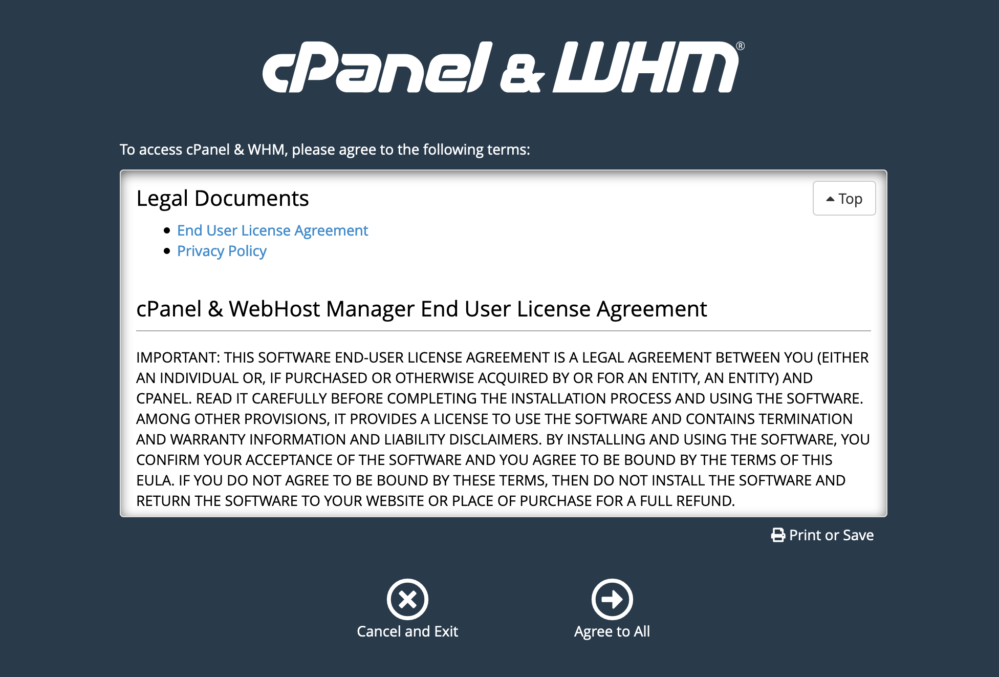

**Last updated 15th May 2020**

## Objective

cPanel is a control panel designed for web hosting. Web hosting tasks are simplified, as it is made up of a graphical interface that allows the automation of settings.

**Learn how to deploy cPanel with pre-installed applications on a VPS in one click.**

## Requirements

In order to install your cPanel server, you will first need to order a VPS with a cPanel distribution.


When your VPS is ready, you will receive an email providing the information to connect to your cPanel server:

>Your application(s):
>
>You can connect to cPanel from https://*hostname*:2087/*session_parameters*


Your cPanel server is now ready to use.

## Instructions

### First connection

The URL above allows you to log in without credentials (user and password) to your cPanel manager.
You will then have to validate your licence and configure your root password in order to access the interface.



The generated URL is temporary to grant a secure first connection. If a prompt for identification is displayed when you click the link, the token in the URL has expired.
You can regenerate this URL with a command line tool available on your VPS. The procedure is explained [below](./#regenerate-your-login-url).
The next page will prompt you for your email address and the nameservers you would like to use.


### Regenerate your login URL

Log in via SSH using the credentials provided in the installation email and run the following command:

```sh
sudo whmlogin
```
You can now click on the generated link to access your administrative interface and configure your root password.

## Go further

Join our community of users on <https://community.ovh.com/en/>.