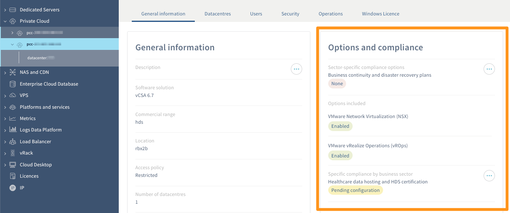

## Objectif

Pour rendre votre infrastructure Private Cloud conforme à [l'hébergement des données de santé](https://www.ovhcloud.com/fr/enterprise/products/hosted-private-cloud/safety-compliance/hds/) en Europe (certification HDS pour la France et conformité règlementaire pour l’Italie, le Royaume-Uni, l’Allemagne et la Pologne) ou des [données bancaires](https://www.ovhcloud.com/fr/enterprise/products/hosted-private-cloud/safety-compliance/pci-dss/) (certification PCI DSS), vous devez réaliser les opérations décrites dans ce guide.

**Découvrez comment activer l'option pour l'hébergement des données de santé ou des données bancaires sur votre offre Hosted Private Cloud.**

## Prérequis

* Être connecté à votre [espace client OVHcloud](https://www.ovh.com/auth/?action=gotomanager&from=https://www.ovh.com/fr/&ovhSubsidiary=fr){.external}.
* Posséder une [infrastructure Private Cloud](https://www.ovh.com/fr/public-cloud/instances/){.external} sur votre compte OVHcloud. Version 6.0 ou supérieure.

## En pratique

### Activation

Pour adapter votre Private Cloud à cette certification, l'une des options de sécurité correspondantes doit être activée. Pour le vérifier, connectez-vous à votre [espace client OVHcloud](https://www.ovh.com/auth/?action=gotomanager&from=https://www.ovh.com/fr/&ovhSubsidiary=fr){.external} et dirigez-vous dans la section `Serveur`. Cliquez sur `Private Cloud`{.action} et sélectionnez le service concerné.

Dans la fenêtre qui s'affiche, vérifiez que vous vous trouvez dans l'onglet `Informations générales`{.action}. Vérifiez ensuite l'état d'activation des options de sécurité dans la section « Options et conformité ».

{.thumbnail}

Si l'option de sécurité souhaitée n'est pas activée, activez-la en cliquant sur le bouton `...`{.action}, puis sur `Activer`{.action}. 

Plusieurs conditions sont essentielles :

- **Les options [NSX](https://www.ovhcloud.com/fr/enterprise/products/hosted-private-cloud/nsx-datacenter-vsphere/){.external} et [vROps](https://www.ovhcloud.com/fr/enterprise/products/hosted-private-cloud/vrops/){.external} doivent être installées**: depuis l'onglet `Informations générales`{.action}, dans la section « Options et conformité », vous pouvez vérifier l'état d'activation de ces options. Si elles ne sont pas activées, activez-les en cliquant sur le bouton `...`{.action} puis sur `Activer`{.action}.

- **La politique d'accès à vCenter doit être restreinte**: depuis l'onglet `Sécurité`{.action} , vous pouvez vérifier l'état de la politique de sécurité. S'il n'est pas restreint, effectuez la modification en cliquant sur `Modifier la politique d'accès à vCenter`{.action}, puis suivez les étapes. N'hésitez pas à consulter notre guide [Présentation de l’espace client Private Cloud OVHcloud](/pages/hosted_private_cloud/hosted_private_cloud_powered_by_vmware/manager_ovh_private_cloud).

- **Vous devez disposer d'au moins une adresse IP autorisée pour vous connecter à vCenter**: depuis l'onglet `Sécurité`{.action} , assurez-vous d'avoir autorisé au moins une adresse IP. Si nécessaire, cliquez sur `Ajouter une nouvelle plage d'adresses IP`{.action}. N'hésitez pas à consulter notre guide [Présentation de l’espace client Private Cloud OVHcloud](/pages/hosted_private_cloud/hosted_private_cloud_powered_by_vmware/manager_ovh_private_cloud).

Pour vous assurer que vous pouvez toujours vous connecter, nous vous recommandons d'avoir au moins deux adresses IP autorisées. Pour des raisons d'accessibilité, ces dernières doivent être fixes et non dynamiques.

- **L'utilisateur « admin » doit avoir des informations à jour et disposer de l'autorisation nécessaire**: depuis l'onglet `Utilisateurs`{.action} , assurez-vous pour l'utilisateur "admin" que le numéro de téléphone et l'adresse e-mail sont correctement renseignés. L'utilisateur « admin » doit aussi disposer de l'autorisation "**token validator**". Si nécessaire, pour changer d'utilisateur, cliquez sur le bouton `...`{.action} , puis sur `Modifier`{.action}. N'hésitez pas à consulter notre guide [Présentation de l’espace client Private Cloud OVHcloud](/pages/hosted_private_cloud/hosted_private_cloud_powered_by_vmware/manager_ovh_private_cloud).

Pour vous assurer que vous pouvez toujours vous connecter à vCenter, nous vous recommandons d'avoir au moins deux utilisateurs disposant des informations et autorisations nécessaires (avec des adresses de messagerie et des numéros de téléphone différents).

La première étape d'activation garantit que la politique d'accès à vCenter est limitée et que vous disposez d'au moins une adresse IP pouvant se connecter à vCenter.

{.thumbnail}

Vérifiez à l'étape suivante que les coordonnées de l'utilisateur « admin » (ou des autres utilisateurs) sont correctement renseignées.

{.thumbnail}

Une fois les étapes d'activation terminées, vous devez:

- valider le token envoyé par SMS aux utilisateurs avec l'autorisation **token validator**. Cela confirme que vous pourrez recevoir ces tokens, qui sont essentiels pour valider les opérations
- compléter les documents que vous recevrez par e-mail pour finaliser la partie contractuelle

{.thumbnail}

Nous vous conseillons de débuter avec l'interface sécurisée en poursuivant la lecture de ce guide. 

> [!primary]
>
>  L'interface vSphere ne sera pas accessible lors de l'activation de l'option de sécurité.
>

### Débuter avec l'interface sécurisée

Après l'activation de l'option de sécurité, vous recevrez un e-mail détaillant le procédé de validation des tokens et leur fonctionnement.

Comme spécifié, les mesures de sécurité suivantes seront mises en place après l’activation de l’option de sécurité :

- tous les utilisateurs existants de votre Private Cloud seront désactivés;

- vous devrez modifier les mots de passe de vos utilisateurs afin que ceux-ci soient réactivés;

- la modification des mots de passe de vos utilisateurs devra être réalisée uniquement à partir de l'interface sécurisée. Vous ne pourrez plus effectuer cette manipulation à partir de votre espace client OVHcloud.

Pour rappel, l'accès à l'interface sécurisée ne sera possible qu'une fois l'option de sécurité activée.
 
Connectez-vous ensuite à l'interface sécurisée via le lien fourni dans l'e-mail que vous avez reçu. Celui-ci sera similaire à `https://pcc-xxx-xxx-xxx-xxx.ovh.com/secure/password-lost`. Une fois connecté, vous pourrez changer le mot de passe de l'utilisateur « admin » puis les mot de passe des éventuels utilisateurs supplémentaires.

Pour plus de détails, consultez [notre guide dédié au fonctionnement de l'interface sécurisée](/pages/hosted_private_cloud/hosted_private_cloud_powered_by_vmware/interface-secure)

## Aller plus loin

[Présentation de l’espace client Private Cloud OVHcloud](/pages/hosted_private_cloud/hosted_private_cloud_powered_by_vmware/manager_ovh_private_cloud)

Échangez avec notre communauté d'utilisateurs sur <https://community.ovh.com/>.

