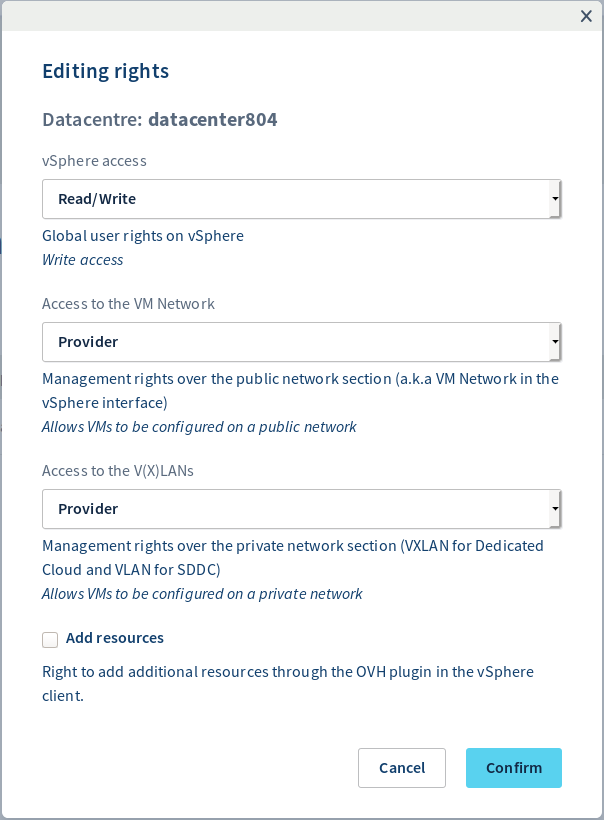

## Objetivo

El servicio Hosted Private Cloud de OVHcloud permite gestionar los permisos de usuario que autorizan a realizar operaciones específicas.

**Esta guía explica cómo gestionar los permisos de usuario en su infraestructura.**

## Requisitos

* Tener contratado un servicio [Hosted Private Cloud](https://www.ovhcloud.com/es/enterprise/products/hosted-private-cloud/){.external}.
* Haber iniciado sesión en el [área de cliente de OVHcloud](https://ca.ovh.com/auth/?action=gotomanager&from=https://www.ovh.com/world/&ovhSubsidiary=ws){.external}.

## Procedimiento

Para gestionar los permisos de un usuario, acceda al menú **Servidores** y, en la sección **Private Cloud**, seleccione la infraestructura en la que quiere modificar los permisos del usuario.

Acceda a la pestaña **Usuarios** y haga clic en los puntos que aparecen al final de la línea correspondiente al usuario.

{.thumbnail}

Desde este menú, podrá modificar los permisos de sus usuarios vSphere por datacenter:

{.thumbnail}

| Acceso  | Permiso | Descripción |
|---|---|---|
| Acceso vSphere | Ninguno / Solo lectura / Lectura y escritura | Permisos generales del usuario en vSphere |
| Acceso a vmNetwork | Ninguno / Solo lectura / Lectura y escritura | Permisos de gestión relativos a la parte de red pública (denominada «VM Network» en la interfaz vSphere) |
| Acceso a V(x)Lans  | Ninguno / Solo lectura / Lectura y escritura | Permisos de gestión relativos a la parte de red privada (VxLan y VLAN) |
| Adición de recursos | Sí / No | Permisos para añadir recursos adicionales a través del plugin OVHcloud en vSphere Client (Host, Datastore, Veeam Backup) |

{.thumbnail}

## Más información

Interactúe con nuestra comunidad de usuarios en <https://community.ovh.com/en/>.
