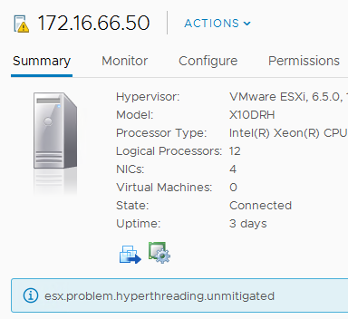
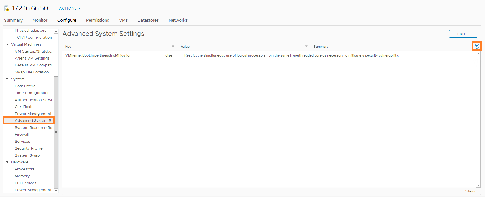

## Objectif

Suite à la diffusion publique de la vulnérabilité L1TF (" L1 Terminal Fault ", ou "Foreshadow"), différentes procédures et patch visant à minimiser l'exposition à ce risque ont été publiées.

**Ce guide vous explique comment bloquer cette vulnérabilité**

## Prérequis

- Posséder un utilisateur pouvant se connecter à vSphere.
- Utiliser l'hyperthreading sur vos machines virtuelles

## En pratique

Pour rappel :

|Variante|vulnérable|fixé par le patch ?|
|:---|:---:|:---:|
|Variant1 : L1 Terminal Fault - VMM (CVE-2018-3646)|YES|NO (mais mitigé)|
|Variant2 : L1 Terminal Fault - OS (CVE-2018-3620)|NO||
|Variant3 : L1 Terminal Fault - SGX (CVE-2018-3615)|NO||

> [!primary]
> 
> L1 Terminal Fault - OS (CVE-2018-3620) [n'affecte pas les hyperviseurs VMware](https://kb.vmware.com/s/article/55807) et [necessite l'accès en local au vCenter/VCSA](https://kb.vmware.com/s/article/52312)
>

> [!primary]
> 
> L1 Terminal Fault - SGX (CVE-2018-3615) n'affecte pas les hyperviseurs VMware : [https://kb.vmware.com/s/article/54913](https://kb.vmware.com/s/article/54913)
> 

Concernant l'offre **Private Cloud**, seules les offres SDDC sont impactées par cette vulnérabilité.

Vous retrouverez les informations de cette faille sur notre [article de blog](https://www.ovh.com/fr/blog/ovh-l1-terminal-fault-l1ft-foreshadow-disclosure/){.external-link}.

## Processus de mitigation

> [!primary]
>
> Il est important de comprendre que les actions détaillées ci-dessous ne corrigent pas la vulnérabilité.
>
> Les actions décrivent uniquement comment désactiver l'hyperthreading sur vos hôtes ESXi. Cependant, la faille L1TF nécesitant l'hyperthreading pour fonctionner, sa désactivation protège votre infrastructure de l'exploitation de cette vulnérabilité.
>

Le processus de mitigation est décrit dans cette base de connaissance VMware : [https://kb.vmware.com/s/article/55806](https://kb.vmware.com/s/article/55806){.external-link}.

Cette procédure se divise en 3 phases distinctes.

### Étape 1: Phase de mise à jour

La mise à jour du vCenter est réalisée par OVHcloud, cependant, le patch des hôtes ESXi est à effectuer par vos soins et est disponible dans [l'update manager](/pages/hosted_private_cloud/hosted_private_cloud_powered_by_vmware/vmware_update_manager){.external-link}.

Vous retrouverez la liste des patchs pour les hôtes ESXi dans [ce document](https://www.vmware.com/security/advisories/VMSA-2018-0020.html){.external-link}.

Suite à la phase de mise à jour des hôtes, le message d'alerte suivant sera présent dans le résumé de votre hôte :

{.thumbnail}

### Étape 2 : Phase d'évaluation de l'environnement

Une fois les hôtes ESXi à jour, le correctif n'est pas encore appliqué.

Il est important d'être conscient des potentiels problèmes listés dans la [base de connaissances](https://kb.vmware.com/s/article/55806){.external-link} mentionnée précedemment, ainsi que les baisses de performances constatées dans cette autre base de connaissance : [https://kb.vmware.com/s/article/55767](https://kb.vmware.com/s/article/55767){.external-link}.

### Étape 3 : Phase d'activation

Après avoir pris connaissance de ces différents éléments, vous pourrez activer le paramètre permettant de désactiver l'hyperthreading, en vous rendant dans les paramètres système avancés.

{.thumbnail}

Un filtre est disponible en haut à droite de la fenêtre.

Cette manipulation est à réaliser sur chaque hôte.

Pour en savoir plus, vous pouvez vous rendre à l'étape 3 de la partie résolution présente dans [cette base de connaissance VMware](https://kb.vmware.com/s/article/55806){.external-link}.

> [!warning]
> 
> Si, à la vue de ces différents éléments, vous ne souhaitez pas désactiver l'hyperthreading, vous pouvez supprimer le message d'alerte en suivant cette [base de connaissance](https://kb.vmware.com/s/article/57374){.external-link}.
> 
> {.thumbnail}
> OVHcloud ne recommande pas cette solution et se dégage de toute responsabilité concernant cette prise de risque.
>

## Aller plus loin

Échangez avec notre communauté d'utilisateurs sur <https://community.ovh.com>.