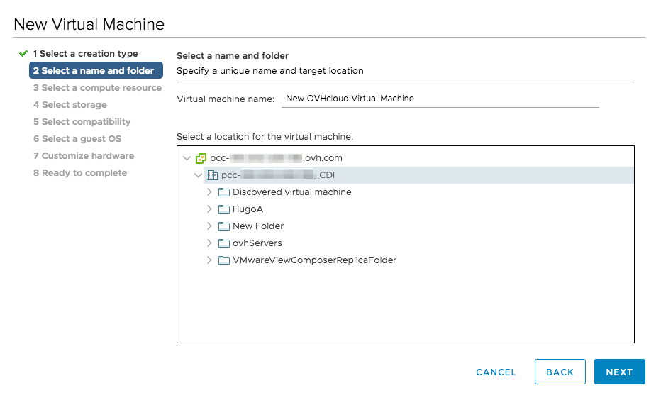
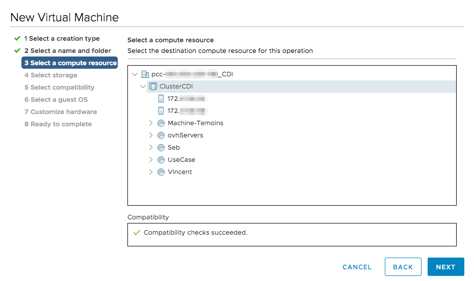
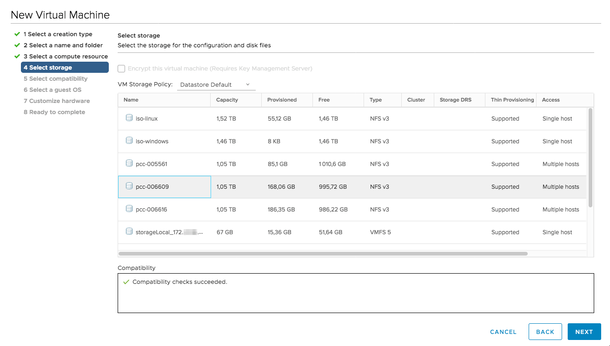
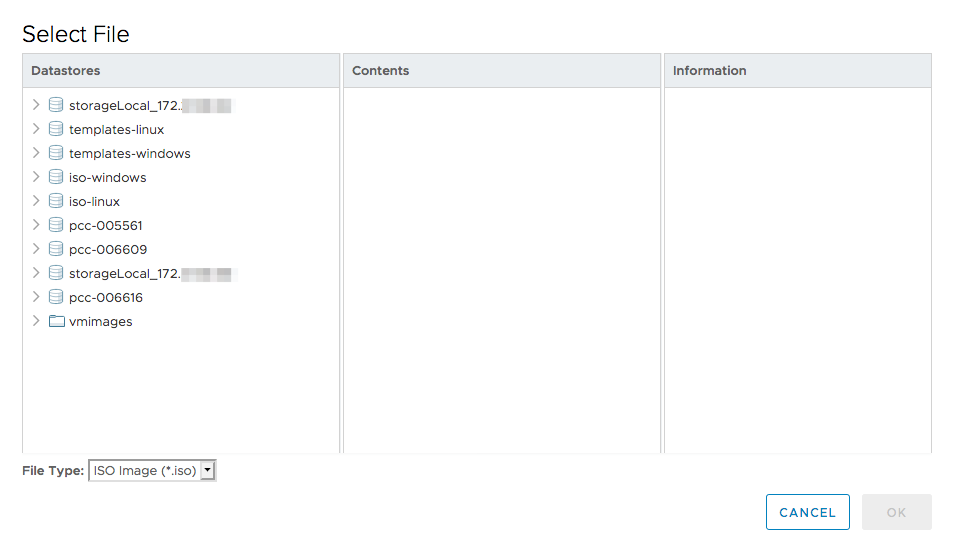
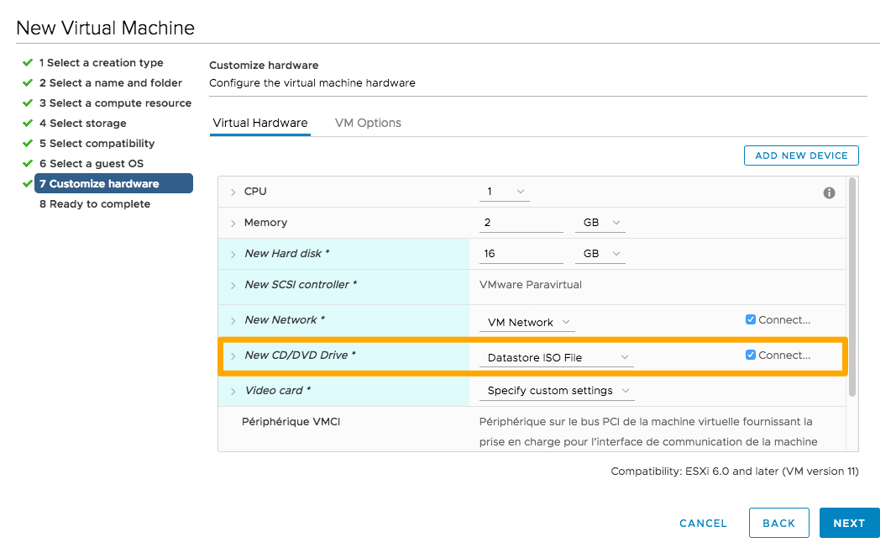
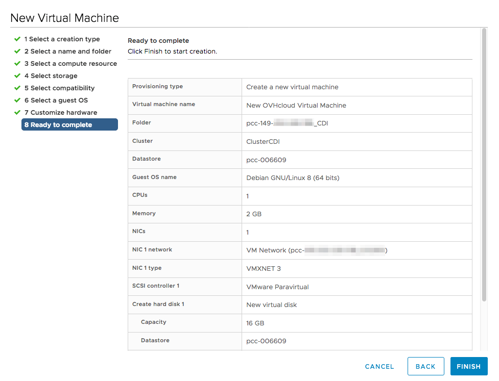
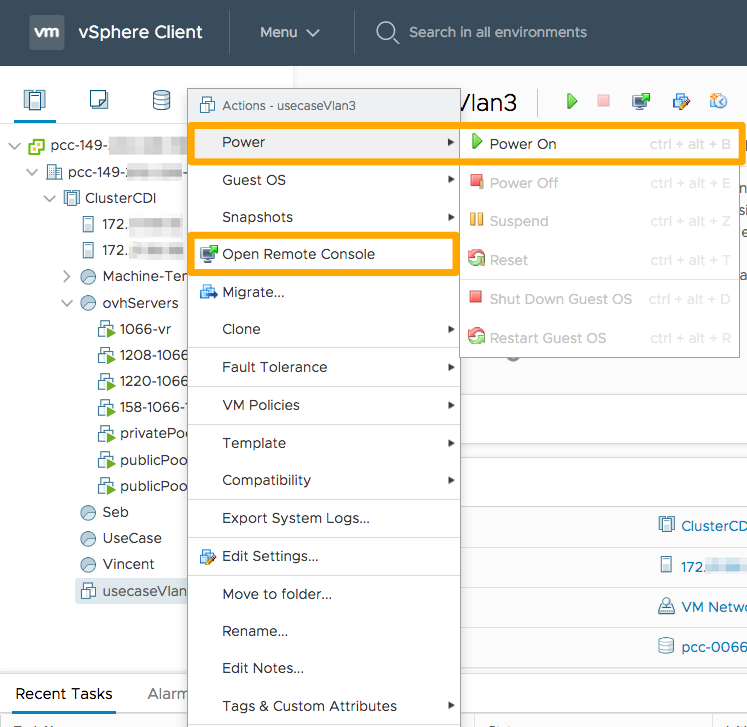

## Objective

In the vSphere interface, you have multiple possibilities to deploy a virtual machine (VM). 

**This guide explains the deployment of a virtual machine by means of an example.**

## Requirements

- a [Hosted Private Cloud infrastructure](https://www.ovhcloud.com/en-ca/enterprise/products/hosted-private-cloud/)
- a user account with access to vSphere (created in the [OVHcloud Control Panel](https://ca.ovh.com/auth/?action=gotomanager&from=https://www.ovh.com/ca/en/&ovhSubsidiary=ca))

## Instructions

### Deploying a virtual machine

A new VM can be deployed from the vSphere client. Right-click on your data centre (or use the  `ACTIONS`{.action} button) and select `New Virtual Machine`{.action}.

{.thumbnail}

You have multiple possibilities regarding the creation of a new VM:

- It is possible to create it and select an ISO from your datastore in the process. You can upload ISO files by connecting [via SFTP](/pages/hosted_private_cloud/hosted_private_cloud_powered_by_vmware/sftp_connexion).
- You can deploy a VM from your own template, an external template or an [OVHcloud template](/pages/hosted_private_cloud/hosted_private_cloud_powered_by_vmware/ovf_template).
- You can clone an existing VM (be careful to avoid IP address conflicts).
- You can clone a VM into a template, so that you can deploy your next virtual machine more quickly.
- You can clone a template into another template. Make use of this, for example, to have the template available on different datastores and thus prevent performance loss during a massive deployment.
- You can convert a template into a VM. This will cause the template to be lost but may be useful if you want to modify it.

{.thumbnail}

The following instructions will focus on deploying a VM using an ISO (`Create a new virtual machine`{.action}).

The next step allows you to define a name for the VM and choose a location. If you do not choose a folder, it will be created at the root of the data centre.

{.thumbnail}

You can then choose the cluster, host, [resource pool](https://docs.vmware.com/en/VMware-vSphere/6.7/com.vmware.vsphere.resmgmt.doc/GUID-60077B40-66FF-4625-934A-641703ED7601.html){.external-link}, or [vApp](https://docs.vmware.com/en/VMware-vSphere/6.7/com.vmware.vsphere.vm_admin.doc/GUID-E6E9D2A9-D358-4996-9BC7-F8D9D9645290.html){.external-link} to place it.

In this case, the VM will be deployed according to the configured DRS rules, and will be placed at the root of the cluster.

{.thumbnail}

Next, you can choose which database to store the configuration and disk files in.

We do not recommend placing your virtual machine in "storageLocal", which corresponds to the local storage of your host. If your host fails, your VM will not be able to restart and will no longer be accessible.

{.thumbnail}

Then select the compatibility between your VM and the host. Unless otherwise noted, it is recommended that you choose the latest one.

{.thumbnail}

In this step, choose a guest operating system. This does not install the operating system, but pre-configures the VM for its usage (CPU/RAM, type of NIC, support for VMware tools installation).

{.thumbnail}

### Configuring the virtual machine

Follow the next steps to configure your VM's resources.

The row `New Network` allows to add a network adapter:

- "VM Network" is used for the public network and direct internet access.
- The VLANs will allow you to use the private network between your virtual machines (and other OVHcloud services when using vRack).

{.thumbnail}

In the row `New CD/DVD Drive`, you can select "Datastore ISO File".

A new window will open where you can browse to your ISO file. It can also be added after the VM is created.

{.thumbnail}

Once the file is selected, it will be displayed as shown below. Do not forget to tick the option `Connect At Power On`{.action}.

{.thumbnail}

A summary of the VM specifications will be displayed. To change your configuration, you can click directly one of the configuration steps on the left.

Click on `FINISH`{.action} to finalise the deployment.

{.thumbnail}

Once the VM is ready, you can start it by right-clicking on it and then clicking on `Power`{.action} and `Power On`{.action}. 

Finally, click on `Open Remote Console`{.action} to access the 'screen' of the VM and begin the installation of the operating system.

{.thumbnail}

The console will open in a new tab and after you have completed the installation, you will be able to use your virtual machine.

{.thumbnail}

> [!primary]
> Once your VM is installed, it is recommended that you disconnect the ISO in the settings. Otherwise, you will not be able to move the VM.
>

## Go further

Join our community of users on <https://community.ovh.com/en/>.
