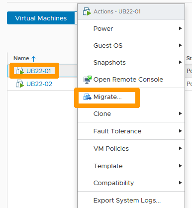
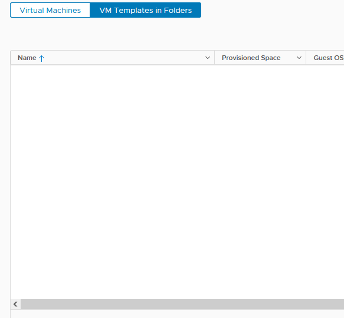
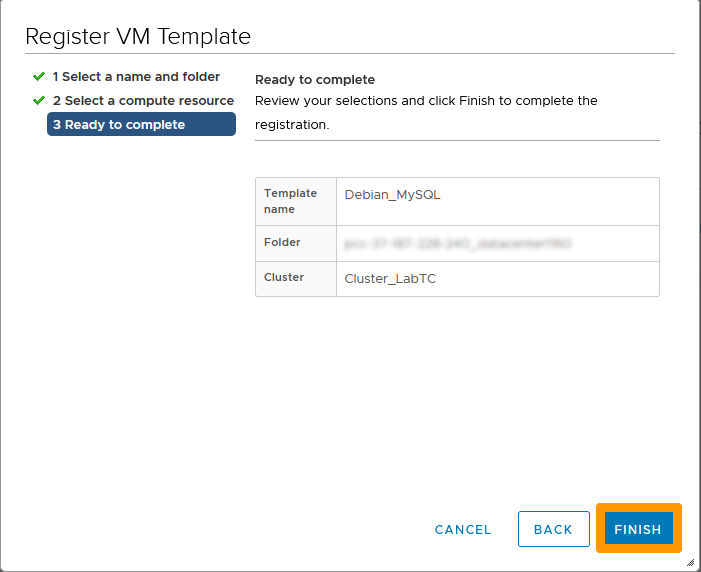

> [!warning]
> OVHcloud provides services for which you are responsible, with regard to their configuration and management. It is therefore your responsibility to ensure that they work properly.
>
> This guide is designed to assist you as much as possible with common tasks. However, we recommend contacting a [specialist provider](https://partner.ovhcloud.com/en-gb/directory/) if you experience any difficulties or doubts when it comes to managing, using or setting up a service on a server.
>

## Objective

Some storages will no longer be available at the end of March 2023 as they will no longer be maintained, as described in this guide: [Life cycle of Hosted Private Cloud powered by VMware](/pages/hosted_private_cloud/hosted_private_cloud_powered_by_vmware/lifecycle_policy#datastores-stockage).

We will go through all the steps to migrate your data to more recent storage and disable your obsolete storage.

## Requirements

- Being an administrative contact of your [Hosted Private Cloud infrastructure](https://www.ovhcloud.com/en-gb/enterprise/products/hosted-private-cloud/) to receive login credentials.
- A user account with access to the [OVHcloud Control Panel](https://www.ovh.com/auth/?action=gotomanager&from=https://www.ovh.co.uk/&ovhSubsidiary=GB).
- A user account with access to vSphere.

## Instructions

### Adding storage

Using the new storage ranges will provide you with full-SSD (vs SSD-accelerated) disks, 2x2x25Gbps network cards (vs 2x10Gbps), higher availability and resilience. Click this link for more information: [NFS Datastore](https://www.ovhcloud.com/en-gb/enterprise/products/hosted-private-cloud/datastores-nfs/).

Use this guide to add more storage if you have not yet subscribed to a more recent solution: [How do I add storage space?](/pages/hosted_private_cloud/hosted_private_cloud_powered_by_vmware/how_to_add_storage)

### Migrating your virtual machines

Go to your vCenter interface and check the virtual machines that are on each of your outdated datastores.

Click on the `storage`{.action} icon, select your Datastore in `Shared Storage`{.action} to the left. Click on the `VM`{.action} tab and stay on `Virtual Machines`{.action} to display the virtual machines on this obsolete storage.

{.thumbnail}

Right-click each of the virtual machines that are on this datastore, choose `Migrate`{.action} and use the [VMware Storage vMotion](/pages/hosted_private_cloud/hosted_private_cloud_powered_by_vmware/vmware_storage_vmotion#finalising-the-operation) guide to migrate to a more recent datastore.

{.thumbnail}

When the tab no longer contains virtual machines, go to `VM template in folders`{.action} to view the saved templates on your *datastore*.

{.thumbnail}

Right-click each of the templates saved in your *datastore* and click `Remove from Inventory`{.action}.

> [!warning]
> The template is deleted from the inventory but is still in the *datastore*. You can retrieve it and move it to another *datastore* or delete it if you no longer need it.
>

{.thumbnail}

The templates list is empty, you can keep moving your templates to another datastore.

{.thumbnail}

Go to the `Files`{.action} tab, go to a folder in a template and click `Move to`{.action}.

{.thumbnail}

Choose a Datastore and click `OK`{.action}.

{.thumbnail}

Wait for the task to complete.

{.thumbnail}

Select the destination datastore for the template on the left, go to the Template folder, select the template file and click `Save VM`{.action}.

{.thumbnail}

Click `NEXT`{.action}.

{.thumbnail}

Click `NEXT`{.action} again.

{.thumbnail}

Click `FINISH`{.action}.

{.thumbnail}

Go to the `VM & templates`{.action} tab to make your model appear.

{.thumbnail}

### Deleting storage for your VMware cluster

Use this guide to delete your obsolete storage: [Delete a datastore](/pages/hosted_private_cloud/hosted_private_cloud_powered_by_vmware/delete_datastore)

> [!warning]
> After deleting your Datastore, log in to your OVHcloud Control Panel to stop subscribing to this service.
>

## Go further

Join our community of users on <https://community.ovh.com/en/>.
