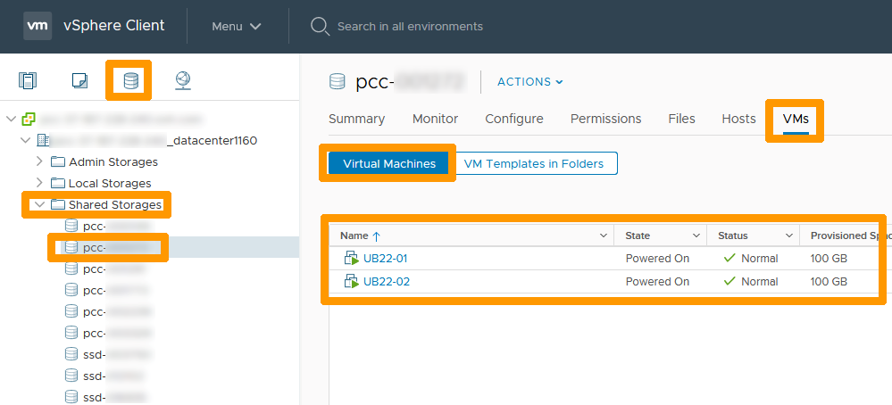
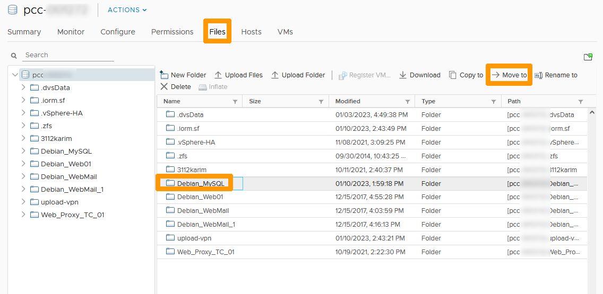
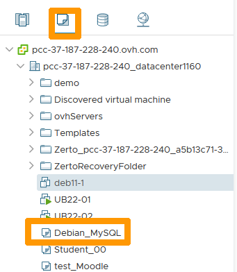

> [!warning]
> OVHcloud vous met à disposition des services dont la configuration, la gestion et la responsabilité vous incombent. Il vous appartient donc de ce fait d’en assurer le bon fonctionnement.
>
> Ce guide a pour but de vous accompagner au mieux sur des tâches courantes. Néanmoins, nous vous recommandons de faire appel à un [prestataire spécialisé](https://partner.ovhcloud.com/fr/directory/) si vous éprouvez des difficultés ou des doutes concernant l’administration, l’utilisation ou la mise en place d’un service sur un serveur.
>

## Objectif

Certains stockages ne seront plus disponibles à la fin Mars 2023 car ils ne seront plus maintenus, comme indiqué dans notre guide sur le [cycle de vie du Hosted Private Cloud powered by VMware](/pages/hosted_private_cloud/hosted_private_cloud_powered_by_vmware/lifecycle_policy#datastores-stockage).

**Découvrez les étapes de migration de vos données vers un stockage plus récent et comment désactiver votre stockage obsolète.** 

## Prérequis

- Être contact administrateur de l'infrastructure [Hosted Private Cloud](https://www.ovhcloud.com/fr/enterprise/products/hosted-private-cloud/), afin de recevoir les identifiants de connexion.
- Avoir un identifiant actif dans l'[espace client OVHcloud](https://www.ovh.com/auth/?action=gotomanager&from=https://www.ovh.com/fr/&ovhSubsidiary=fr)
- Avoir un identifiant actif dans vSphere.

## En pratique

### Ajout d'un stockage

Les nouvelles gammes de stockage vous permettent de bénéficier de disques full-SSD (comparativement à des disques SSD-accelerated sur les précédentes gammes de stockage), de cartes-réseau 2x2x25Gbps (comparativement à des cartes-réseau 2x10Gbps sur les précédentes gammes de stockage), d'une meilleure disponibilité et résilience. 

Consultez notre page [Datastore NFS](https://www.ovhcloud.com/fr/enterprise/products/hosted-private-cloud/datastores-nfs/) pour obtenir plus d'informations.

Si vous n'avez pas encore souscrit à une offre plus récente, Utilisez [ce guide](/pages/hosted_private_cloud/hosted_private_cloud_powered_by_vmware/how_to_add_storage) pour ajouter un stockage plus important.

### Migration de vos machines virtuelles et des modèles de machines virtuelles

Dans votre interface vCenter, vérifiez les machines virtuelles qui se trouvent sur chacun de vos datastores obsolètes.

Cliquez sur l'icône de `stockage`{.action}, choisissez à gauche votre Datastore dans `Shared Storage`{.action}. Cliquez sur l'onglet `VM`{.action} et restez sur `Machines virtuelles`{.action} pour faire apparaître les machines virtuelles qui se trouvent sur ce stockage obsolète.

{.thumbnail}

Faites un clic-droit sur chacune des machines virtuelles qui se trouvent sur ce datastore, choisissez `Migrer`{.action} et aidez-vous du guide « [VMware Storage vMotion](/pages/hosted_private_cloud/hosted_private_cloud_powered_by_vmware/vmware_storage_vmotion#finaliser-le-vmotion) » pour effectuer la migration vers un datastore plus récent.

{.thumbnail}

Lorsque vous n'aurez plus de machines virtuelles dans l'onglet, rendez-vous sur `Modèle de VM dans des dossiers`{.action} pour afficher les modèles enregistrés sur votre *datastore*.

{.thumbnail}

Faites un clic-droit sur chacun des modèles enregistrés dans votre *datastore* et cliquez sur `Supprimer de l'inventaire`{.action}.

> [!warning]
> Le modèle est supprimé de l'inventaire mais se trouve toujours dans le *datastore*. Vous pouvez le récupérer pour le remettre sur un autre *datastore* ou le supprimer si vous n'en avez plus besoin.
>

{.thumbnail}

La liste des modèles est vide, vous pouvez maintenant déplacer vos modèles sur un autre datastore.

{.thumbnail}

Allez sur l'onglet `Fichiers`{.action}, positionnez-vous sur un dossier d'un modèle et cliquez sur `Déplacez vers`{.action}.

{.thumbnail}

Choisissez un Datastore et cliquez sur `OK`{.action}.

{.thumbnail}

Attendez que la tâche soit terminée.

{.thumbnail}

Choisissez le Datastore de destination du modèle à gauche, allez dans le dossier du modèle, sélectionnez le fichier du modèle et cliquez sur `Enregistrer une VM`{.action}.

{.thumbnail}

Cliquez sur `NEXT`{.action}.

{.thumbnail}

Cliquez à nouveau sur `NEXT`{.action}.

{.thumbnail}

Cliquez sur `FINISH`{.action}.

{.thumbnail}

Allez dans l'onglet `VM & modèles`{.action}. pour faire apparaître votre modèle.

{.thumbnail}

### Suppression du stockage de votre cluster VMware

Dès que vous n'aurez plus de données sur votre stockage, il sera alors possible de supprimer votre *datastore*.

Aidez-vous du guide « [Supprimer un datastore](/pages/hosted_private_cloud/hosted_private_cloud_powered_by_vmware/delete_datastore) » pour supprimer votre stockage obsolète.

> [!warning]
> Après avoir supprimé votre *Datastore*, il vous faudra arrêter la souscription à ce service depuis votre espace client OVHcloud.
>

## Aller plus loin

Échangez avec notre communauté d'utilisateurs sur <https://community.ovh.com>.
