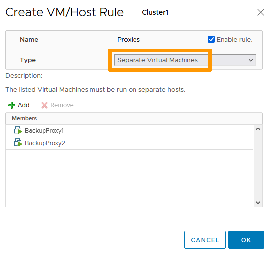

**Last updated 22nd February 2022**

## Objective

During the backup process, you may experience a freeze (approx. 30 seconds) or disk lock when deleting the VM snapshot in the NFS datastore.

This disk lock happens because the VMDK snapshot is mounted on the backup proxy, which works on a different host.

This problem will not occur if the virtual machine and the backup proxy are located on the same host.

**This guide will show you how to implement a bypass solution, using the VMware DRS mechanism.**

## Requirements

- Being an administrative contact of your [Hosted Private Cloud infrastructure](https://www.ovhcloud.com/en-ie/enterprise/products/hosted-private-cloud/) to receive login credentials
- A user account with access to vSphere (created in the [OVHcloud Control Panel](https://www.ovh.com/auth/?action=gotomanager&from=https://www.ovh.ie/&ovhSubsidiary=ie))
- [Veeam Managed Backup](https://www.ovhcloud.com/en-ie/enterprise/products/hosted-private-cloud/veeam-backup-managed/){.external} option enabled

## Instructions

### Limitations of this solution

Please note the following before you begin this process:

- In large environments, creating multiple DRS rules can be time-consuming.
- The user must manually add the new VMs into the DRS rules.
- Any VMs that need to be backed up, but are not part of the DRS rules, may still experience freezes.

### Implementing the solution

To implement this solution, click on the relevant cluster, then go to the `Configure`{.action} tab and the `VM/Host Rules`{.action} section

{.thumbnail}

Add a rule to **"Keep virtual machines together"** and add VMs with a backup proxy. If you have a large number of VMs to backup, you can create multiple DRS rules, and link them with multiple backup proxies. The OVHcloud algorithm will ensure that the virtual machine backup process is performed by whichever backup proxy is present on the same ESXi host as the VM.

> [!warning]
>
> Adding a new backup proxy will result in an additional cost.
>

{.thumbnail}

Create another rule to **"Separate virtual machines"**, in order to keep backup proxies on different hosts:

{.thumbnail}

Note that you must have an anti-affinity rule, so that backup proxies are never on the same host, and as many affinity rules as you have backup proxies.

## Go further

Join our community of users on <https://community.ovh.com/en/>.