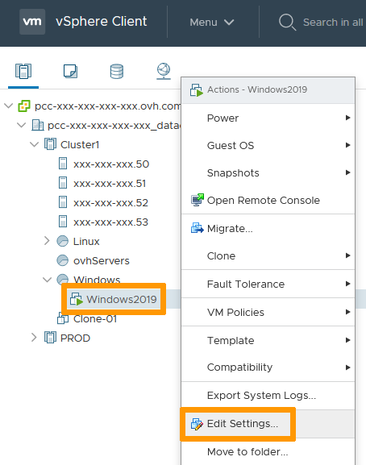
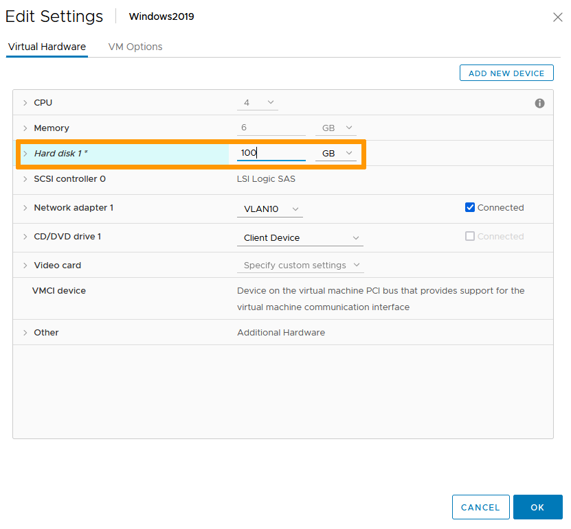
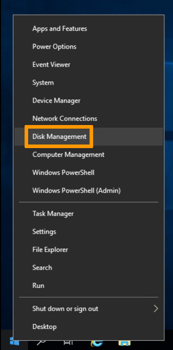
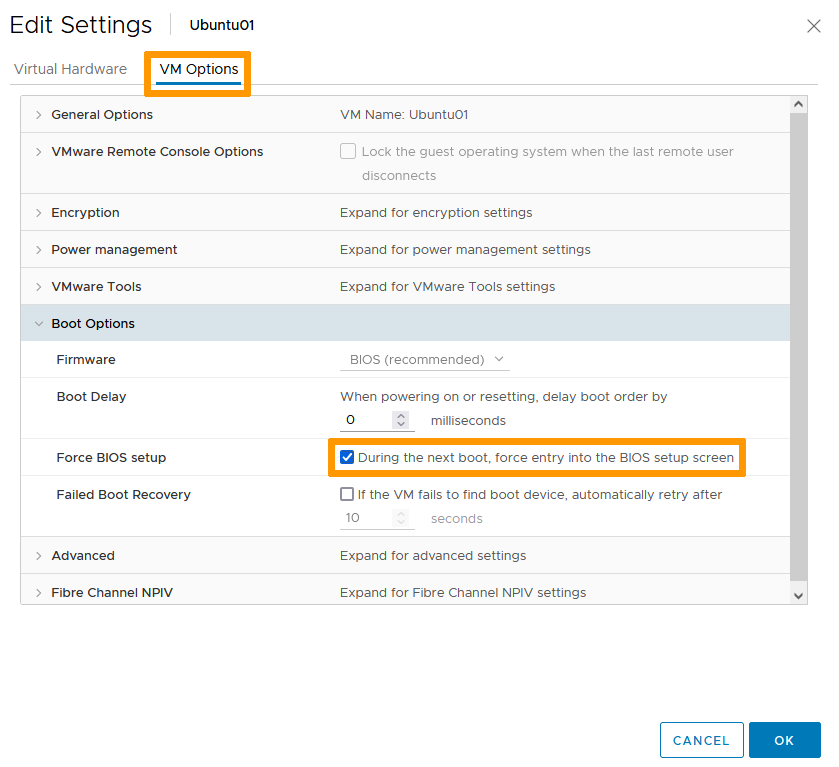
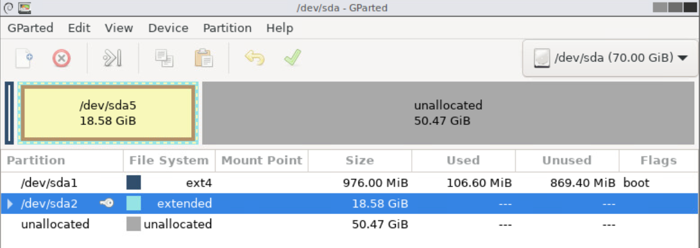
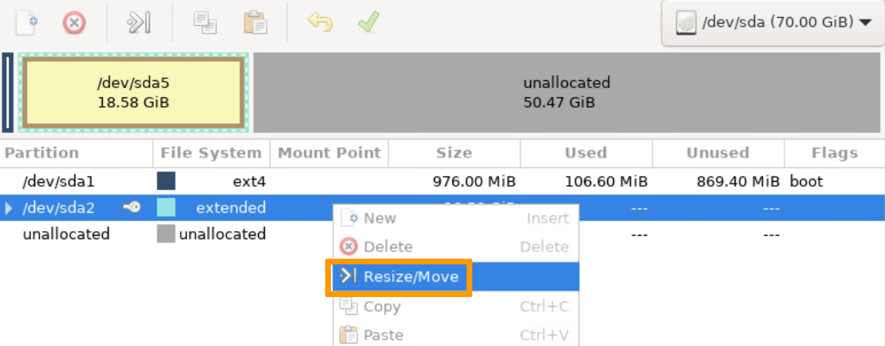
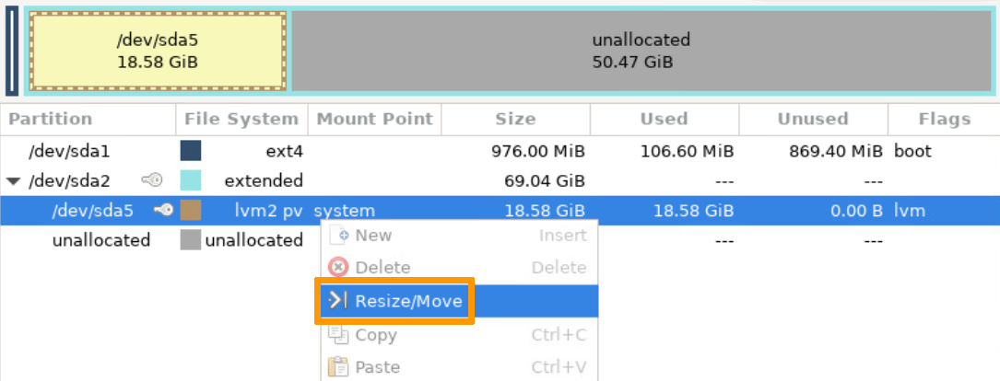
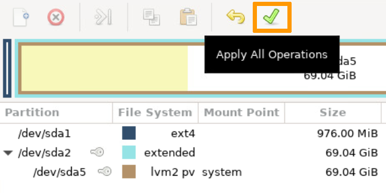
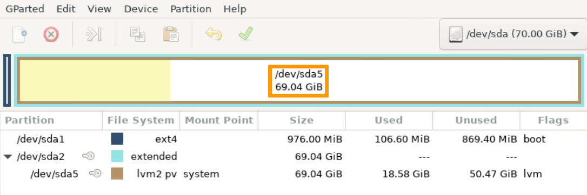

## Objective

We will demonstrate how to use vSphere and OS management tools to add space to your virtual disks for both Windows and Linux.

**This guide offers you a step by step study case to achieve this objective.**

## Requirements

- Being an administrative contact of your [Hosted Private Cloud infrastructure](https://www.ovhcloud.com/en-gb/enterprise/products/hosted-private-cloud/) to receive login credentials
- A user account with access to vSphere (created in the [OVHcloud Control Panel](https://www.ovh.com/auth/?action=gotomanager&from=https://www.ovh.co.uk/&ovhSubsidiary=GB))

## Instructions

> [!warning]
>
> Before proceeding with this type of change, we recommend a full backup or a clone of the virtual machine.
>

### Windows VM

In the vSphere interface menu, go to the `Hosts & Clusters`{.action} dashboard.

{.thumbnail}

On the left side, navigate to the VM you wish to modify, right click on it and select `Edit Settings`{.action}.

{.thumbnail}

Find the disk you are extending and modify the size value as needed (in our case, we changed the value from 80 to 100 GB). 
Click `OK`{.action}.

{.thumbnail}

You can verify the change was applied in your recent tasks view.

{.thumbnail}

Log on the VM and go to the "Disk Management" console. 
One simple way to do it is to right click on "Start" and select `Disk Management`{.action}.

{.thumbnail}

In the management console, you can see there is 20GB of unallocated space, corresponding to the space added to the virtual disk previously.

{.thumbnail}

Right-click the existing logical disk and select `Extend Volume`{.action}.

{.thumbnail}

Click `Next`{.action} in the first wizard window. 
In the second window, the whole available space will be selected by default. It can be modified if needed. Click `Next`{.action}. 
Click `Finish`{.action} in the last window.

{.thumbnail}

You can now see your disk fully extended and available.

{.thumbnail}

### Linux VM

> [!primary]
>
> For Linux VMs, we'll use a partition utility. There are many available products and we do not recommend any over the others. Our use of [GParted LiveCD](http://gparted.sourceforge.net/livecd.php) is in no way an endorsement.
> For creating an ISO library and mounting an ISO to a VM, refer to [How to connect an ISO image to a VM](/pages/hosted_private_cloud/hosted_private_cloud_powered_by_vmware/how_to_connect_an_iso_image_to_a_vm).

In the vSphere interface menu, go to the `Hosts & Clusters`{.action} dashboard.

{.thumbnail}

On the left side, navigate to the VM you wish to modify, right-click it and select `Edit Settings`{.action}.

{.thumbnail}

Connect the utility ISO to your VM ([How to connect an ISO image to a VM](/pages/hosted_private_cloud/hosted_private_cloud_powered_by_vmware/how_to_connect_an_iso_image_to_a_vm)).  
Find the disk you are expanding and modify the size value as needed (in our case, we changed the value from 20 to 70 GB). 

{.thumbnail}

In the `VM Options`{.action} tab, check the "During the next boot, force entry into the BIOS setup screen" box so you can boot on the partition utility. 
Click `OK`{.action}.

{.thumbnail}

You can verify the change was applied in your recent tasks view.

{.thumbnail}

Boot (or reboot) the VM and start the partition utiliy. 
*Refer to the software developer documentation to boot and get to the management console.* 
In the management console, you can see there is 50GB of unallocated space, corresponding to the space added to the virtual disk previously.

{.thumbnail}

Right-click the existing logical volume and select `Resize/Move`{.action}.

{.thumbnail}

Drag the right arrow to select the whole available space or type 0 in the "Free space following" field. 
Click `Resize/Move`{.action}.

{.thumbnail}

Click the green checkmark to apply all operations.

{.thumbnail}

Click `Apply`{.action} to confirm.

{.thumbnail}

Click `Close`{.action} when done.

{.thumbnail}

You can now see your volume contains the unallocated space. 
We still need to apply the space to the disk.

{.thumbnail}

Right-click the existing disk and select `Resize/Move`{.action}.

{.thumbnail}

Drag the right arrow to select the whole available space or type 0 in the "Free space following" field. 
Click `Resize`{.action}.

{.thumbnail}

Click the green checkmark to apply all operations.

{.thumbnail}

Click `Apply`{.action} to confirm.

{.thumbnail}

Click `Close`{.action} when done.

{.thumbnail}

You can now see your vitual disk is extended and ready for use. 

{.thumbnail}

## Go further

Join our community of users on <https://community.ovh.com/en/>.
