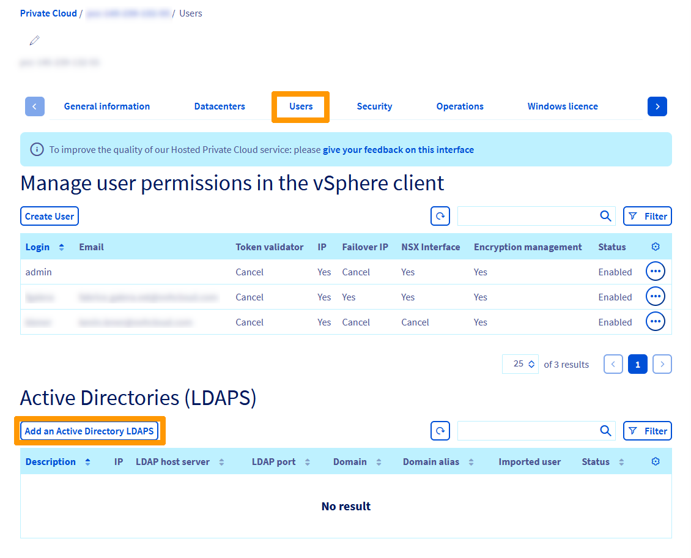
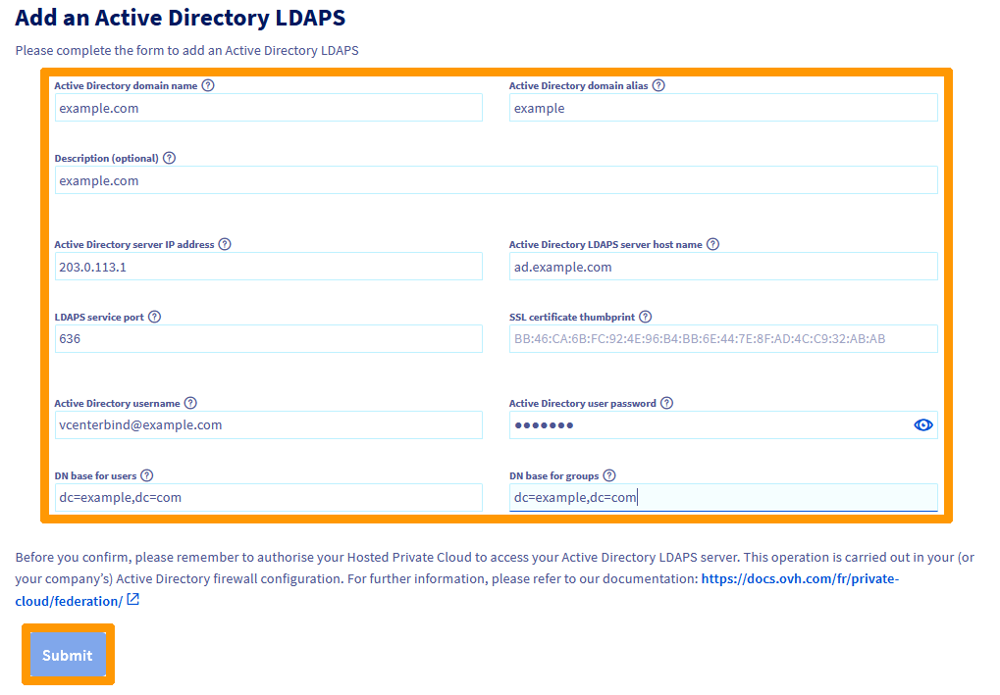
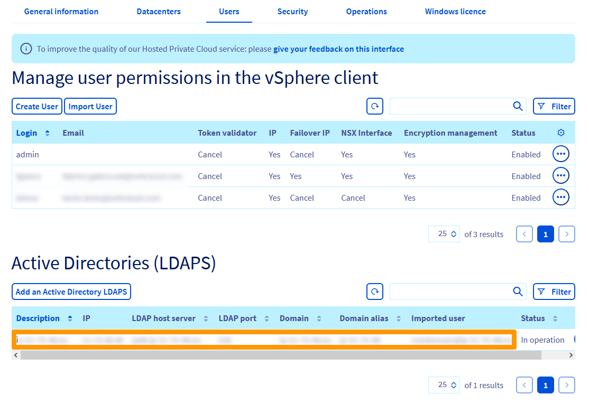
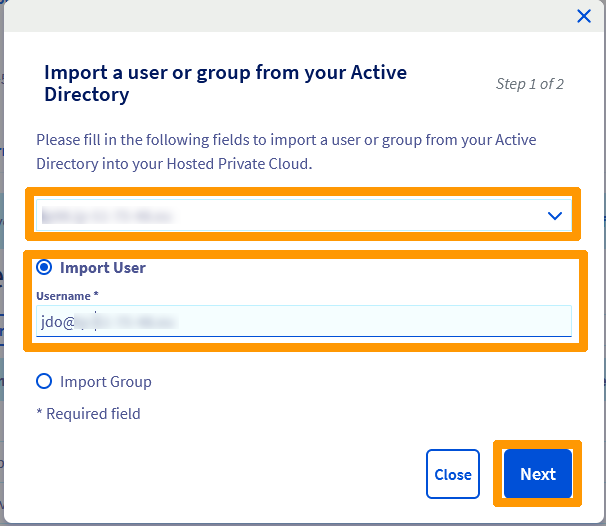
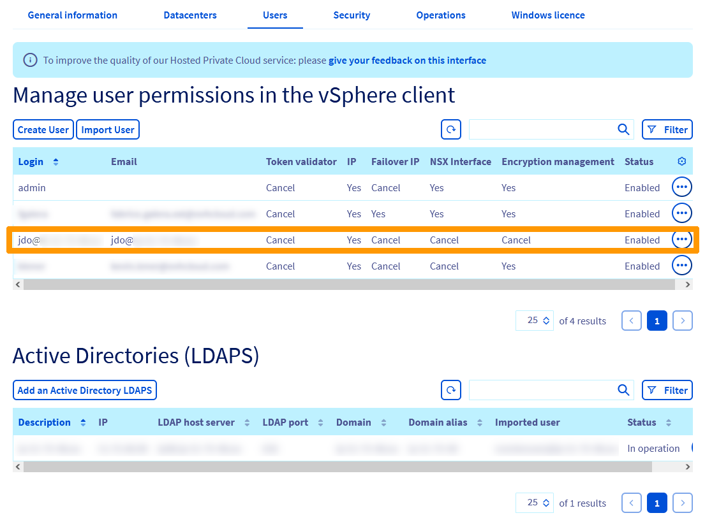
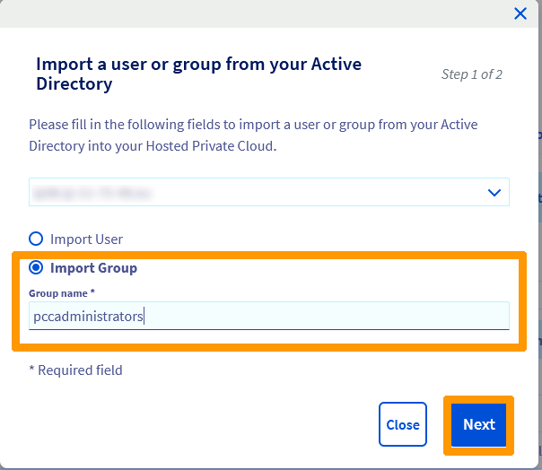
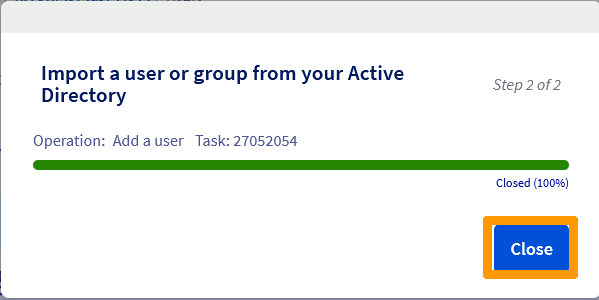
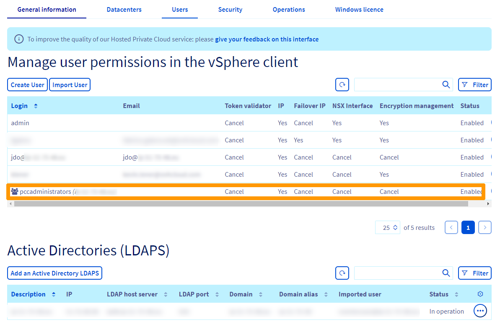
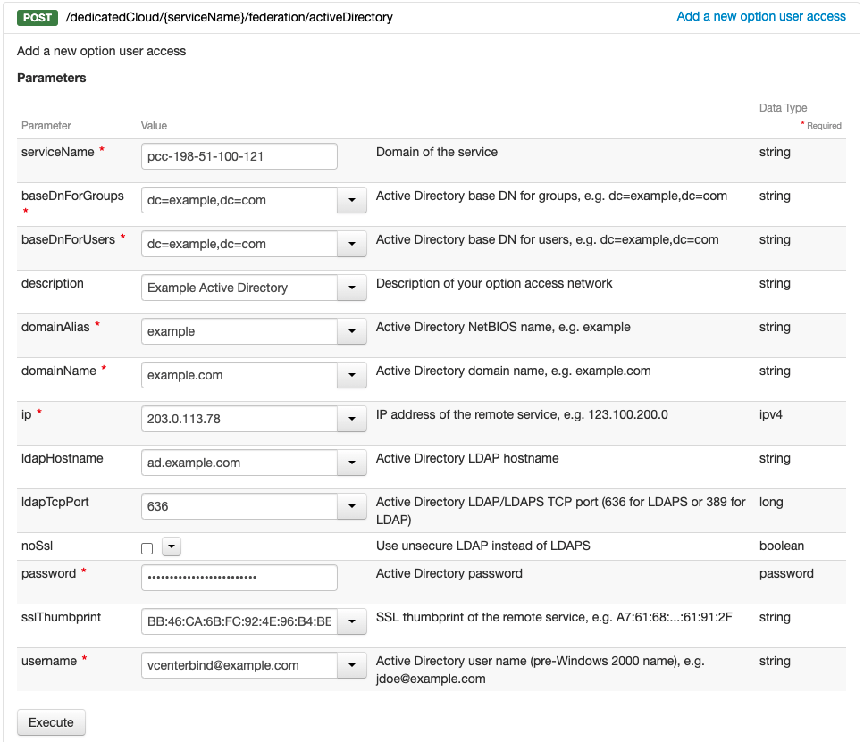
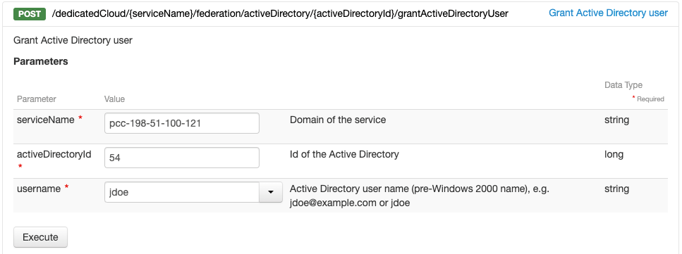

## Objectif

- Avoir souscrit une offre [Hosted Private Cloud](https://www.ovhcloud.com/fr/enterprise/products/hosted-private-cloud/){.external}.
- Disposer d'un serveur Active Directory accessible depuis une adresse IP publique et possédant un [certificat SSL valide pour le service LDAPS](https://docs.microsoft.com/fr-fr/troubleshoot/windows-server/identity/enable-ldap-over-ssl-3rd-certification-authority){.external}.
- Disposer d'un accès utilisateur au domaine Active Directory associé, avec au minimum un accès en lecture seule (pour la connexion LDAPS).
- Avoir accès à l’interface de gestion vSphere de votre Hosted Private Cloud.

## En pratique

### Récupérer les informations nécessaires

La connexion du vCenter au serveur Active Directory est réalisée via le protocole LDAPS fourni par le serveur Active Directory.

Afin de préparer la mise en place de la configuration, vous devez récupérer les informations suivantes :

- Nom de domaine Active Directory (FQDN).
- Alias de domaine Active Directory (Nom NetBIOS).
- Adresse IP publique du serveur Active Directory.
- Nom d'hôte du serveur LDAPS Active Directory. Nom utilisé dans le certificat SSL du service LDAPS, ce nom doit résoudre sur l'adresse IP publique du serveur Active Directory.
- Port du service LDAPS (par défaut 636).
- Base DN (Base Distinguished Name) pour les utilisateurs. Il s'agit du DN à partir duquel seront recherchés les utilisateurs. Par exemple, dc=example,dc=com
- Base DN (Base Distinguished Name) pour les groupes. Il s'agit du DN à partir duquel seront recherchés les groupes. Par exemple, dc=example,dc=com
- Identifiant et mot de passe d'un utilisateur du domaine qui sera utilisé pour la connexion au serveur LDAPS. Il doit être au minimum en lecture seule sur la section du serveur Active Directory pour les deux « Base DN » choisis précédemment. Identifiant pre-Windows 2000 sous la forme UPN (user@example.com).

Pour plus d'informations, vous pouvez vous référer à la [documentation VMware à ce sujet](https://docs.vmware.com/en/VMware-vSphere/6.7/com.vmware.psc.doc/GUID-98B36135-CDC1-435C-8F27-5E0D0187FF7E.html){.external}.

En complément des informations précédentes, vous devez récupérer l'empreinte du certificat SSL (SHA1 Fingerprint) du serveur LDAPS Active Directory.

Vous pouvez récupérer cette information par la méthode de votre choix.

- Via cette commande PowerShell sur le serveur Active Directory :

```shell
Get-ChildItem -Path Cert:\LocalMachine\MY | Select-Object -property FriendlyName, Subject, NotBefore, NotAfter, @{label='Thumbprint';'Expression'={$_.thumbprint -replace '(..(?!$))','$1:'}}
```

Ici, il s'agit de la valeur à droite du signe deux-points ( : ) :

```shell
> Thumbprint : BB:46:CA:6B:FC:92:4E:96:B4:BB:6E:44:7E:8F:AD:4C:C9:32:AB:AB
```

- Vous pouvez aussi utiliser la commande OpenSSL suivante (depuis une machine Linux/Unix/Mac distante) :

```shell
openssl s_client -connect ad.example.com:636 < /dev/null 2>/dev/null | openssl x509 -fingerprint -noout -in /dev/stdin
```

Ici, il s'agit de la valeur à droite du signe égal ( = ) :

```shell
> SHA1 Fingerprint=BB:46:CA:6B:FC:92:4E:96:B4:BB:6E:44:7E:8F:AD:4C:C9:32:AB:AB
```

### Autoriser la connexion au serveur Active Directory depuis votre Hosted Private Cloud

Récupérez l'adresse IP de votre Hosted Private Cloud par la méthode de votre choix.

Via cette commande sur le serveur Active Directory ou une machine Windows distante :

```shell
nslookup pcc-198-51-100-121.ovh.com
```

Ici, il s'agit de la valeur à la fin de la dernière ligne :

```shell
> Address:  198.51.100.121
```

Il est également possible d'utiliser la commande suivante (depuis une machine Linux/Unix/Mac distante) :

```shell
host pcc-198-51-100-121.ovh.com
```

Ici, il s'agit de la valeur à la fin de la ligne :

```shell
> pcc-198-51-100-121.ovh.com has address 198.51.100.121
```

Utilisez cette adresse IP pour autoriser votre Hosted Private Cloud à accéder à votre serveur LDAPS Active Directory (par défaut sur le port TCP 636).

Cette opération s'effectue dans la configuration du pare-feu de votre Active Directory ou de votre entreprise.

Exemple de configuration de règle de pare-feu entrant :

|Adresse IP distante (source)|Adresse IP locale (destination)|Port distant (source)|Port local (destination)|Protocole|
|---|---|---|---|---|
|198.51.100.121|Toutes les adresses|Tous les ports|636|TCP|

Adaptez cette configuration à votre entreprise et mettez en place la règle de pare-feu.

### Ajouter votre serveur Active Directory comme source d'authentification

Depuis votre espace client OVHcloud, rendez-vous dans les paramètres OVHcloud de votre infrastructure Hosted Private Cloud by VMware.

Positionnez-vous sur l'onglet `Utilisateurs`{.action} et cliquez sur `Ajouter un Active Directory LDAPS`{.action} dans la rubrique **Active Directories (LDAPs)**.



Saisissez ces informations : 

- **Nom de domaine Active Directory** : Nom de domaine Active directory.
- **Alias de domaine Active Directory**: Nom NetBIOS de votre domaine.
- **Description (Facultatif)** : Nom de domaine Active Directory.
- **Adresse IP du serveur Active Directory** : Adresse IP publique d'accès à votre serveur LDAPS.
- **Nom d'hôte du serveur LDAPS Active Directory** : Nom FQDN public de votre serveur Active directory.
- **Port du service LDAPS** : Numéro du port du service LDAPS.
- **Empreinte du certificat SSL** : Empreinte du certificat SSL.
- **Identifiant utilisateur Active Directory** : Identifiant pre-Windows 2000 sous la forme UPN (user@example.com).
- **Mot de passe utilisateur Active Directory** : Mot de passe de l'utilisateur Active Directory.
- **Base DN pour les utilisateurs** : Nom DN contenant les utilisateurs comme, par exemple, dc=example,dc=com pour le domaine example.com.
- **Base DN pour les groupes** : Nom DN contenant les groupes comme, par exemple, dc=example,dc=com pour le domaine example.com.

Cliquez ensuite sur `Executer`{.action}.



Une fenêtre apparaît pour afficher l'état d'avancement, attendez d'avoir atteint 100% et cliquez sur `Fermer`{.action}.

> [!primary]
>
> Si un paramètre n'est pas valide, la tâche sera annulée avant d'arriver à 100%. Dans ce cas, attendez quelques minutes jusqu'à ce que l'annulation soit complète avant de relancer la configuration.
>


Votre domaine Active Directory est relié à votre infrastructure VMware. Vous pouvez maintenant ajouter des utilisateurs et des groupes de votre annuaire Active Directory pour vous connecter à votre interface vSphere.



### Autoriser un utilisateur Active Directory à accéder à votre Hosted Private Cloud

Depuis votre espace client OVHcloud, vous pouvez autoriser un utilisateur issu de votre serveur Active Directory à accéder à votre Hosted Private Cloud.

Cliquez sur `Importer un utilisateur`{.action}


Sélectionnez votre annuaire Active Directory, cliquez sur `Importer un utilisateur`{.action}, saisissez votre nom d'utilisateur dans un format UPN (user@example.com) et cliquez sur `Suivant`{.action}.



Une fenêtre avec l'état d'avancement de la tâche apparaît, attendez d'avoir atteint 100% et cliquez sur `Fermer`{.action}.


Un nouvel utilisateur est affiché dans l'espace client, vous pouvez l'utiliser pour vous connecter à l'interface vSphere. 

> [!primary]
>
> Par défaut, l'utilisateur ne possède aucune permission sur votre Hosted Private Cloud, il pourra uniquement se connecter à votre Hosted Private Cloud. Vous pouvez ajuster les permissions depuis l'espace client.
>



### Autoriser un groupe Active Directory à accéder à votre Hosted Private Cloud

Vous avez la possibilité d'autoriser directement un ensemble d'utilisateurs (groupe) issu de votre serveur Active Directory à accéder à votre Hosted Private Cloud au travers de l'espace client.

Cliquez sur `Importer un utilisateur`{.action}.


Sélectionnez votre annuaire Active Directory, cliquez sur `Importer un groupe`{.action}, saisissez le `nom de votre groupe` et cliquez sur `Suivant`{.action}.



Une fenêtre avec l'état d'avancement de la tâche apparaît, attendez d'avoir atteint 100% et cliquez sur `Fermer`{.action}.



Le groupe apparaît dans la liste des utilisateurs de votre cluster, les membres de ce groupe peuvent se connecter à l'interface d'administration de votre cluster.

> [!primary]
>
> Par défaut, le groupe ne possède aucune permission sur votre Hosted Private Cloud. Ses membres pourront se connecter à votre Hosted Private Cloud mais n'auront aucun accès. Vous pouvez ajuster les permissions depuis l'espace client.
>



### Utiliser l'API OVHcloud

Il est possible d'utiliser l'API OVHcloud pour effectuer les mêmes opérations (ajout d'un annuaire et autorisation d'un groupe ou d'un utilisateur à se connecter à votre interface vCenter).

#### Ajouter un annuaire Active directory

Récupérez votre « serviceName » en utilisant l'appel API suivant :

> [!api]
>
> @api {v1} /dedicatedCloud GET /dedicatedCloud
>

Effectuez ensuite la mise en place du serveur Active Directory comme source d'authentification.

Vous devrez spécifier les informations récupérées précédemment. Ne cochez pas la case « noSsl ».

> [!api]
>
> @api {v1} /dedicatedCloud POST /dedicatedCloud/{serviceName}/federation/activeDirectory
>

{.thumbnail}

Assurez-vous que l'opération renvoyée s'effectue sans erreur. Vous pouvez la suivre depuis [l'espace client OVHcloud](https://www.ovh.com/auth/?action=gotomanager&from=https://www.ovh.com/fr/&ovhSubsidiary=fr), dans l'onglet `Opérations`{.action} de votre Hosted Private Cloud.

> [!primary]
>
> Si les informations fournies ne sont pas valides, l'opération concernée sera annulée et un message indiquera l'erreur renvoyée.
>
> {.thumbnail}

#### Autoriser un utilisateur Active Directory à accéder à votre Hosted Private Cloud

Vous avez la possibilité d'autoriser un utilisateur issu de votre serveur Active Directory à accéder à votre Hosted Private Cloud, grâce à l'API OVHcloud.

Récupérez votre « activeDirectoryId » en utilisant l'appel API suivant :

> [!api]
>
> @api {v1} /dedicatedCloud GET /dedicatedCloud/{serviceName}/federation/activeDirectory
>

Effectuez l'ajout de l'utilisateur issu de votre Active Directory.

Vous devrez spécifier le nom d'utilisateur « pre-Windows 2000 », tel qu'indiqué dans votre Active Directory.

> [!api]
>
> @api {v1} /dedicatedCloud POST /dedicatedCloud/{serviceName}/federation/activeDirectory/{activeDirectoryId}/grantActiveDirectoryUser

{.thumbnail}

Assurez-vous que l'opération renvoyée s'effectue sans erreur. Vous pouvez la suivre depuis [l'espace client OVHcloud](https://www.ovh.com/auth/?action=gotomanager&from=https://www.ovh.com/fr/&ovhSubsidiary=fr), dans l'onglet `Opérations`{.action} de votre Hosted Private Cloud.<br>
Si les informations fournies ne sont pas valides, l'opération concernée sera annulée et un message indiquera l'erreur renvoyée.

#### Autoriser un groupe Active Directory à accéder à votre Hosted Private Cloud

Vous avez la possibilité d'autoriser directement un ensemble d'utilisateurs (groupe) issu de votre serveur Active Directory à accéder à votre Hosted Private Cloud, grâce à l'API OVHcloud.

Récupérez votre « activeDirectoryId » en utilisant l'appel API suivant :

> [!api]
>
> @api {v1} /dedicatedCloud GET /dedicatedCloud/{serviceName}/federation/activeDirectory
>

Effectuez l'ajout du groupe issu de votre Active Directory.

Vous devrez spécifier le nom du groupe « pre-Windows 2000 », tel qu'indiqué dans votre Active Directory.

> [!api]
>
> @api {v1} /dedicatedCloud POST /dedicatedCloud/{serviceName}/federation/activeDirectory/{activeDirectoryId}/grantActiveDirectoryGroup

{.thumbnail}

Assurez-vous que l'opération renvoyée s'effectue sans erreur. Vous pouvez la suivre depuis [l'espace client OVHcloud](https://www.ovh.com/auth/?action=gotomanager&from=https://www.ovh.com/fr/&ovhSubsidiary=fr), dans l'onglet `Opérations`{.action} de votre Hosted Private Cloud.<br>
Si les informations fournies ne sont pas valides, l'opération concernée sera annulée et un message indiquera l'erreur renvoyée.

## Aller plus loin

Échangez avec notre communauté d’utilisateurs sur <https://community.ovh.com/>.
