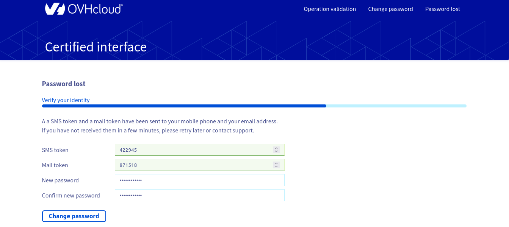

## Wprowadzenie

OVHcloud zapewnia bezpieczny interfejs umożliwiający potwierdzanie wrażliwych operacji (takich jak zmiana hasła, dodanie użytkownika itp.) realizowanych przez użytkowników lub osoby trzecie mające dostęp do Twojej infrastruktury Hosted Private Cloud HDS lub PCI-DSS.

**Z tego przewodnika dowiesz się, jak zatwierdzać wrażliwe operacje przy użyciu bezpiecznego interfejsu.**

## Wymagania początkowe

- Posiadanie infrastruktury z opcją **advanced security** (dostępną w ofertach [PCI-DSS](https://www.ovhcloud.com/pl/enterprise/products/hosted-private-cloud/safety-compliance/sddc/) i [HDS](https://www.ovhcloud.com/pl/enterprise/products/hosted-private-cloud/safety-compliance/hds/)) To uprawnienie umożliwia zatwierdzanie.
- Dostęp do bezpiecznego interfejsu, na przykład: https://pcc-xxx-xxx-xxx-xxx.ovh.com/secure/ (uwaga: pamiętaj o umieszczeniu ukośnika „/” na końcu adresu)

## W praktyce

Zatwierdzanie operacji „wrażliwych” w bezpiecznym interfejsie jest możliwe wyłącznie dla użytkowników posiadających uprawnienie **token validator**. Administrator ma już to uprawnienie, ponieważ jest ono niezbędne do włączenia opcji **advanced security**. 

Pamiętaj, że uprawnienie to można przyznać także innym użytkownikom za pośrednictwem Panelu klienta OVHcloud. W razie takiej potrzeby skorzystaj z dokumentacji [Prezentacja Panelu klienta Private Cloud OVHcloud](/pages/hosted_private_cloud/hosted_private_cloud_powered_by_vmware/manager_ovh_private_cloud).

Za pośrednictwem bezpiecznego interfejsu możesz wykonać trzy rodzaje operacji. W zależności od wykonywanej operacji, zapoznaj się z odpowiednim rozdziałem niniejszego przewodnika:

- [Zatwierdzenie operacji za pomocą tokena](./#zatwierdzenie-operacji-za-pomoca-tokena)
- [Zmiana hasła użytkownika](./#zmiana-hasla-uzytkownika)
- [Reset hasła](./#reset-hasla)

### Zatwierdzenie operacji za pomocą tokena

Jeśli token został otrzymany SMS-em, należy go wprowadzić w bezpiecznym interfejsie, aby zatwierdzić oczekujące zadanie.

> [!warning]
>
> Wygenerowany token jest ważny przez 15 minut. Po upływie tego czasu zadanie zostanie anulowane w razie braku zatwierdzenia.
>
> Następnie token zostanie wygenerowany na nowo (w przypadku konserwacji) lub będziesz musieć wygenerować go ponownie (jeśli nastąpi to po Twoim działaniu).
>

Oto przykładowa wiadomość SMS, jaką możesz otrzymać:

{.thumbnail}

Wiadomość ta zawiera następujące informacje:

- użytkownik posiadający uprawnienie **token validator**, który otrzymał wiadomość SMS. Informacja ta pomoże Ci zarządzać tokenami do zatwierdzenia, jeśli Twój numer telefonu został dodany do wielu kont użytkownika;
- nazwa operacji wymagająca zatwierdzenia;
- ID operacji;
- token do zatwierdzenia operacji;
- link umożliwiający zatwierdzenie operacji (pamiętaj, że jeśli Twój telefon nie jest podłączony do sieci z [autoryzowanym IP](/pages/hosted_private_cloud/hosted_private_cloud_powered_by_vmware/manager_ovh_private_cloud#bezpieczenstwo), strona się nie wyświetli).

Aby zatwierdzić operację, kliknij link otrzymany w wiadomości. Następnie przejdź do sekcji `Operation validation`{.action}.

{.thumbnail}

Otworzy się okno logowania, w którym wyłącznie użytkownik z uprawnieniem **token validator** może wykonać zatwierdzenie.

Wyświetl operację, wprowadzając jej ID w polu „ID operacji” i klikając przycisk `Załaduj operację`{.action}. Następnie wprowadź token otrzymany w wiadomości SMS i kliknij `Confirm operation`{.action}.

{.thumbnail}

SMS potwierdzający zatwierdzenie operacji zostanie wysłany do użytkowników posiadających uprawnienie **token validator**. Przykład:

{.thumbnail}

Wiadomość ta zawiera następujące informacje:

- użytkownik posiadający uprawnienie **token validator**, który otrzymał wiadomość SMS;
- nazwa i ID operacji;
- użytkownik posiadający uprawnienie **token validator**, który potwierdził zatwierdzenie.

### Zmiana hasła użytkownika

Każdy użytkownik może zmienić swoje hasło, nawet bez uprawnienia **token validator**. Musi jednak znać swoje aktualne hasło, aby to zrobić.

> [!primary]
>
> Jeśli użytkownik nie zna swojego hasła, musi poprosić innego użytkownika posiadającego uprawnienie **token validator** o zmianę hasła w jego imieniu przy użyciu procedury [password reset](./#reset-hasla).
> 

Aby zmienić hasło innego użytkownika, zaloguj się do bezpiecznego interfejsu (`https://pcc-xxx-xxx-xxx-xxx.ovh.com/secure/`) i kliknij przycisk `Zmień hasło`{.action}.

{.thumbnail}

Na stronie, która się wyświetli, wybierz odpowiedniego użytkownika i ustaw nowe hasło.

Do użytkowników posiadających uprawnienie [token validator](./#zatwierdzenie-operacji-za-pomoca-tokena) zostanie wysłany token, aby mogli **zatwierdzić operację**.

{.thumbnail}

### Reset hasła

Ta procedura jest dostępna wyłącznie dla użytkowników posiadających uprawnienie **token validator**. Użytkownik, który nie posiada tej zgody, otrzyma błąd 400.

> [!primary]
>
> Jeśli użytkownik, który nie posiada uprawnienia **token validator**, utraci swoje hasło, powinien poprosić o jego zresetowanie innego użytkownika posiadającego to uprawnienie.
> 

Aby zresetować hasło innego użytkownika, zaloguj się do bezpiecznego interfejsu (`https://pcc-xxx-xxx-xxx-xxx.ovh.com/secure/`) i kliknij przycisk `Password lost`{.action}.

{.thumbnail}

Wyświetla się komunikat informujący, że musisz mieć możliwość odbierania wiadomości SMS, aby kontynuować. Jeśli masz taką możliwość, wprowadź odpowiednie informacje (w szczególności nazwę użytkownika, którego hasło ma zostać zresetowane) i kliknij przycisk `Next step`{.action}.

{.thumbnail}

Wprowadź dwa tokeny otrzymane w wiadomości SMS oraz e-mailem, po czym ustaw nowe hasło.

> [!primary]
>
> Jeśli reset został przeprowadzony dla innego użytkownika, wtedy osoba, która przeprowadziła tę procedurę, powinna przekazać temu użytkownikowi nowe hasło. Zalecamy, aby użytkownik jak najszybciej [zmienił otrzymane hasło](./#zmiana-hasla-uzytkownika).
> 

{.thumbnail}

## Sprawdź również

Dołącz do społeczności naszych użytkowników na stronie <https://community.ovh.com/en/>.
