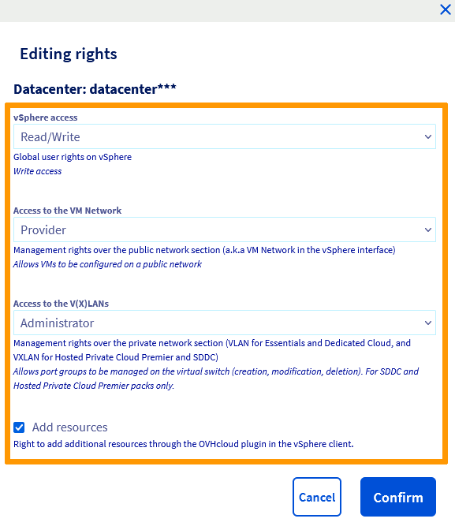
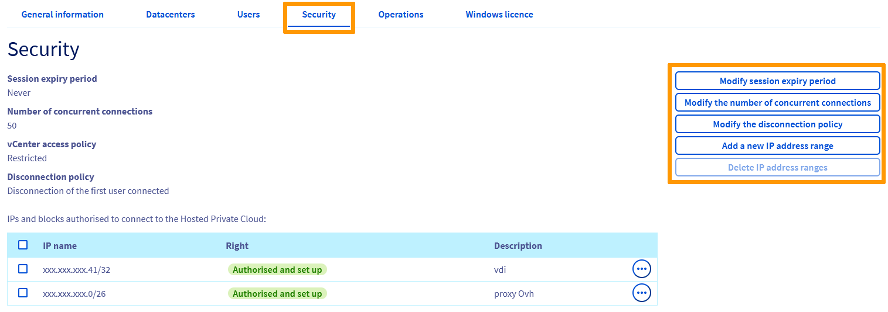
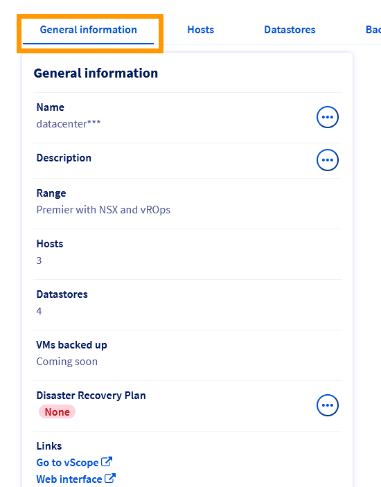
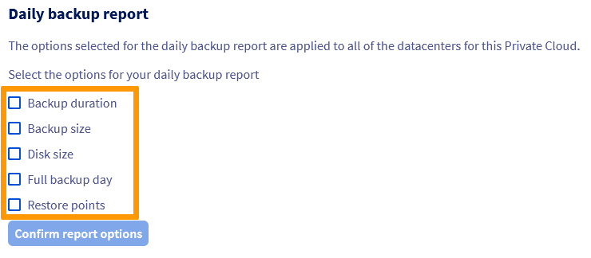

**Last updated 15th December 2021**

## Objective

The OVHcloud Hosted Private Cloud Control Panel enables you to easily manage your Hosted Private Cloud infrastructure.

**This guide explains the management options available.**

## Requirements

- A [Hosted Private Cloud infrastructure](https://www.ovhcloud.com/asia/enterprise/products/hosted-private-cloud/)
- Access to the [OVHcloud Control Panel](https://ca.ovh.com/auth/?action=gotomanager&from=https://www.ovh.com/asia/&ovhSubsidiary=asia)

## Instructions

### Interface Access

Navigate to the [OVHcloud Control Panel](https://ca.ovh.com/auth/?action=gotomanager&from=https://www.ovh.com/asia/&ovhSubsidiary=asia) and log on with your administrative credentials.

{.thumbnail}

### Hosted Private Cloud View

Go to the `Hosted Private Cloud`{.action} tab and select your service under `Private Cloud`{.action} in the left-hand navigation bar. You can rename your infrastructure by clicking the `Pencil`{.action} button in the center of the page.

{.thumbnail}

#### General Information

The General Information tab gives you an overview of your services:

- The "Description" field is editable through the `...`{.action} button 
- The "Software solution" shows the vCSA version installed
- The "Location" of your Hosted Private Cloud
- The "Access policy" of your infrastructure (`Open` or `Restricted`)
- The "Number of datacenters" in your infrastructure
- The "Number of IP blocks" you own and the option to order more through the `...`{.action} button  
- Links to your management interfaces
- Your "Options and compliance" tab shows your enabled and disabled options with direct access to modification though the `...`{.action} buttons
- The "Mailing list" section allows you to sign up to the OVHcloud Hosted Private Cloud mailing list
- The "Renewal" date section also allows for license ordering or service cancellation through the `...`{.action} button

{.thumbnail}

#### Datacenters

The Datacenters tab shows your current virtual datacenters and offers a button to add more as you need. 
The full Datacenter view (see below) will give you more details and options. 

{.thumbnail}

#### Users

The Users tab lists all the accounts which can log in to vSphere and allows the creation of new ones.

{.thumbnail}

You have several options when you click on the `...`{.action} button next to a user

- Edit the entries in the summary table
- See/Change the user's rights for each Datacenter
- Change the user's password
- Delete the user

Clicking `See/Change the rights for each DC`{.action} will take you to the rights management window.

{.thumbnail}

Click `...`{.action} and then `Modify rights`{.action} to edit them.

- **vSphere access**: to set the global rights for a user in vSphere

|Right|Description|
|---|---|
|Provider|reserved for OVHcloud administrators|
|None|no access|
|Read-only|read-only access|
|Read/Write|read and write access|

- **Access to the VM Network**: concerns management rights over the public network section (a.k.a "VM Network" in the vSphere interface)

|Right|Description|
|---|---|
|Provider|allows VMs to be configured on a public network|
|None|no access|
|Read-only|read access only|

- **Access to the V(X)LANs**: concerns management rights over the private network section (VXLAN for Hosted Private Cloud and VLAN for SDDC)

|Right|Description|
|---|---|
|Provider|allows VMs to be configured on a private network|
|Administrator|allows port groups to be managed on the virtual switch (creation, modification, deletion), for SDDCs only|
|None|no access|
|Read-only|read access only|

- **Add resources**: gives the right to add additional resources through the OVHcloud plugin in the vSphere client

{.thumbnail}

#### Security

The Security tab allows for management of vCenter access policy. 
You can configure options settings with the buttons on the right.

{.thumbnail}

> [!warning]
>
>  If you set the access policy to "Restricted" and do not enter any IP addresses, no user will be able to connect to the vSphere client. However, virtual machines will remain accessible.
> 

At the bottom of the page, you can also add or see your Key Management Servers. 
Check out [Enabling Virtual Machine Encryption](/pages/hosted_private_cloud/hosted_private_cloud_powered_by_vmware/vm_encrypt) for more details.

{.thumbnail}

#### Operations

The Operations tab keeps a log of all tasks executed on your infrastructure. 
You can sort the list by types and if the tasks are actionable, you will have options available through the `...`{.action} button.

{.thumbnail}

> [!primary]
>
> If your access to the vSphere client is denied, a scheduled maintenance may be in progress. Check this tab first before taking further measures.
>

#### Windows Licence

The Windows license tab shows your Windows SPLA licence status. 
More information on the [pricing page](https://www.ovhcloud.com/asia/enterprise/products/hosted-private-cloud/images-licenses/).

{.thumbnail}

### Datacenter View 

A Hosted Private Cloud may include multiple virtual datacenters. 
The left-hand navigation bar will list them when you select a Hosted Private Cloud service. Click on one to open its management page. 
The datacenter name and description can be customized by clicking the `Pencil`{.action} button.

{.thumbnail}

#### General Information

The General Information tab gives you an overview of your services:

- The "Name" and "Description" fields are editable via the `...`{.action} button
- The "Range" shows the VMware services suscribed
- The "Hosts" and "Datastores" fields give you the quantity of each in your Hosted Private Cloud
- The "VMs backed up" shows your backup solution status
- The "Disaster Recovery Plan" shows your DRA solution status
- Links to your management interfaces

{.thumbnail}

#### Hosts

The Hosts tab gives a summary of your hosts in the selected datacenter. 
*The billing mode is switchable via the `...`{.action} button if the billing mode is set to hourly* 
You can also order one host via the `Order a host`{.action} button.

{.thumbnail}

#### Datastores

The Datastores tab gives a summary of your datastores in the selected datacenter. 
*The datastore mode is switchable to global via the `...`{.action} button* 
You can also order a datastore via the `Order a datastore`{.action} button.

{.thumbnail}

#### Backup

The Backup tab allows you to activate a Veeam Backup solution. 
Check out the [Activating and using Veeam Managed Backup](/pages/hosted_private_cloud/hosted_private_cloud_powered_by_vmware/veeam_backup_as_a_service) guide for more details.

{.thumbnail}

Once the solution is activated, the Backup page also allows you to set up daily backup reports.

{.thumbnail}

#### Disaster Recovery Plan (DRP)

The Disaster Recovery Plan tab allows you to build a DRP plan with Zerto. 
Check out [Setting up Zerto Virtual Replication for your DRP](/pages/hosted_private_cloud/hosted_private_cloud_powered_by_vmware/zerto_virtual_replication_as_a_service) for more details.

{.thumbnail}

> [!warning]
>
>  You need to own a secondary Hosted Private Cloud solution to enable any Zerto option.
>

## Go further

Join our community of users on <https://community.ovh.com/en/>.
