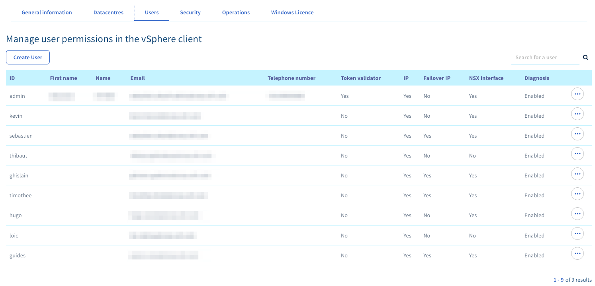
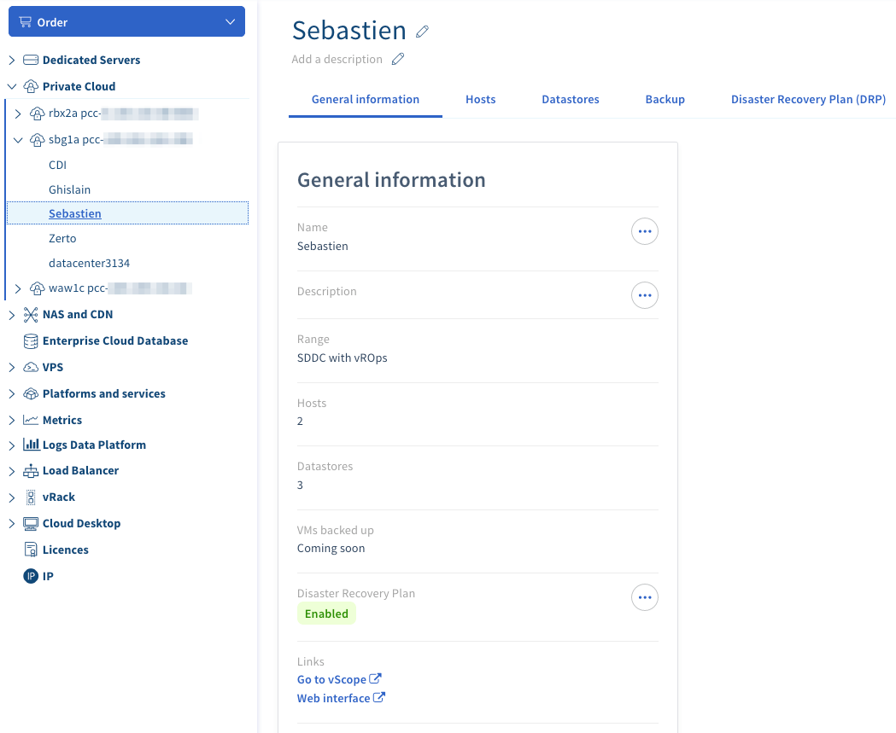
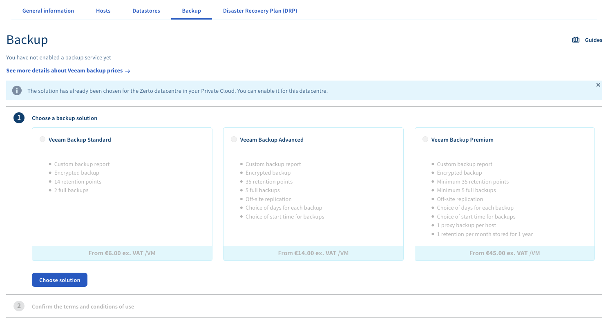

## Obiettivo

Lo Spazio Cliente OVHcloud propone numerose opzioni di configurazione della tua infrastruttura Private Cloud.

**Questa guida ti mostra le funzionalità disponibili in questa interfaccia per gestire i tuoi servizi.**

## Prerequisiti

- Essere connesso allo [Spazio Cliente OVHcloud](https://www.ovh.com/auth/?action=gotomanager&from=https://www.ovh.it/&ovhSubsidiary=it){.external}, sezione `Hosted Private Cloud`{.action} > `Private Cloud`{.action}.
- Disporre di un servizio [Private Cloud](https://www.ovhcloud.com/it/enterprise/products/hosted-private-cloud/){.external} attivo

## Procedura

### Informazioni generali

Accedendo alla sezione `Hosted Private Cloud`{.action} > `Private Cloud`{.action} del tuo [Spazio Cliente OVHcloud](https://www.ovh.com/auth/?action=gotomanager&from=https://www.ovh.it/&ovhSubsidiary=it){.external}, visualizzi le informazioni relative alla tua piattaforma:

{.thumbnail}

In alto a sinistra viene mostrato il nome e la descrizione dell’istanza (`1 nell’immagine`). Personalizzare queste informazioni è molto utile, soprattutto se hai creato più infrastrutture. 

A sinistra, `2 sull’immagine`, visualizzi il tuo o i tuoi Private Cloud, nonché i datacenter virtuali che lo compongono.

#### Informazioni generali

Nella prima sezione sono disponibili le informazioni generali del tuo Private Cloud:

{.thumbnail}

- La descrizione del tuo Private Cloud (con la possibilità di cambiare il proprio nome).
- versione del tuo servizio
- codice della gamma commerciale
- datacenter, e più precisamente la localizzazione in cui la tua infrastruttura è installata
- modalità di accesso alla tua infrastruttura (`Libero` o `Limitato`), con le restrizioni per IP sorgente
- numero di datacenter virtuali presenti nella tua infrastruttura
- numero di blocchi IP (con la possibilità di ordinare blocchi aggiuntivi)

#### opzioni e conformità

Nella tabella centrale, visualizzi lo stato di attivazione delle opzioni del tuo Private Cloud.

{.thumbnail}

#### Gestione del servizio

Nella tabella a destra, potrai gestire il tuo abbonamento alla mailing list Private Cloud OVHcloud.

Visualizzi anche la data del prossimo rinnovo del tuo servizio Private Cloud. A destra della data, il pulsante con tre puntini `...`{.action} consente di ordinare una licenza o eliminare il tuo servizio Private Cloud.

{.thumbnail}

Per maggiori dettagli sulla rescissione di un servizio Private Cloud, consulta la nostra guida [Disattivare una soluzione Private Cloud](/pages/account_and_service_management/managing_billing_payments_and_services/comment_resilier_le_private_cloud).

#### Datacenter

In questa scheda viene mostrato un breve riassunto dei datacenter virtuali presenti nella tua soluzione Private Cloud:

{.thumbnail}

Descriveremo in seguito tutte le informazioni relative ai datacenter virtuali.

> [!primary]
>
> Da questa sezione è possibile aggiungere altri datacenter, senza spese aggiuntive.
> 

#### Utenti

In questa scheda sono presenti tutti gli utenti autorizzati a connettersi a vSphere:

{.thumbnail}

Per creare un nuovo utente, clicca sul pulsante `Crea un utente`{.action} a sinistra.

Per ogni utente troverai informazioni relative all’utente e ai permessi applicati su tutta la tua infrastruttura Private Cloud:

- identificativo
- nome (facoltativo)
- cognome (facoltativo)
- indirizzo email (facoltativo)
- numero di telefono (facoltativo)
- il permesso *token validator*, che consente di confermare le operazioni sensibili sui servizi Private Cloud dotati dell’opzione HDS o PCI-DSS.
- il permesso *Ip*, che consente di accedere al plugin OVH network
- il permesso *Additional IP*, che consente di gestire gli Additional IP associati al tuo Private Cloud.
- il permesso*Interface NSX*, che consente di accedere all’interfaccia NSX se l’opzione è attiva nel tuo Private Cloud.
- lo stato (Diagnostica), che consente di vedere se l’utente è stato creato.

cliccando sui tre puntini `...`{.action} in corrispondenza dell’utente, vengono mostrate diverse opzioni che permettono di:

- modificare le voci della tabella (Modifica dei permessi visti precedentemente, l’aggiunta di un indirizzo email e di un numero di telefono).
- visualizzare e modificare i permessi dell’utente per datacenter
- modificare la password dell’utente
- eliminare l’utente

Vediamo in dettaglio la modifica dei permessi per datacenter:

{.thumbnail}

- `Accesso vSphere`{.action} \- permessi globali dell’utente su vSphere:

|Permesso|Descrizione|
|---|---|
|Nessuno|Nessun accesso|
|Sola lettura|Accesso in sola lettura|
|Lettura/Scrittura|Accesso in lettura/scrittura|
|Operatore|Accesso riservato agli amministratori OVHcloud|

- `Accesso al VM Network`{.action} \- Gestione dei permessi nella sezione rete pubblica (`VM Network` nell'interfaccia vSphere):

|Permesso|Descrizione|
|---|---|
|Nessuno|Nessun accesso|
|Sola lettura|Accesso in sola lettura|
|Operatore|Permette di configurare macchine virtuali sulla rete pubblica|

- `Accesso al V(X)LAN`{.action} \- Gestione dei permessi nella sezione rete privata (VxLan per Hosted Private Cloud e VLAN per SDDC):

|Permesso|Descrizione|
|---|---|
|Nessuno|Nessun accesso|
|Sola lettura|Accesso in sola lettura|
|Operatore|Permette di configurare macchine virtuali sulla rete privata|
|Amministratore|Permette di gestire i port group dello switch virtuale (creare, modificare, eliminare...)|

- `Aggiungi risorse`{.action} \- Permesso di aggiungere risorse supplementari tramite il plugin OVH nel client vSphere

#### Sicurezza

In questa scheda è possibile configurare la politica di accesso al tuo vCenter:

{.thumbnail}

Utilizza i pulsanti sulla destra per definire i parametri degli elementi presenti nella parte superiore e nella tabella: È possibile configurare:

- modifica la durata di una sessione

- numero di connessioni simultanee autorizzate

- politica di accesso, libera o limitata, con un’autorizzazione per IP sorgente (gli IP saranno indicati nella tabella)
È possibile modificare o eliminare l’IP o l’intervallo di indirizzi IP, cliccando sui tre puntini `...`{.action} in corrispondenza della tabella.

> [!warning]
>
> Se la politica di accesso selezionata è “Limitata” e non sono stati inseriti IP, nessun utente sarà in grado di accedere al client vSphere. Le macchine virtuali saranno comunque accessibili
> 

- La politica di disconnessione indica per quale utente verrà chiusa la sessione: il primo o l’ultimo ad aver effettuato l’accesso.
Nel nostro esempio le connessioni simultanee consentite sono 50\. Quando il 51°utente effettua il login, il primo ad aver effettuato l’accesso verrà disconnesso.

Una seconda tabella è disponibile per quanto riguarda l’opzione *VM encrypton*. 

Per maggiori dettagli su questa opzione consulta [questa guida](/pages/hosted_private_cloud/hosted_private_cloud_powered_by_vmware/vm_encrypt).

#### Operazioni

In questa scheda vengono mostrate le operazioni in corso sulla tua infrastruttura:

{.thumbnail}

È possibile verificare lo stato delle operazioni, eventuali interventi pianificati...

Per modificare la data di un intervento di manutenzione clicca sui tre puntini`...`{.action} in corrispondenza della tabella.

> [!primary]
>
> Se, ad esempio, non riesci ad accedere al client vSphere perché è in corso un intervento di manutenzione, potrai verificarlo da questa scheda.
>

#### Licenze Windows

Dalla scheda `Licenza Windows`{.action} è possibile attivare sul tuo datacenter le licenze SPLA Windows cliccando sul pulsante a destra:

{.thumbnail}

Per consultare le tariffe, [clicca qui](https://www.ovhcloud.com/it/enterprise/products/hosted-private-cloud/images-licenses/){.external}.

### Panoramica dei datacenter

Sulla tua infrastruttura Private Cloud possono essere presenti diversi datacenter. Per visualizzarli, seleziona il tuo servizio nel menu a sinistra:

{.thumbnail}

Per personalizzare il nome del tuo datacenter e aggiungere una descrizione, clicca sull’icona a forma di matita.

In questa interfaccia vengono mostrate le informazioni relative al datacenter selezionato: gamma (SDDC o DC), numero di host e datastore.
Per le gamme Hosted Private Cloud e Software Defined Datacenter, è possibile usufruire di più datacenter nella stessa soluzione Private Cloud.

#### Host

In questa scheda vengono mostrate le informazioni relative agli host del tuo datacenter.

{.thumbnail}

Per ogni datastore potrai visualizzare:

- nomi degli host
- profili (M, L,L+...).
- modalità di fatturazione (se hai scelto la fatturazione oraria, è possibile passare al forfait mensile). Per farlo, clicca sul pulsante in corrispondenza della tabella.
- stato
- numero di ore utilizzate (informazione disponibile solo per le risorse orarie)

Per ordinare un nuovo host con forfait mensile, clicca sul pulsante in alto a sinistra.

#### Datastore

Le informazioni presenti in questa scheda sono simili a quelle della tab precedente:

{.thumbnail}

Per ogni datastore potrai visualizzare:

- nome
- profili 
- tipo (Hybrid o full SSD)
- dimensioni
- modalità di fatturazione
- stato del datastore (che consente di sapere se è installato correttamente)
- numero di ore utilizzate (informazione disponibile solo per le risorse orarie)

Per ordinare un nuovo datastore con forfait mensile, clicca sul pulsante in alto a sinistra in corrispondenza della tabella.

#### Backup

La scheda di backup consente di attivare la soluzione `Veeam backup`.

{.thumbnail}

Per maggiori informazioni su questa opzione, consulta [questa guida](/pages/hosted_private_cloud/hosted_private_cloud_powered_by_vmware/veeam_backup_as_a_service){.external}.

## Per saperne di più

Contatta la nostra Community di utenti all’indirizzo <https://community.ovh.com/en/>.
