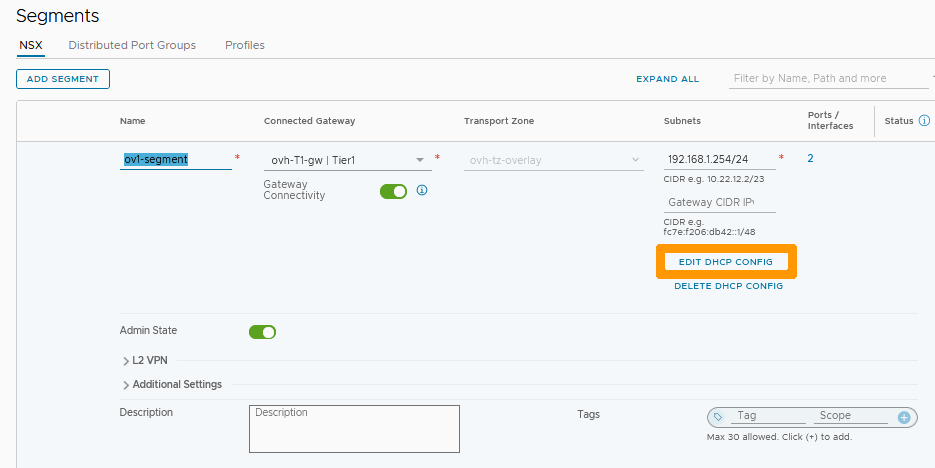

**Dernière mise à jour le 27/02/2023**

## Objectif

Il est possible d'utiliser un redirecteur DNS dans NSX. Son rôle est de centraliser toutes les requêtes DNS et de les rediriger vers des serveurs DNS externes, ce qui permet de réduire le flux réseau. Vous pouvez attacher le redirecteur DNS sur la passerelle nord-sud (ovh-T0-gw) ou la passerelle est-ouest (ovh-T1-gw), en fonction de vos besoins.

**Découvrez comment configurer un redirecteur DNS dans NSX.**

> [!warning]
> OVHcloud vous met à disposition des services dont la configuration, la gestion et la responsabilité vous incombent. Il vous appartient donc de ce fait d’en assurer le bon fonctionnement.
>
> Ce guide a pour but de vous accompagner au mieux sur des tâches courantes. Néanmoins, nous vous recommandons de faire appel à un [prestataire spécialisé](https://partner.ovhcloud.com/fr/) si vous éprouvez des difficultés ou des doutes concernant l’administration, l’utilisation ou la mise en place d’un service sur un serveur.
>

## Prérequis

- Être contact administrateur de l'infrastructure [Hosted Private Cloud powered by VMware](https://www.ovhcloud.com/fr-ca/enterprise/products/hosted-private-cloud/), celui-ci recevant les identifiants de connexion.
- Avoir un identifiant utilisateur actif avec les droits spécifiques pour NSX (créé dans l'[espace client OVHcloud](https://ca.ovh.com/auth/?action=gotomanager&from=https://www.ovh.com/ca/fr/&ovhSubsidiary=qc)).
- Avoir **NSX** déployé avec un segment configuré dans votre configuration NSX. Vous pouvez vous aider de notre guide sur la [gestion des segments dans NSX](/pages/hosted_private_cloud/hosted_private_cloud_powered_by_vmware/nsx-02-segment-management).

## En pratique

Nous allons créer un redirecteur DNS et l'attacher à la passerelle nord-sud (ovh-T0-gw), il sera utilisable sur l'ensemble des segments de NSX.

### Configuration du redirecteur DNS

Dans l'interface NSX, allez dans l'onglet `Networking`{.action} et cliquez sur `DNS`{.action} à gauche dans la rubrique **IP Management**. Cliquez ensuite sur `ADD DNS SERVICE`{.action}.

{.thumbnail}

Renseignez ces informations :

- **Name** : nom de votre service, par exemple `dns-forwarder`.
- **Tier-0/Tier-1 Gateway** : votre passerelle Nord-Sud `ovh-T0-gw`.
- **DNS Service IP** : adresse IP privée non utilisé dans vos segments comme `192.168.200.1`.

Cliquez ensuite sur les `trois points verticaux`{.action} en dessous de **Default DNS Zone**.

{.thumbnail}

Cliquez sur `Add New Default Zone`{.action}.

{.thumbnail}

Renseignez ces valeurs :

- **Name** : nom de la zone, par exemple `cdns.ovh.net`.
- **DNS Servers** : serveur DNS OVHcloud `213.186.33.99`.

Cliquez ensuite sur `SAVE`{.action}.

{.thumbnail}

Cliquez à nouveau sur `SAVE`{.action}.

{.thumbnail}

Votre redirecteur DNS est actif et utilisable sur tous vos segments en Overlay ou VLAN connectés à votre passerelle nord-sud (ovh-t0-gw).

{.thumbnail}

### Modification du serveur DHCP pour utiliser un redirecteur DNS

Si vous avez configuré des serveurs DHCP dans NSX comme indiqué dans notre guide de [configuration du DHCP](/pages/hosted_private_cloud/hosted_private_cloud_powered_by_vmware/nsx-03-configure-dhcp-onsegment), vous pouvez modifier la configuration pour utiliser le redirecteur DNS dans vos configurations DHCP.

Nous allons voir comment modifier le serveur DNS sur la configuration DHCP d'un de vos segments.

Restez sur l'onglet `Networking`{.action} et cliquez sur `Segments`{.action} à gauche dans la rubrique **Connectivity**. 

Cliquez ensuite sur les `trois points verticaux`{.action} à coté de votre segment et cliquez sur `Edit`{.action} dans le menu.

{.thumbnail}

Cliquez sur `EDIT DHCP CONFIG`{.action}.

{.thumbnail}

Cliquez sur la `croix`{.action} à droite du DNS existant dans l'option **DNS Servers**, afin de l'enlever de la configuration.

{.thumbnail}

Ajoutez, dans **DNS Servers**, l'adresse IP de votre redirecteur DNS, par exemple `192.168.200.1`{.action} et cliquez sur `APPLY`{.action}.

{.thumbnail}

Cliquez sur `SAVE`{.action}.

{.thumbnail}

Cliquez sur `CLOSE EDITING`{.action}.

{.thumbnail}

Le paramétrage DHCP de votre segment utilise maintenant le redirecteur DNS créé précédemment.

## Aller plus loin

[Premiers pas avec NSX](/pages/hosted_private_cloud/hosted_private_cloud_powered_by_vmware/nsx-01-first-steps)

[Gestion des segments dans NSX](/pages/hosted_private_cloud/hosted_private_cloud_powered_by_vmware/nsx-02-segment-management)

[Configuration du DHCP](/pages/hosted_private_cloud/hosted_private_cloud_powered_by_vmware/nsx-03-configure-dhcp-onsegment)

[Documentation VMware sur le service DNS dans NSX](https://docs.vmware.com/fr/VMware-NSX-T-Data-Center/3.2/administration/GUID-A0172881-BB25-4992-A499-14F9BE3BE7F2.html)

Si vous avez besoin d'une formation ou d'une assistance technique pour la mise en oeuvre de nos solutions, contactez votre commercial ou cliquez sur [ce lien](https://www.ovhcloud.com/fr-ca/professional-services/) pour obtenir un devis et demander une analyse personnalisée de votre projet à nos experts de l’équipe Professional Services.

Échangez avec notre communauté d'utilisateurs sur <https://community.ovh.com>.
