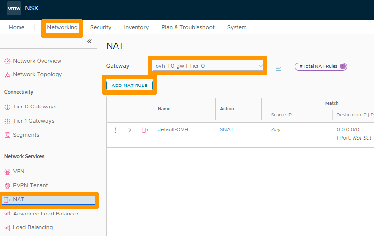
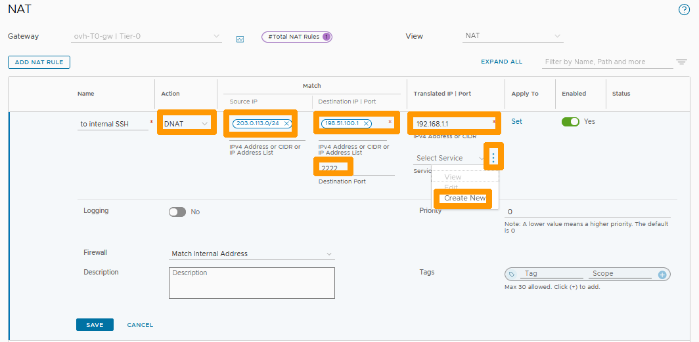
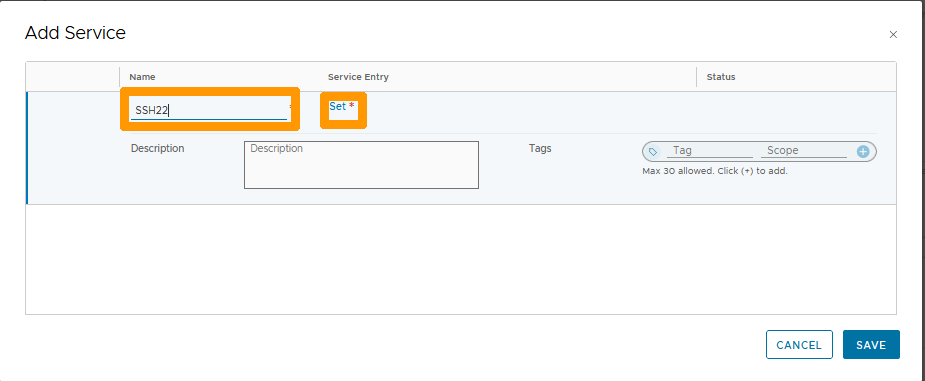
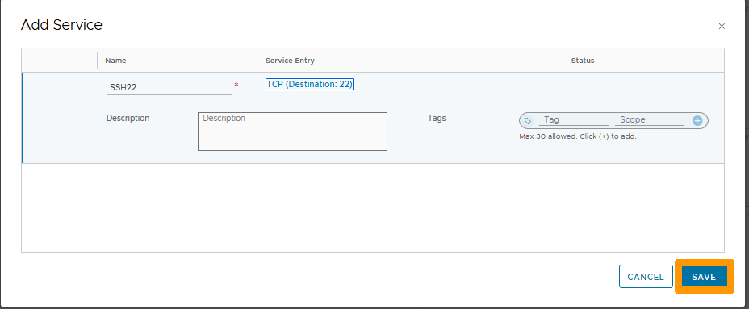

## Objectif

**Learn how to configure NAT to create port redirections with NSX.**

> [!warning]
> OVHcloud provides services for which you are responsible, with regard to their configuration and management. It is therefore your responsibility to ensure that they work properly.
>
> This guide is designed to assist you as much as possible with common tasks. However, we recommend contacting a [specialist provider](https://partner.ovhcloud.com/en-ca/directory/) if you experience any difficulties or doubts when it comes to managing, using or setting up a service on a server.
>

## Requirements

- Being an administrative contact of your [Hosted Private Cloud infrastructure](https://www.ovhcloud.com/en-ca/enterprise/products/hosted-private-cloud/) to receive login credentials.
- A user account with access to the [OVHcloud Control Panel](https://ca.ovh.com/auth/?action=gotomanager&from=https://www.ovh.com/ca/en/&ovhSubsidiary=ca).
- Having **NSX** deployed with two segments configured in your NSX configuration, you can use our guide on [segment management in NSX](/pages/hosted_private_cloud/hosted_private_cloud_powered_by_vmware/nsx-02-segment-management) for more information.

## Instructions

When you deploy your NSX solution, a SNAT rule is automatically created by OVHcloud, so you can go online from your segments.

We will add a redirection rule (DNAT) from the public virtual IP address on port 2222 in TCP to a virtual machine on LINUX on port 22 in TCP. In our example, we will use fictitious IP addresses.

In the NSX interface, go to the `Networking`{.action} tab, select `NAT`{.action} in the **Network Services** section, then select `ovh-T0-gw | Tier-0`{.action} to the right of **Gateway** and click `ADD NAT RULE`{.action}.

{.thumbnail}

Fill in this information :

- **Action** : Select `DNAT`{.action}.
- **Source IP** : Enter the IP address or range of addresses that can use this redirection.
- **Destination IP** : Public virtual IP address of NSX.
- **Destination PORT** : Listening port on public address such as `2222`.
- **Translated IP** : IP address of the virtual machine being redirected to.

Then click on the `three vertical dots`{.action} to the right of **Select Services**.

{.thumbnail}

Enter `SSH22`{.action} under the **Name** column and click `Set`{.action} under the **Service Entry** column.

{.thumbnail}

Click `ADD SERVICE ENTRY`{.action}.

{.thumbnail}

Fill in these values :

- **Name** : Enter `SSH22`.
- **Service Type** : Select `TCP`{.action}.
- **Source Ports** : Write the number `22`.

Then click `APPLY`{.action}.

{.thumbnail}

Click `SAVE`{.action}.

{.thumbnail}

Click `SAVE`{.action} to confirm the creation of the redirection rule.

{.thumbnail}

The rule is created and active.

{.thumbnail}

## Go further 

[Getting started with NSX](/pages/hosted_private_cloud/hosted_private_cloud_powered_by_vmware/nsx-01-first-steps)

[Segment management in NSX](/pages/hosted_private_cloud/hosted_private_cloud_powered_by_vmware/nsx-02-segment-management)

[VMware NAT in NSX documentation](https://docs.vmware.com/en/VMware-NSX-T-Data-Center/3.2/administration/GUID-7AD2C384-4303-4D6C-A44A-DEF45AA18A92.html)

If you need training or technical assistance to implement our solutions, contact your sales representative or click on [this link](https://www.ovhcloud.com/en-ca/professional-services/) to get a quote and ask our Professional Services experts for a custom analysis of your project.

Join our community of users on <https://community.ovh.com/en/>.
