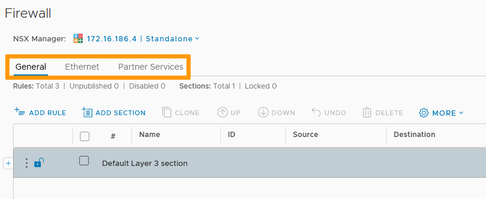
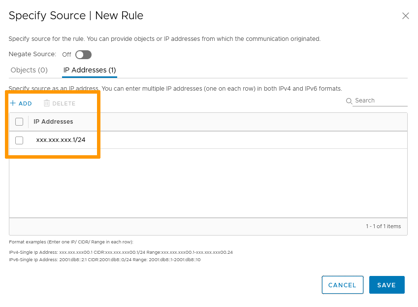
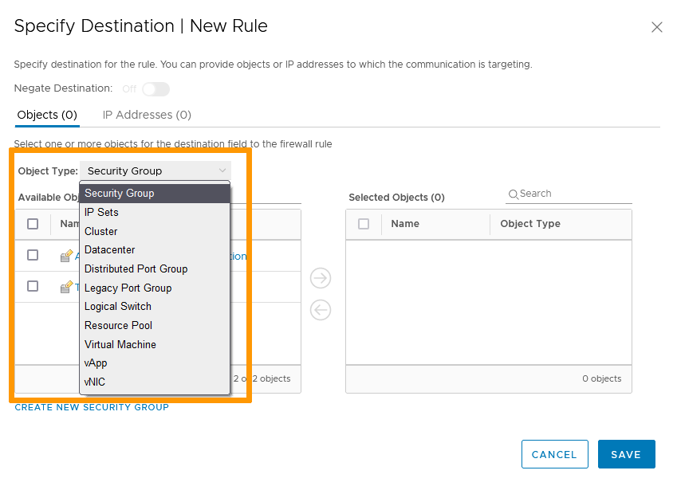

**Last updated on 1st December 2021**

## Objective

As does the [NSX Edge Firewall](/pages/hosted_private_cloud/hosted_private_cloud_powered_by_vmware/nsx_configurer_le_edge_firewall), the distibuted firewall restricts or allows network traffic based on rules applied to network nodes or groups.

The distributed firewall optimizes traffic and bandwidth consumption by applying rules to packets before they are sent to the Edge firewall. 

**This guide explains how to create rules.**

## Requirements

- being an administrative contact of your [Hosted Private Cloud infrastructure](https://www.ovhcloud.com/it/enterprise/products/hosted-private-cloud/) to receive login credentials
- a user account with access to vSphere as well as the specific rights for NSX (created in the [OVHcloud Control Panel](https://www.ovh.com/auth/?action=gotomanager&from=https://www.ovh.it/&ovhSubsidiary=it))

## Instructions

### Interface access

In the vSphere interface menu, go to the `Networking and Security`{.action} dashboard.

{.thumbnail}

On the left side, navigate to the `Firewall`{.action} section.

{.thumbnail}

The distributed Firewall allows for:

- `General`{.action} rules (layer 3 and up)
- `Ethernet`{.action} rules (layer 2)
- `Partner Services`{.action} rules (requires integration of third party products)

{.thumbnail}

### Priorities

Before creating rules, it is important to understand how and when they will be applied. 
The Distributed Firewall has three layers ot priority:

- Types
- Sections
- Rules

#### Types

The type of rules/sections is defined by the layer it will apply on. 
Layer 2 rules will be applied before Layer 3 and up. 
That means that Ethernet rules will have a higher priority than General ones.

#### Sections

Sections are rules folders that allow better segmentation and easier management. 
Sections are applied from top to bottom. 
That means that in the case of conflicting rules in different sections, the rule within the section with the highest priority will be applied.

#### Rules

Rules manage identified service(s) from specified source(s) to specified destination(s). 
Rules are applied from top to bottom. 
The first rule that matches the traffic overrides all the other rules below. 
That means that in the case of conflicting rules within a section, the rule with the highest priority (lowest number) will be applied.

#### Order

You can add rules and sections in any tabs of the firewall. 
You can modify the rule/section order by selecting a rule/section and using the up and down arrows. 

{.thumbnail}

### Firewall Rules

Click on `+ Add Rule`{.action}.

The new rule shows with:

- An activation slider
- A selection box for specific actions (order change, deletion...)
- Name
- ID
- Source
- Destination
- Service
- Applied To
- Action
- Log slider
- Advanced settings    

{.thumbnail}

> [!warning]
>
> By default, rules have `Any` as source and destination, meaning it encompasses all traffic. To avoid security issues, it is best practices to avoid broad targets.
>

#### Name

Name the rule by clicking the `Name`{.action} field. The ID field will be automatically populated.

#### Source

The source field defines the origin of the traffic.

Hover over the field and click on the `pencil`{.action} icon. You can add objects and/or IP addresses as needed.     

> [!primary]
>
> If "Negate Source" is turned on, the rule is applied to all sources except for the sources selected.
    
Click `Save`{.action} when ready.

{.thumbnail}

{.thumbnail}

#### Destination

The destination field defines the target of the traffic.

Hover over the field and click on the `pencil`{.action} icon. You have the same choices for destination as you had for source.    

> [!primary]
>
> If "Negate Source" is turned on, the rule is applied to all destinations except for the destinations selected.

Click `Save`{.action} when ready.

{.thumbnail}

{.thumbnail}

#### Service

The service field defines the type of traffic aimed at.

Hover over the field and click on the `pencil`{.action} icon. You have the choice between using existing services and groups or adding raw ports/protocols.

> [!primary]
>
> Clicking on an existing service or group will show you a description of the ports and protocols involved.

Click `Save`{.action} when ready.

{.thumbnail}

{.thumbnail}

{.thumbnail}

#### Applied To

The applied to field defines the scope of the rule.

Hover over the field and click on the `pencil`{.action} icon. 
By default, the rule is set to apply to all clusters on which Distributed Firewall is installed, which means it will apply to all VMs. 
You can add all Edge gateways or specific objects available in the list.   

Click `Save`{.action} when ready.

{.thumbnail}

#### Action

The action field defines how to handle the traffic.

You have three possible options to choose from:

- Allow: The traffic will go through.
- Block: The traffic will be blocked with no further communication.
- Reject: The traffic will be blocked and a "port unreachable" message will be sent to the source.     

{.thumbnail}

#### Log

The log slider allows you to keep a journal of events on the rule.

#### Advanced Settings

Aside from a comments section and a statistics section, the advanced settings section allows you to define if the target traffic is inbound, outbound or both and if you want to target IPv4, IPv6 or both.

Click `Save`{.action} when ready.

{.thumbnail}

### Publishing rules

No creation/modification of a rule/section will be registered until you click the `Publish`{.action} button.

{.thumbnail}

## Go further

Join our community of users on <https://community.ovh.com/en/>.
