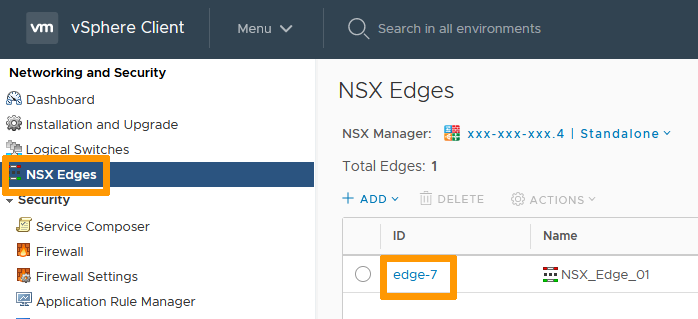

## Objective

NAT stands for network address translation. It’s a way to map multiple addresses to a single one.      
There are two types of NAT:

- DNAT stands for Destination NAT. It modifies the destination address and is used for inbound traffic.
- SNAT stands for Souce NAT. It modifies the source address and is used for outbound traffic.

**This guide explains how to create NAT rules.**

## Requirements

- being an administrative contact of your [Hosted Private Cloud infrastructure](https://www.ovhcloud.com/en/enterprise/products/hosted-private-cloud/) to receive login credentials
- a user account with access to vSphere as well as the specific rights for NSX (created in the [OVHcloud Control Panel](https://ca.ovh.com/auth/?action=gotomanager&from=https://www.ovh.com/world/&ovhSubsidiary=we))
- a deployed [NSX Edge Services Gateway](/pages/hosted_private_cloud/hosted_private_cloud_powered_by_vmware/nsx_deploying_edge_gateway)

## Instructions

### Interface access

In the vSphere interface menu, go to the `Networking and Security`{.action} dashboard.

{.thumbnail}

On the left side, navigate to the `NSX Edges`{.action} section then click on the appliance you're setting up.

{.thumbnail}

Go to the `NAT`{.action} tab.

### DNAT

Click `+ Add`{.action} and select `Add DNAT Rule`{.action}.

{.thumbnail}

Set the parameters as follows:

- the interface the traffic will come from (for DNAT, your public facing interface)
- the protocol and possibly sub-protocol targeted
- the source IP or IP range
- if applicable, the source port
- the original destination IP (typically, your public facing IP)
- if applicable, the original port targeted
- the translated destination IP or IP range
- enable or disable the rule
- enable or disable logs on the rule     

Click `Add`{.action}.

{.thumbnail}

### SNAT

Click `+ Add`{.action} and select `Add SNAT Rule`{.action}.

{.thumbnail}

Set the parameters as follows:

- the interface the traffic will be sent out of
- the protocol and possibly sub-protocol targeted
- the source IP or IP range
- if applicable, the source port
- the destination IP or IP range
- if applicable, the destination port
- the translated source IP or IP range
- enable or disable the rule
- enable or disable logs on the rule     

Click `Add`{.action}.

{.thumbnail}

### Publish

Rules created or modified will not be registered and active until you click the `Publish`{.action} button.

{.thumbnail}

The rules you created are now functional.

{.thumbnail}

## Go further

Join our community of users on <https://community.ovh.com/en/>.
