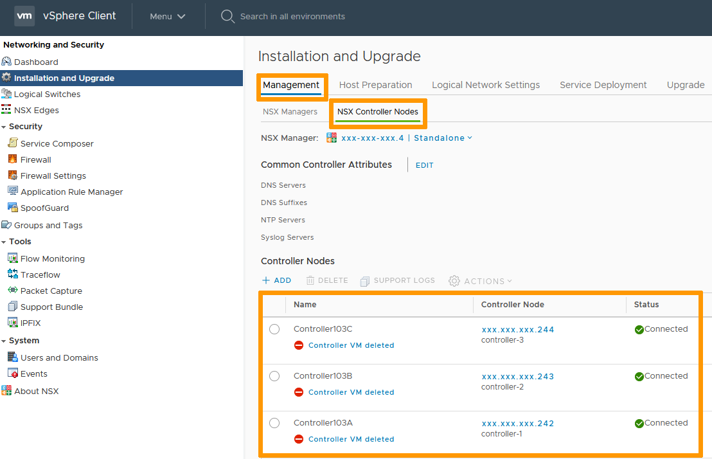

## Objectif

Dans votre interface NSX, le message *VM du contrôleur supprimée* peut apparaître.

**Ce guide vous explique comment interpréter ce message.**

## Prérequis

- Être contact administrateur de l'infrastructure [Hosted Private Cloud](https://www.ovhcloud.com/fr/enterprise/products/hosted-private-cloud/), afin de recevoir les identifiants de connexion.
- Avoir un identifiant utilisateur actif avec les droits spécifiques pour NSX (créé dans l'[espace client OVHcloud](https://www.ovh.com/auth/?action=gotomanager&from=https://www.ovh.com/fr/&ovhSubsidiary=fr)).
- Avoir déployé une [NSX Edge Services Gateway](/pages/hosted_private_cloud/hosted_private_cloud_powered_by_vmware/nsx_deploying_edge_gateway)

## En pratique

Depuis [l'interface NSX](/pages/hosted_private_cloud/hosted_private_cloud_powered_by_vmware/nsx_access-interface), dans le menu `Installation et mise à niveau`{.action} menu, puis l'onglet `Gestion`{.action} et la section `Nœuds de NSX controller`{.action}, le message d'erreur *VM du contrôleur supprimée* peut apparaître sous le résumé « Nœuds de contrôleur ».

Cela vient du fait qu'OVHcloud n'héberge pas de contrôleurs sur votre infrastructure, mais sur une infrastructure de gestion interne distincte afin de ne pas consommer de ressources sur vos hôtes.

Dans le fonctionnement standard de NSX, il est prévu que les contrôleurs se trouvent sur le même datacenter que vos machines virtuelles, entrainant cette erreur. Le fonctionnement de votre infrastructure n'est en rien affecté par ce message.

Dans l'interface NSX, assurez-vous simplement que le statut des contrôleurs est `Connecté`. Si c'est le cas, votre machine est fonctionnelle.

> [!warning]
>
> La résolution de cette erreur via le bouton `Résoudre`{.action} provoque la suppression des contrôleurs de votre infrastructure, ce qui perturbera l'utilisation de NSX ainsi que celle du réseau de l'infrastructure. Nous vous conseillons donc de ne pas effectuer cette action. La gestion des contrôleurs NSX reste à la charge d'OVHcloud.
> 

Cela explique également l'alerte sur le tableau de bord NSX :

## Aller plus loin

Échangez avec notre communauté d'utilisateurs sur <https://community.ovh.com>.
