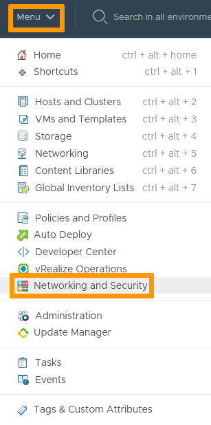
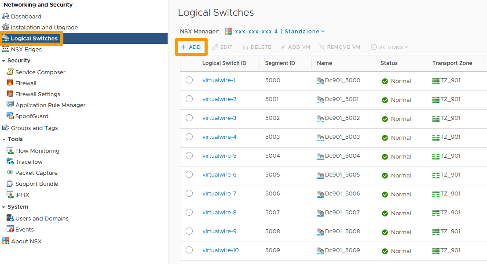
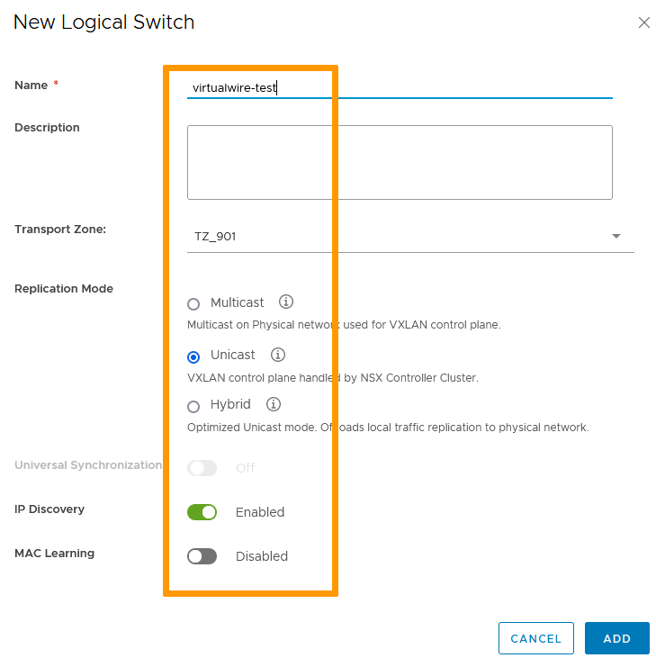
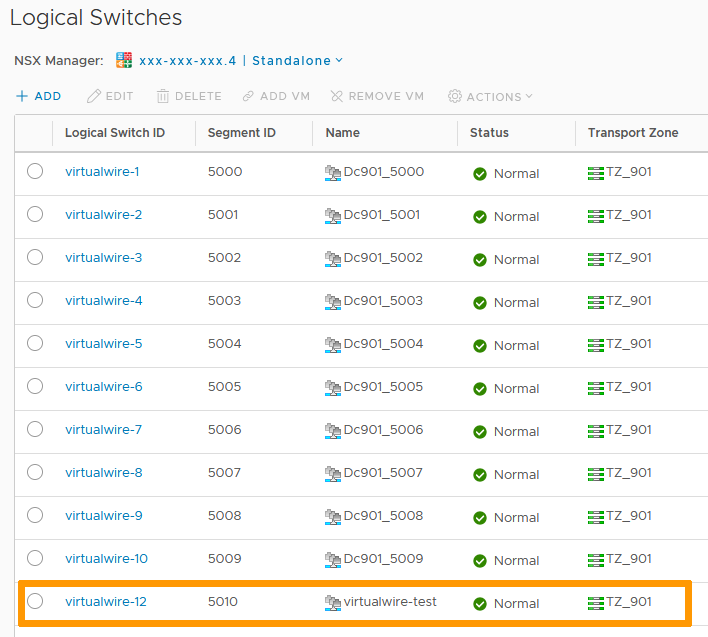

## Objective

OVHcloud sets up a base of 10 VxLANs on your NSX Edge Gateway.

**This guide explains how to create additional VxLANs.**

## Requirements

- Being an administrative contact of your [Hosted Private Cloud infrastructure](https://www.ovhcloud.com/es-es/enterprise/products/hosted-private-cloud/) to receive login credentials
- A user account with access to vSphere as well as the specific rights for NSX (created in the [OVHcloud Control Panel](https://www.ovh.com/auth/?action=gotomanager&from=https://www.ovh.es/&ovhSubsidiary=es))
- A deployed [NSX Edge Services Gateway](/pages/hosted_private_cloud/hosted_private_cloud_powered_by_vmware/nsx_deploying_edge_gateway)

## Instructions

In the vSphere interface menu, go to the `Networking and Security`{.action} dashboard.

{.thumbnail}

On the left side, navigate to the `Logical Switches`{.action} section. 
The view shows the existing vxlans created. 
Click on `+ Add`{.action} to create an additional one.

{.thumbnail}

Name your new Logical Switch and choose your options:

- The **Transport Zone** defines which hosts a logical switch can reach. By default, OVHcloud creates a transport zone per virtual datacenter.
- The typical **Replication Mode** is unicast, allowing traffic between hosts to be managed using NSX services.
- **IP Discovery** limits the saturation of ARP traffic in individual VxLAN segments and is recommended
- **MAC Learning** builds a VLAN/MAC learning table on each vNIC. It is only recommended if you are using virtual network adapters that are performing VLAN trunking.

Click `Add`{.action} when done.

{.thumbnail}

Your VxLAN is now created and functional, you will find it in the `Logical Switches`{.action} view

{.thumbnail}

It is also visible in the `Networking`{.action} view.

{.thumbnail}

## Go further

Join our community of users on <https://community.ovh.com/en/>.
