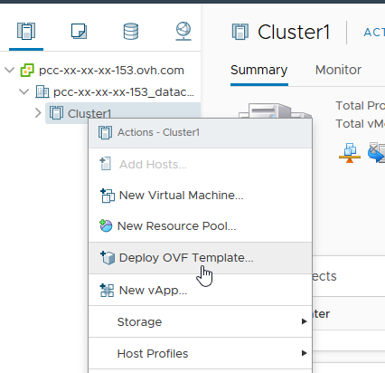

> [!primary]
> Esta traducción ha sido generada de forma automática por nuestro partner SYSTRAN. En algunos casos puede contener términos imprecisos, como en las etiquetas de los botones o los detalles técnicos. En caso de duda, le recomendamos que consulte la versión inglesa o francesa de la guía. Si quiere ayudarnos a mejorar esta traducción, por favor, utilice el botón «Contribuir» de esta página.
> 

OVHcloud ofrece plantillas Linux, Windows Server y Windows SQL Server (en formato OVF) que puede desplegar directamente desde su cliente Web (HTML 5).

Las MV Windows desplegadas a partir de una plantilla utilizan automáticamente las licencias SPLA que ofrece OVHcloud. El despliegue de una MV Windows provocará automáticamente una facturación adicional.

**Esta guía explica dónde encontrar las plantillas y cómo desplegarlas.**

> [!primary]
> 
> En [esta página](https://www.ovhcloud.com/es/enterprise/products/hosted-private-cloud/images-licenses/) puede consultar el precio del licenciamiento de las imágenes que OVHcloud pone a su disposición.
>

## Requisitos

- Tener acceso al cliente web (HTML5).
- Haber activado las [licencias de Windows](/pages/hosted_private_cloud/hosted_private_cloud_powered_by_vmware/manager_ovh_private_cloud#licencia-windows) desde el [área de cliente de OVHcloud](https://ca.ovh.com/auth/?action=gotomanager&from=https://www.ovh.com/world/&ovhSubsidiary=ws){.external} (en la pestaña `Licencia Widows`{.action} de la plataforma). 

Desde un navegador de internet, vaya a la página de inicio de su Private Cloud y haga clic en `OVH Templates`{.action}.

{.thumbnail}

En la nueva pantalla de `OVH Templates`, acceda al detalle de las plantillas Linux, Windows y SQL propuestas. 

Al seleccionar la plantilla, se abrirá una ventana en la que podrá consultar los enlaces necesarios para desplegarla, en función de su versión de vSphere.

{.thumbnail}

### Desplegar la plantilla OVF

Una vez conectado al cliente web vSphere, haga clic en `Hosts and Clusters`{.action}. A continuación, haga clic derecho en el datacenter y seleccione `Deploy OVF Template...`{.action}.

{.thumbnail}

Se abrirá un cuadro de diálogo donde podrá configurar el despliegue. En primer lugar, introduzca la URL obtenida como se explica más arriba.

{.thumbnail}

En la siguiente etapa, elija el datacenter.

{.thumbnail}

Seleccione a continuación el cluster en el que quiera desplegar la máquina virtual.

{.thumbnail}

A continuación se mostrarán todos los detalles de la plantilla, incluyendo la contraseña predeterminada. Por seguridad, es importante que la cambie la primera vez que se conecte.

{.thumbnail}

Elija el datastore en el que quiera que se almacene la máquina virtual, así como el formato del disco.

{.thumbnail}

Ahora elija la red que quiera utilizar.

{.thumbnail}

Se mostrará un resumen de la configuración elegida. Compruebe que sea correcta.

{.thumbnail}

Cuando haga clic en `Finish`{.action}, se creará una tarea en la que podrá consultar el progreso del despliegue.

{.thumbnail}

Una vez finalizado el despliegue, ya puede cerrar esta ventana.

La máquina virtual desplegada aparecerá en el inventario.

{.thumbnail}

### Finalización de la instalación para SQL Server

Inicie su máquina virtual recién desplegada y abra la consola.

Abra la sesión Windows e introduzca el nombre de su instancia SQL, la contraseña y el juego de caracteres que desee en la ventana prevista a tal efecto.

{.thumbnail}

> [!primary]
> 
> Le recomendamos que establezca una contraseña que cumpla estos criterios:
> 
> * Tener al menos ocho caracteres.
> * Tener al menos tres tipos de caracteres (letras mayúsculas, minúsculas, cifras, caracteres especiales).
> * la contraseña no debe ser una palabra que esté en el diccionario;
> * No incluir información personal (nombre, apellidos o fecha de nacimiento).
>

Una vez introducidos los datos, haga clic en `Aceptar`{.action}.

Se abrirá una ventana que muestra el despliegue. Al finalizar el despliegue, se abrirá una última ventana en la que se le informará de la marcha.

Haga clic de nuevo en `Aceptar`{.action} para que la instalación finalice y reinicie la máquina virtual.

Una vez reiniciada, podrá empezar a utilizar su máquina virtual.

## Más información

Interactúe con nuestra comunidad de usuarios en <https://community.ovh.com/en/>.
