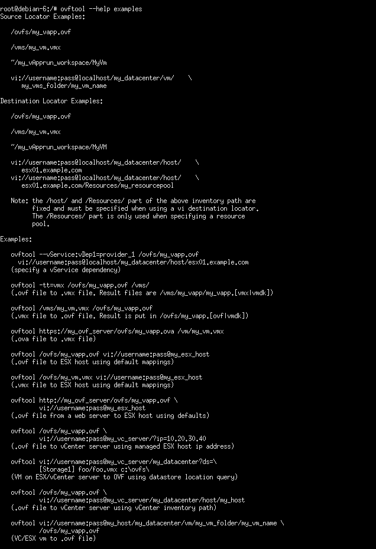
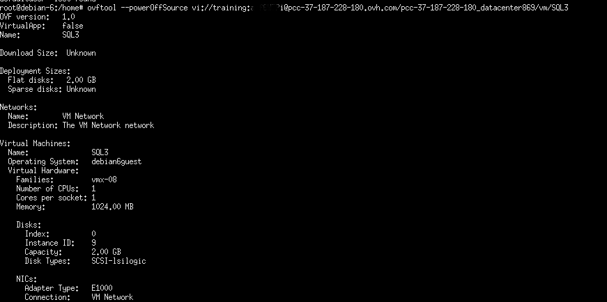

## Objective

[OVFTOOL](https://www.vmware.com/support/developer/ovf/){.external} is an **export/import** tool for VMs using the OVF format (compatible with Windows, Linux and Mac).

**This guide offers a step by step study case on how to use this tool.**

## Requirements

- Being an administrative contact of your [Hosted Private Cloud infrastructure](https://www.ovhcloud.com/es-es/enterprise/products/hosted-private-cloud/) to receive login credentials
- A user account with access to vSphere (created in the [OVHcloud Control Panel](https://www.ovh.com/auth/?action=gotomanager&from=https://www.ovh.es/&ovhSubsidiary=es))

## Instructions

We will use the OVFTOOL v4.0 under **Linux Debian**.

{.thumbnail}

Use the `ovftool --help` command to see the application help file and `ovftool --help examples` for examples.

{.thumbnail}

We will proceed with an export of an **.ovf** virtual machine in pcc-37-187-228-180.ovh.com called SQL3.

Before the export, shut the VM down using the `vftool powerOffSource` command as shown below.

{.thumbnail}

In the vCenter recent tasks, you can see the VM being shut.

We can now export the VM. Type in the following command:

`ovftool vi://user:password@Dedicatedcloud/datacentre/vm/vmname /destination`

{.thumbnail}

Export happens and is successful.

{.thumbnail}

To convert an .OVF file into a .VMX one, use the `ovftool -tt=vmx file.ovf /destination/` command.

{.thumbnail}

{.thumbnail}

To import the VM in your infrastructure, you need to indicate the destination datastore `ovftool -ds=datastore file.ovf`

{.thumbnail}

The virtual machine is now deployed in your environment.

Finally, migrating SQL3 to a new Hosted Private Cloud (transfer does not require a third party machine).

{.thumbnail}

## Go further

Join our community of users on <https://community.ovh.com/en/>.
